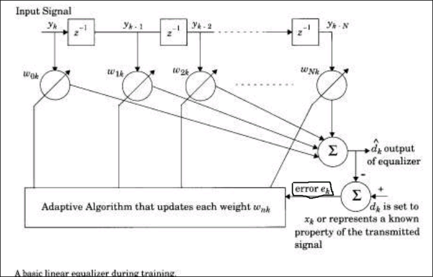
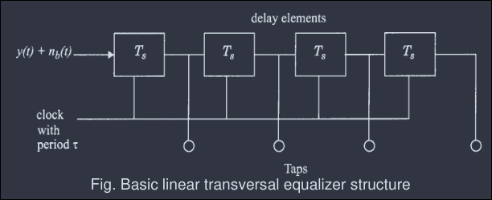
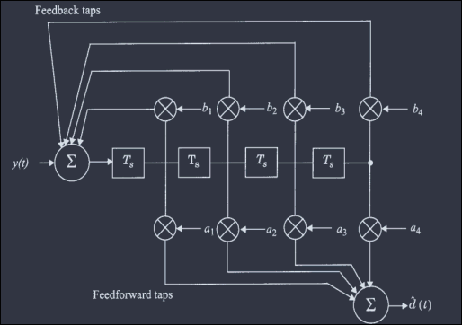
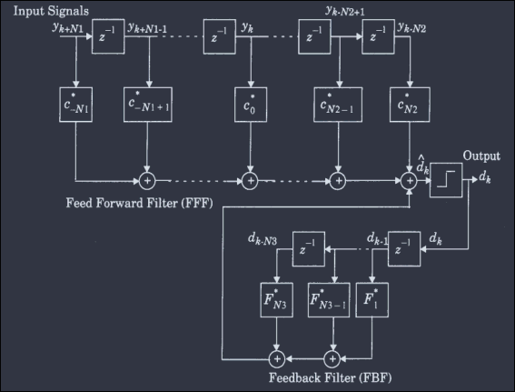
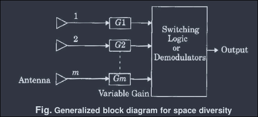
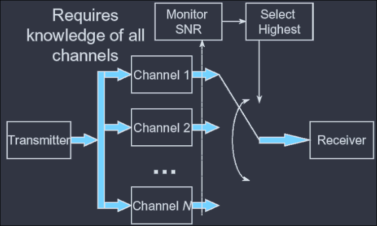
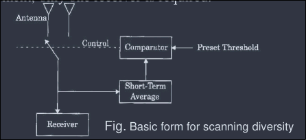
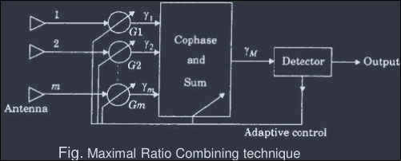
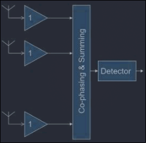

# Chapter 5: Equalization and Diversity Techniques

## Exam Frequency Table (2070–2082 BS, 22 papers)

| Topic | Typical Marks | Frequency |
|---|---|---|
| Diversity techniques — types + combining methods (space diversity, MRC) | 4–8 | Very High (appears almost every year) |
| Equalization: need, ISI compensation, training/tracking modes | 2–8 | Very High |
| RAKE receiver — working / block diagram / time diversity | 3–8 | High |
| MLSE equalization + block diagram | 4–6 | High |
| Interleaving — need and working | 2–6 | Moderate–High |
| MSE algorithm / optimal weight derivation | 7–8 | Moderate (long numerical/derivation type) |
| Adaptive equalization algorithms (any two, e.g. ZF, LMS) | 4–5 | Moderate |
| Space diversity techniques with block diagrams (general) | 4 | Moderate |
| Feedback vs Maximal Ratio Combining comparison | 4 | Low–Moderate |
| Antenna diversity types (comparison-based) | 4 | Low–Moderate |

**Reading tip:** Diversity (esp. space diversity + combining techniques) and the equalization need/training-tracking pair are the safest high-yield areas. RAKE receiver and MLSE are frequently paired with time diversity questions, so prepare them together.

---

## 5.0 Introduction

- Equalization, diversity, and channel coding are three techniques used independently or in combination to improve received signal quality.
- **Equalization** compensates for Inter-Symbol Interference (ISI) created by time-dispersive channels (when signal bandwidth $B_s$ > channel coherence bandwidth $B_c$).
  - Categories: Linear equalization, Non-linear equalization (adaptive).
- **Diversity** compensates for fading channel impairments; usually implemented using two or more receiving antennas.
  - Categories: Spatial diversity, antenna polarization diversity, frequency diversity, time diversity.
- **Distinction:** Equalization counters time dispersion (ISI). Diversity reduces the depth and duration of fades experienced in a flat fading channel.

---

## 5.1 Equalization: Linear, Non-linear, Adaptive

### 5.1.1 Need for Equalization

- Equalization compensates for Inter-Symbol Interference (ISI) caused by multipath time-dispersive channels.
- An equalizer within a receiver compensates for the average range of expected channel amplitude and delay characteristics.
- Since mobile fading channels are random and time-varying, the equalizer must **track** the time-varying channel characteristics — hence called an **adaptive equalizer**.
- An adaptive equalizer operates in two phases: **Training** and **Tracking**.

### 5.1.2 Modes of Operation

#### Training Mode

- Purpose: to measure/characterize the channel.
- A known, fixed-length training sequence is transmitted first so the receiver's equalizer can converge to a proper setting.
- Training sequence is typically a pseudo-random binary signal or a fixed prescribed bit pattern.
- The training sequence is designed to let the equalizer acquire the proper filter coefficients even under the **worst possible channel condition** (deepest fade, maximum ISI, maximum delay).
- An adaptive filter at the receiver uses a recursive algorithm to evaluate the channel and estimate filter coefficients to compensate for it.
- Three factors affect the convergence time of the equalizer:
  - Equalizer structure
  - Equalizer algorithm
  - Time rate of change of the multipath radio channel
- TDMA wireless systems are particularly well suited for equalizers (since data is sent in bursts with a training preamble).

#### Tracking Mode

- Follows the training mode.
- Once the training sequence ends, filter coefficients are near-optimal.
- User data is sent immediately after the training sequence.
- As user data is received, the equalizer's adaptive algorithm continues to **track** the changing channel.
- As a result, the adaptive equalizer continuously updates its filter characteristics over time.

### 5.1.3 Implementation

- Usually implemented at baseband or IF in a receiver.

$$y(t) = x(t) * f(t) + n_b(t)$$

- $x(t)$: transmitted signal
- $f(t)$: combined impulse response of transmitter, channel, and RF/IF section of receiver
- $n_b(t)$: baseband noise at the equalizer input
- $h_{eq}(t)$: impulse response of the equalizer
- $*$: convolution operator

- Taking $d(t)$ as the desired output — the convolution of $y(t)$ with the equalizer:

$$d(t) = y(t)*h_{eq}(t) = x(t) * f(t) * h_{eq}(t) + n_b(t) * h_{eq}(t)$$

- For distortion-free recovery, we require $f(t) * h_{eq}(t) = \delta(t)$
- Therefore: $F(f)\, H_{eq}(f) = 1$
- This shows that an **equalizer is essentially the inverse filter of the channel**.
- If the channel is frequency selective, the equalizer enhances frequency components with small amplitudes and attenuates the strong frequencies in the received response.
- For a time-varying channel, an **adaptive** equalizer is required to track channel variations.

### 5.1.4 Adaptive Equalization

- An adaptive equalizer is a time-varying filter that must be continuously retuned.
- Implemented as a transversal filter with $N$ delay elements, $N+1$ taps, and $N+1$ tunable complex weights.
- Weights are updated continuously by an adaptive algorithm, either on a sample-by-sample or block-by-block basis.
- The adaptive algorithm is controlled by the error signal $e_k$.

#### Block Diagram

#### Operation

- The error signal is derived by comparing the equalizer output $\hat d_k$ with some signal $d_k$, which is either an exact replica of the transmitted signal $x_k$, or represents a known property of the transmitted signal.
- The adaptive algorithm uses $e_k$ to minimize a cost function and iteratively update the equalizer weights to reduce that cost function.
- The **Least Mean Squares (LMS)** algorithm searches for the optimum (or near-optimum) filter weights via the following iterative operation:

  $$\text{New weights} = \text{Previous weights} + (\text{constant}) \times (\text{Previous error}) \times (\text{Current input vector})$$

  where Previous error = Previous desired output − Previous actual output.

- The constant may be adjusted to control the variation between filter weights on successive iterations.
- This process repeats rapidly in a loop as the equalizer attempts to converge; many techniques exist to minimize the error.
- Upon convergence, the adaptive algorithm freezes the filter weights until the error signal exceeds an acceptable level, or until a new training sequence is sent.
- The most common cost function is the **Mean Square Error (MSE)** between the desired signal and the equalizer output: $E[e(k)\,e(k)^*]$.

### 5.1.5 Equalization Techniques (Linear vs Non-linear)

- Two general categories: **linear** and **non-linear** equalization.
- If $d(t)$ is *not* fed back to adapt the equalizer → **linear equalization**.
- If $d(t)$ *is* fed back to change subsequent outputs of the equalizer → **non-linear equalization**.

#### Linear Equalization

##### Linear Transversal Equalizer (LTE)

- LTE is made up of tapped delay lines, as shown in the block diagram.

  

- Assuming the delay elements have unity gain and delay $T_s$, the transfer function of the linear equalizer can be written as a function of the delay operator: $\exp(-j\omega T_s)$ or $z^{-1}$.
- The simple LTE uses only **feed-forward** taps.
- The equalizer can also use both feed-forward and feedback taps:

  

- Equalizers using both feed-forward and feedback taps tend to be unstable and are rarely used.

#### Non-linear Equalization

- Used in applications where channel distortion is too severe for linear equalization.
- Attempting to compensate for severe distortion, a linear equalizer places too much gain near spectral nulls, enhancing the noise present at those frequencies.
- Two effective non-linear methods:
  - Decision Feedback Equalization (DFE)
  - Maximum Likelihood Sequence Estimator (MLSE)

##### Decision Feedback Equalizer (DFE)

##### Maximum Likelihood Sequence Estimation (MLSE)

- MLSE tests **all possible data sequences** (rather than decoding each received symbol individually) and chooses the data sequence with the maximum probability as the output.
- Usually has a large computational requirement.
- First proposed by **Forney**, using a basic MLSE estimator structure implemented via the **Viterbi Algorithm**.
- The state of the radio channel is estimated using the $L$ most recent input samples.
- If $M$ is the size of the modulation's symbol alphabet, the channel has $M^L$ states.
- The Viterbi algorithm traces the channel's state through the $M^L$-state trellis and, at stage $k$, gives the most probable sequence.
- MLSE is the **optimum equalizer**, as it minimizes the probability of sequence error.

*Frequently asked alongside:* MLSE block diagram + definition of time diversity and its two implementations (see §5.3 RAKE receiver, which is the classic time-diversity implementation).

### 5.1.6 Solutions for Optimum Weights (MSE Derivation)

- Let input vector $y_k$ and weight vector $w_k$:

$$y_k = [y_k,\ y_{k-1},\ y_{k-2},\ \dots,\ y_{k-N}]^T$$
$$\omega_k = [\omega_k,\ \omega_{k-1},\ \omega_{k-2},\ \dots,\ \omega_{k-N}]^T$$

- Output:
$$\hat d_k = y_k^T w_k = w_k^T y_k$$

- Desired equalizer output:
$$d_k = x_k$$

- Error signal:
$$e_k = d_k - \hat d_k = x_k - \hat d_k = x_k - y_k^T \omega_k = x_k - \omega_k^T y_k$$
$$|e_k|^2 = x_k^2 + \omega_k^T y_k y_k^T \omega_k - 2x_k y_k^T \omega_k$$

- Expected value:
$$E\left[|e_k|^2\right] = E[x_k^2] + \omega_k^T E[y_k y_k^T]\, \omega_k$$

- The filter weight $w_k$ is not included in the time-average calculation, since it is assumed to have already converged to an optimum value — i.e., $w_k$ does not change with time.

- **Input correlation matrix** $R$, an $(N+1)\times(N+1)$ square matrix:

$$R = E[y_k y_k^*] = E
\begin{bmatrix}
y_k^2 & y_k y_{k-1} & y_k y_{k-2} & \dots & y_k y_{k-N}\\
y_{k-1} y_k & y_{k-1}^2 & y_{k-1} y_{k-2} & \dots & y_{k-1} y_{k-N} \\
\vdots & \vdots & \vdots & \ddots & \vdots \\
y_{k-N} y_k & y_{k-N} y_{k-1} & y_{k-N} y_{k-2} & \dots & y_{k-N}^2
\end{bmatrix}$$

- **Cross-correlation vector** $p$ between the desired response and the input signal:

$$p = E[x_k y_k] = E[x_k y_k \ \ x_k y_{k-1} \ \ x_k y_{k-2} \ \ \dots \ \ x_k y_{k-N}]^T$$

- **Mean Square Error:**

$$\zeta = E\left[|e_k|^2\right] = E[x_k^2] + \omega^T R \omega - 2 p^T \omega$$

- Minimizing the MSE with respect to weights gives the optimal solution $w_k$ (set below).

### 5.1.7 Algorithms for Adaptive Equalization

#### Zero Forcing (ZF)

- Zero forcing equalizer is a linear equalization algorithm that applies the **inverse of the channel's frequency response**. First proposed by Robert Lucky.
- For a channel with frequency response $F(f)$, the zero-forcing equalizer $C(f)$ is constructed as:

$$C(f) = \frac{1}{F(f)}$$

  so that the combination of channel and equalizer gives a flat frequency response and linear phase.

- Equalizer coefficients $c_n$ are chosen to force the samples of the combined channel + equalizer impulse response to zero at all but one of the $N_T$-spaced sample points in the tapped delay line filter.
- Letting the number of coefficients increase without bound gives an infinite-length equalizer with zero ISI at the output.
- **Limitations in practice:**
  - Even though the channel's impulse response has finite length, the equalizer's impulse response needs to be infinitely long.
  - At frequencies where the received signal is weak, the zero-forcing filter's gain grows very large to compensate — this boosts any noise added after the channel and destroys the overall SNR.
  - The channel may have frequency-response zeros that cannot be inverted at all (Gain × 0 = still 0).

#### Least Mean Square (LMS) Algorithm

- Criterion: minimize the MSE between the desired equalizer output and the actual equalizer output.
- Using the MSE derivation above (§5.1.6):
- For a given channel condition, the prediction error $e_k$ depends on the tap gain vector $w_k$; thus the equalizer's MSE is a function of $w_N$.
- Let the **cost function** $J(w_N)$ denote the MSE as a function of the tap gain vector $w_N$.
- The optimal tap gain vector $w_N$ is obtained by iteratively solving the normal equation as the equalizer converges to an acceptably small value of $J_{opt}$:

$$\frac{\partial}{\partial w_N} J(w_N) = -2p_N + 2R_{NN} w_N = 0$$
$$R_{NN}\, \hat w_N = p_N$$
$$J_{opt} = J(\hat w_N) = E[x_k x_k^*] - p_N^T \hat w_N$$

---

## 5.2 Diversity Methods and Combining

### 5.2.1 Need for Diversity

- Diversity is a powerful, low-cost receiver technique that improves the wireless link.
- Diversity decisions are made at the receiver (RX) and are unknown to the transmitter (TX).
- **Concept:** If one radio path undergoes a deep fade, another independent path may carry a strong signal. By having more than one path to select from, both instantaneous and average SNR at the receiver can be improved — often by as much as 20–30 dB.

### 5.2.2 Microscopic vs Macroscopic Diversity

#### Microscopic Diversity

- Used to combat small-scale fading.
- If antennas are separated by a fraction of a meter, one may receive a null while the other receives a strong signal.
- By selecting the best signal at all times, the receiver mitigates small-scale fading — this is called **antenna diversity** (or **space diversity**).

#### Macroscopic Diversity

- Used against large-scale fading caused by shadowing (variations in terrain profile and surroundings).
- In deep shadowing, received signal strength at a mobile can drop well below the free-space level.
- By selecting a base station that is not shadowed (when others are), the mobile substantially improves average SNR on the forward link.
- Called macroscopic diversity because it exploits large separations between serving base stations.

### 5.2.3 Diversity Techniques (Space Diversity)

- Space diversity, aka antenna diversity.
- Signals received from spatially separated antennas on the mobile have essentially **uncorrelated envelopes** for antenna separations of one-half wavelength ($\lambda/2$) or more.
- General block diagram:

  

- Four categories: Selection, Feedback/Scanning, Maximal Ratio Combining, Equal Gain Combining.

#### Selection Diversity

- $m$ diversity branches whose gains are adjusted to provide the same average SNR per branch.
- The receiver branch with the **highest instantaneous SNR** is connected to the demodulator — i.e., antenna signals are sampled and the best one is sent to a single demodulator.
- A practical selection diversity system must be designed so that the reciprocal of the mobile's fading rate is longer than the internal time constants of the selection circuitry.
- Block diagram:

  

  **Principle:** Selecting the best signal among all branch signals received at the receiving end.

#### Feedback or Scanning Diversity

- The $M$ signals are scanned in a fixed sequence until one is found above a predetermined threshold.
- That signal is received until it falls below the threshold, at which point scanning resumes.
- Resulting fading statistics are somewhat inferior to other methods.
- Simple to implement — only one receiver is required.
- Block diagram:

  

  **Principle:** The $M$ signals are scanned in a fixed sequence until one is found above the predetermined threshold.

#### Maximal Ratio Combining (MRC)

- Signals from all $m$ branches are weighted according to their signal voltage-to-noise power ratios, then summed.
- Individual signals must be **co-phased** before summing — i.e., all signal components are considered.
- MRC produces an output SNR equal to the **sum of the individual branch SNRs**.
- Produces an acceptable output SNR even when none of the individual signals themselves is acceptable.
- Gives the **best statistical reduction of fading** among all techniques.
- Block diagram:

  

  **Principle:** Combining all signals in a co-phased and weighted manner to achieve the highest achievable SNR at the receiver at all times.

#### Equal Gain Combining (EGC)

- Used when it is inconvenient to provide the variable weighting capability required for MRC.
- Branch weights are all set to unity, but signals from each branch are co-phased to provide combining gain.
- Simple to implement.
- Retains the ability to produce an acceptable signal from a number of unacceptable inputs.
- Performance is only marginally inferior to MRC, and superior to selection diversity.
- Note: MRC requires an accurate estimate of channel amplitude gain, increasing receiver complexity.
  - Alternative: weight all signals equally after coherent detection, which removes phase distortion.
- Simplified block diagram:

  

#### Feedback vs Maximal Ratio Combining (Comparison)

| Aspect | Feedback / Scanning Diversity | Maximal Ratio Combining |
|---|---|---|
| Receivers needed | Only one | One per branch (m receivers) |
| Signal use | Uses one branch above threshold at a time | Combines all branches simultaneously |
| Complexity | Low | High (needs channel amplitude/phase estimation) |
| Fading performance | Inferior | Best statistical reduction of fading |
| Output SNR | Equal to the selected branch's SNR | Sum of all branch SNRs |

### 5.2.4 Types of Antenna Diversity — Overview

*(Exam phrasing: "discuss and compare different types of antenna diversity technique")*

| Technique | Basis of Operation | Relative Complexity |
|---|---|---|
| Selection Diversity | Picks branch with highest instantaneous SNR | Low |
| Feedback/Scanning Diversity | Scans branches, locks onto first above threshold | Lowest |
| Equal Gain Combining | Co-phases and sums all branches with equal weight | Moderate |
| Maximal Ratio Combining | Co-phases and sums all branches, weighted by SNR | Highest |

- All are forms of **space diversity**; the choice is a trade-off between implementation complexity and fading performance (Selection/Feedback = simplest but weakest; MRC = most complex but best performance).

---

## 5.3 RAKE Receivers and Interleaving

### 5.3.1 Time Diversity

- **Principle:** Signals representing the same information are sent over the same channel at different times.
- Time diversity repetitively transmits information at time spacings that exceed the **coherence time** of the channel.
- The modern implementation of time diversity involves the use of the **RAKE receiver** for CDMA.

### 5.3.2 RAKE Receiver

- CDMA spreading codes are designed to provide very low correlation between successive chips.
- Propagation delay spread in the radio channel merely provides multiple versions of the transmitted signal at the receiver.
- If multipath components are delayed in time by more than a chip duration, they appear as uncorrelated noise at a CDMA receiver, and equalization is not required.
- Since there is useful information in the multipath components, a CDMA receiver may combine the time-delayed versions of the original transmitted signal to improve the SNR at the receiver.
- A **RAKE receiver** is a radio receiver designed to counter the effects of multipath fading.
  - It does this by using several "sub-receivers" called **fingers** — i.e., several correlators, each assigned to a different multipath component.
  - Each finger independently decodes a single multipath component.
  - At a later stage, the contributions of all fingers are combined to make the most use of the differing transmission characteristics of each path.
  - This can result in a higher SNR in a multipath environment than in a clean (single-path) environment.
- Multipath components are delayed copies of the original transmitted wave, each traveling through a different echo path with a different magnitude and time-of-arrival at the receiver.
- Since each component carries the original information, if the magnitude and time-of-arrival (phase) of each component is computed at the receiver — through a process called **channel estimation** — then all components can be added coherently to improve information reliability.
- **Working of an M-branch RAKE receiver (summary):**
  - Individual multipath components are collected by correlators/fingers, each tuned to a different multipath delay.
  - Finger outputs are weighted (as in maximal ratio combining) and combined to give the best estimate of the transmitted signal.
  - Since each finger's output represents an independently-fading path, combining them yields diversity gain — the receiver "rakes" together energy from multiple resolvable multipath components, hence the name.
- RAKE receiver directly exploits the concept of **time diversity**, since multipath components are naturally delayed (time-shifted) copies of the same transmitted signal.

*(Note: "RACK" as printed in some PYQs is a scanning/transcription variant of "RAKE" — treated as the same topic.)*

**Where to add a figure:** *Insert a RAKE receiver block diagram here (M correlators/fingers → channel estimation/weighting → combiner → output), as this is a frequently drawn diagram in exams.*

### 5.3.2 Interleaving

- **Purpose:** Channel coding (block/convolutional codes) is effective against random, independent bit errors, but wireless fading channels produce **burst errors** (many consecutive bits corrupted during a deep fade). Interleaving is needed to spread out burst errors so that channel coding can correct them as if they were random errors.
- **Working principle:**
  - Coded data symbols are reordered (interleaved) before transmission, so that adjacent symbols in the transmitted stream are no longer adjacent in the original message.
  - At the receiver, the reverse process (de-interleaving) restores the original symbol order.
  - Any burst error introduced by the channel is thus spread out (de-clustered) across the de-interleaved sequence, appearing as isolated, scattered errors rather than one long burst.
  - The channel decoder, being effective against scattered/random errors, can then correct these errors that would otherwise have overwhelmed it as a burst.
- Interleaving is commonly implemented using a block (matrix) structure: data is written into a matrix row-by-row and read out column-by-column for transmission (or vice versa), which is what disperses burst errors.
- **Relation to equalization:** Equalization offsets the ISI introduced by a multipath time-dispersive channel (e.g., via an adaptive equalizer), while interleaving offsets burst errors from fading — the two techniques address different impairments and are often used together in a receiver chain.

**Where to add a figure:** *Insert an interleaving/de-interleaving matrix diagram here (write-in rows, read-out columns) as commonly asked with "+Fig".*

---

## Additional Info (preserved from original notes, not directly PYQ-tested)

### Polarization Diversity

- Involves both horizontal and vertical polarization.
- Horizontal and vertical polarizations experience different fading variations, providing diversity without needing spatial separation of antennas.

### Frequency Diversity

- Transmits information on more than one carrier frequency.
- Frequencies separated by more than the coherence bandwidth of the mobile channel are uncorrelated with each other and hence do not experience the same fading — providing frequency diversity.
