# High-Frequency Exam Questions

|Topic|Typical Marks|Frequency|
|---|---|---|
|Characteristics of Speech Signal|4 - 8|Very High|
|Linear Predictive Coding (LPC)|5 - 8|Very High|
|Vocoders (Operation & Types)|4 - 6|High|
|GSM Codec (Block Diagram & Operation)|4 - 6|High|
|Viterbi Decoding Algorithm|3 - 5|High|
|Convolutional Encoding & Decoding|5 - 8|Medium|
|Hamming Code (with Example)|5|Medium|
|Sub-band Coding|6|Medium|
|Turbo Coding|2 - 5|Low|

---

# Characteristics of Speech Signal

The properties of a speech signal are exploited by coders to achieve compression.

## Autocorrelation Function (ACF)

- **Definition:** There is a high correlation between adjacent samples in a speech segment.
- **Significance:** This implies a large component of any sample can be predicted from previous samples with a small random error. This property is the basis for differential and predictive coding schemes.
- **Formula:**  
   $$\begin{equation}
        C(k) = \dfrac1N \sum_{n=0}^{N-|k|-1} x(n)\cdot x(n+|k|)
    \end{equation}$$ 
- **Observation:** Typical speech signals have an adjacent sample correlation as high as **0.85 to 0.9**.

### Probability Density Function (PDF)

- The amplitude of a speech signal has a non-uniform probability density function.
- **Formula:**  
   $$\begin{equation}
        p(x) = \frac{1}{\sqrt{2\sigma_x}} \exp\left(\frac{-\sqrt{2} |x|}{\sigma_x}\right)
    \end{equation}$$ 
- **Characteristics of PDF:**
    - High probability of near-zero amplitudes.
    - Significant probability of very high amplitudes.
    - Monotonically decreasing function between these extremes.
- **Coding Implication:** Non-uniform quantizers (including vector quantizers) are used to allocate more levels to high-probability regions and fewer levels to low-probability regions.

## Power Spectral Density Function (PSD)

- **Non-flat Characteristic:** The PSD of speech is non-flat.
- **Coding Implication:** This allows for significant compression by coding different frequency bands separately (Frequency Domain Coding). This distributes quantization noise across the spectrum.
- **Critical Note:** High-frequency components, though low in energy, are very important for speech intelligibility and must be adequately represented.

---

# Frequency Domain Coding of Speech

This method divides the speech signal into frequency components which are quantized and encoded separately. The bit allocation can be dynamically varied among different bands.

## Sub-band Coding
- **Method:** The speech signal is divided into several smaller sub-bands (typically 4 or 8) using a bank of filters.
- **Process:** Each sub-band is sampled at its bandpass Nyquist rate and then encoded.
- **Bit Rate:** Operates in the range of **9.6 kbps to 32 kbps**.
- **Key Technique:** Low-pass translation of sub-band signals to zero frequency (similar to single sideband modulation) is used to reduce the sampling rate effectively.
- **Block Diagram:**  
    - 

## Adaptive Transform Coding (ATC)

- **Method:** Involves block transformations (e.g., Discrete Cosine Transform) of windowed segments of speech.
- **Process:** Each segment is represented by a set of transform coefficients. These are quantized with bits allocated based on perceptual significance.
- **Bit Rate:** Operates in the range of **9.6 kbps to 20 kbps**.
- **Common Transform:**
    - **Discrete Cosine Transform (DCT):**  
    $$\begin{equation}
        X_C (k) = \sum_{n=0}^{N-1} x(n) g(k) \cos\left[\frac{(2n+1)k\pi}{2N} \right]\ \text{for } k = 0, 1, 2, \dots N-1
    \end{equation}$$  
    - Where g(0) = 1 and g(k) = $\sqrt{2}$, k = 1, 2, $\dots$ N-1
    - **Inverse DCT:**  
   $$\begin{equation}
        x(n) = \frac1N \sum_{k=0}^{N-1} X_C (k) \cos\left[ \frac{(2n+1)k\pi}{2N} \right]\ \text{for } n = 0, 1, 2, \dots N-1
    \end{equation}$$ 

---

# Vocoders (Analysis-Synthesis Systems)

Vocoders analyze the voice signal at the transmitter, transmit derived parameters, and synthesize the voice at the receiver using these parameters. They model the speech generation process to provide a compact description of the signal.

- **Advantages:** High economy in transmission bit rate.
- **Disadvantages:** More complex than waveform coders, less robust, and performance tends to be talker-dependent.
- **Most Popular Type:** Linear Predictive Coder (LPC).

## Channel Vocoder

- **Type:** A frequency domain vocoder.
- **Principle:** Determines the envelope of the speech signal for a number of frequency bands, samples, encodes, and multiplexes these samples.
- **Parameters Transmitted:** Energy details per frequency band, a voice/unvoiced decision, and pitch frequency (for voiced speech).
- **Sampling:** Performed every 10ms to 30ms.

### Analyzer Block Diagram
- The channel vocoder employs a number of bandpass filters
    - each having a bandwidth between 100 Hz and 300 Hz
- The output of each filter is rectified and lowpass filtered.
    - the bandwidth of the LPF is selected to match:
    - the time variations in the characteristics of the vocal tract.
- For measurement of the spectral magnitudes, a voicing detector and a pitch estimator are included in the speech analysis.
- Block Diagram
    - 

### Synthesizer Block Diagram

- At the receiver the signal samples are passed through D/A converters.
- The outputs of the D/As are multiplied by the voiced or unvoiced signal sources.
- The resulting signal are passed through bandpass filters.
- The outputs of the bandpass filters are summed to form the synthesized speech signal
- Block Diagram
    - 

## Formant Vocoder

- **Definition:** Formants are spectral peaks with a high degree of energy, corresponding to resonances in the vocal tract (especially prominent in vowels).  
    - 
    
- **Example:** Spectral envelope of an [i] pronounced by a male speaker, showing the first three formants (F1, F2, F3).  
    - 
    
- **Working:** Instead of sending the entire power spectrum envelope, it estimates and transmits the positions (frequencies) of the first 3 or 4 formants and their intensities, along with pitch information. This is more efficient than transmitting the full spectral samples.

### Analyzer

- Block Diagram
    - 

### Synthesizer

- Block Diagram
    - 

# Linear Predictive Coding (LPC)

- **Type:** A time-domain class of vocoder.
- **Significance:** The most popular class of low-bit-rate vocoders; computationally intensive.
- **Bit Rate:** Capable of good quality voice at **4.8 kbps**.
- **Principle:** Models the vocal tract as an all-pole linear filter. The objective is to estimate the parameters of this model.  
    $$\begin{equation}
        H(z) = \frac{G}{1 + \sum_{k=1}^{M} b_k z^{-k}}
    \end{equation}$$ 
    - where `G` is the gain of the filter.

---

# GSM Codec

The original GSM speech coder is the **Regular Pulse Excited Long-Term Prediction (RPE-LTP)** codec, with a net bit rate of **13 kbps**.

## Principle

- It combines the low complexity and good quality of the baseband RELP codec with the excellent quality and error resilience of the MPE-LTP codec.
- A key modification was the addition of a long-term prediction loop, reducing the bit rate from 14.77 kbps to 13.0 kbps without quality loss.

## Encoder Block Diagram

- **Steps:**
    1. Speech is pre-emphasized and segmented into 20ms blocks.
    2. **Short-Term Prediction (STP):** Eight reflection coefficients (Logarithmic Area Ratios - LARs) are computed.
    3. **Long-Term Prediction (LTP):** Determines the pitch period and gain factor to minimize the residual error.
    4. **RPE Encoding:** The LTP residual is weighted, decomposed into candidate excitation sequences, and quantized.

## Decoder Block Diagram

- Performs complementary operations to the encoder using the received parameters to synthesize the original speech.

## Frame Structure (260 Bits)

The 260 bits of output for every 20ms speech block are ordered by importance:
- **Class Ia (50 bits):** Very important bits. Protected with CRC for error detection.
- **Class Ib (132 bits):** Important bits. Convolutionally encoded for forward error correction.
- **Class II (78 bits):** Least significant bits. Have no error correction or detection.

---

# Block Codes

A block code is a set of fixed-length codewords. A binary block code of length `n` and size `M` is a set of `M` binary sequences.

- **Important Terms:**
    - **Block length (n):** The length of each codeword.
    - **Code Rate (k/n):** The fraction of the codeword that consists of information symbols.
    - **Minimum Distance (d'):** The minimum Hamming distance between any two codewords. Determines the error-correcting capability.

## Linear Block Code (LBC)

- **Properties:**
    - The sum (mod-2) of any two codewords is also a codeword.
    - The all-zero codeword is always present.
    - For a linear code, the minimum distance (`d'`) equals the minimum weight (`w'`) of any non-zero codeword.
- **Representation:**
    - **Generator Matrix (G):** A `k x n` matrix that encodes the information word (`i`) of length `k` into a codeword (`c`) of length `n`.  
        c=iG

## Hamming Code

- **Type:** A linear block code capable of correcting single-bit errors within a block.
- **Structure:** Employs modulo-2 arithmetic (Ex-OR) and inserts parity bits between data bits. Offers little protection against burst errors.
- **Parameters:**
    - Code length: $n \le 2^{n-k} - 1$
    - Number of message bits: $k \le n - \log_2 (n+1)$
    - error-correcting capability: $t_c = \dfrac{d_{min} - 1}2$ 

### Structure Diagram

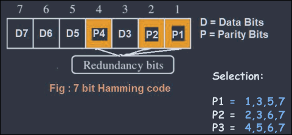

### Example: Encoding 1011

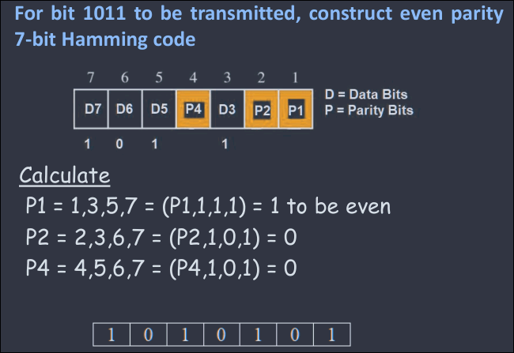

### Example: Error Location in 1011011

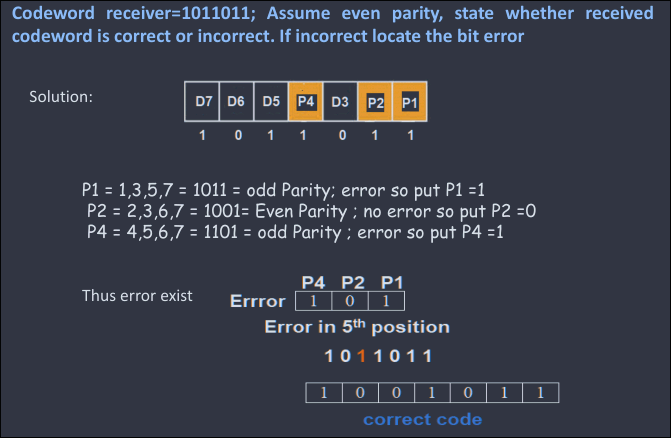

## Hadamard Code

- **Generation:** Produced by an `n x n` Hadamard matrix.
- **Relation:** If the message has `k` bits, then `n = 2^k`.
- **Code Rate:** r = $\dfrac{k}{n} = \dfrac{k}{2^k}$
- The code rate decreases with an increase in `k`.

### Conditions for Hadamard Code Vectors

1. The first row consists of all zeros.
2. The second row has an equal number of 1s and 0s (i.e., n/2 of each).
3. Every pair of rows differs in exactly n/2 positions (orthogonal property).
4. Each code is distinct.

### Matrix Construction

- On code vector, row of matrix consist of all zero elements
- 2$^{nd}$ row, equal to no. of 1's and 0's.
    - i.e. half no. of $n/2$ 1's, and 0's.
- Each code different from each other.
- If single msg bit, k = 1
    - $n = 2^k = 2^1 = 2$
- If single message bit k = 2
    - $n = 2^k = 2^2 = 4$
- Hadmard matrix n x n = 2 x 2:
    - $\begin{bmatrix}
        0 & 0 \\
        0 & 1
    \end{bmatrix}$
- Hadamard matrix n x n = 4 x 4:
    - $\begin{bmatrix}
        0 & 0 & 0 & 0\\
        0 & 1 & 0 & 1 \\
        0 & 0 & 1 & 1\\
        0 & 1 & 1 & 0
    \end{bmatrix}$
    - which is equivalent to
    - $\begin{bmatrix}
        H2 & H2 \\
        H2 & H2'
    \end{bmatrix}$

---

# Convolutional Codes

In convolutional codes, the block of `n` code digits generated in a time unit depends not only on the current block of `k` message digits but also on the previous `L` blocks. The encoder has memory.

- **Example Encoder:** (Figure shows a typical convolutional encoder structure)  
    - 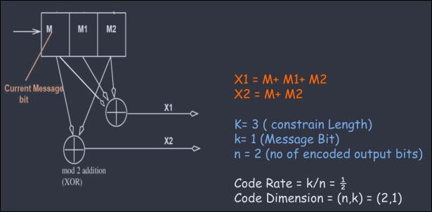

## Representations

### Code Tree
- Each branch represents an input symbol. The corresponding output symbols are indicated on the branch.
- Input '0' typically takes the upper branch; Input '1' takes the lower branch.
- **Example (Message: 110):**  
    - 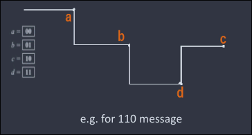

### Code Trellis

- A compact representation of the code tree. It is a state diagram that is unrolled in time.  
    - 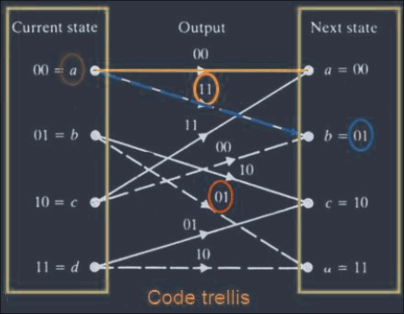

### State Diagram

- A single diagram showing all possible states and transitions of the encoder.  
    - 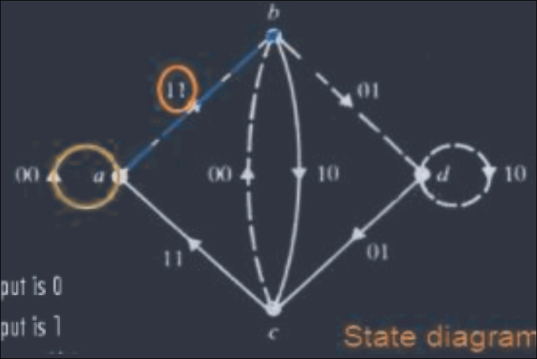

## Viterbi Algorithm

- **Purpose:** A maximum likelihood decoding algorithm used for convolutional codes.
- **Principle:** It finds the most probable transmitted sequence by searching for the minimum distance path through the code trellis. It improves computational efficiency by comparing and discarding non-optimal paths (survivor paths) at each state.
- **Process:**
    1. At each time step, calculate the branch metric for each possible transition.
    2. For each state, add the branch metric to the previous path metric.
    3. Select the path with the best (minimum) metric to be the survivor for that state.
    4. At the end, trace back to find the most likely transmitted sequence.

### Example: Decoding Y = 11 01 10

- For Y = 11 01 10:
- 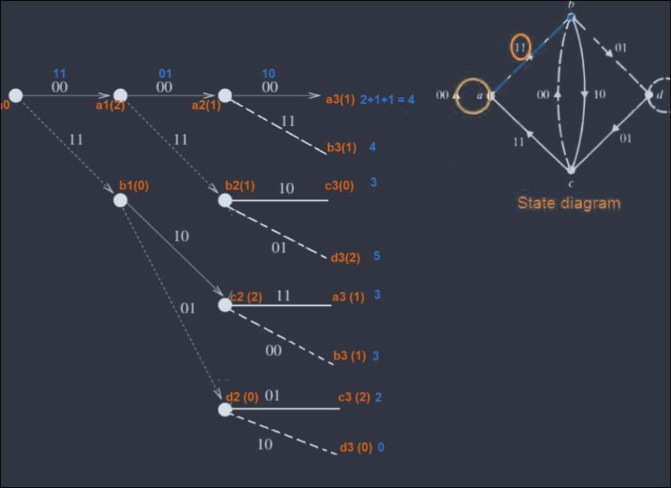
- 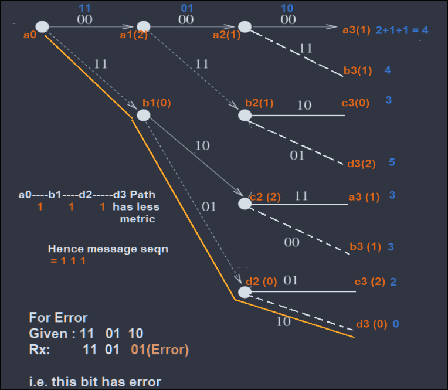

---

# Turbo Coding

- **Type:** A powerful error-correcting code combining features of both block and convolutional codes.
- **Key Components:** Uses two or more **Recursive Systematic Convolutional (RSC)** encoders operating in parallel, separated by an **interleaver**.
- **Performance:** Performs very well in low Signal-to-Noise Ratio (SNR) environments, allowing performance close to the Shannon capacity bound.
- **Comparison:** At high SNRs, Reed-Solomon codes may have better performance.

## Encoder Block Diagram

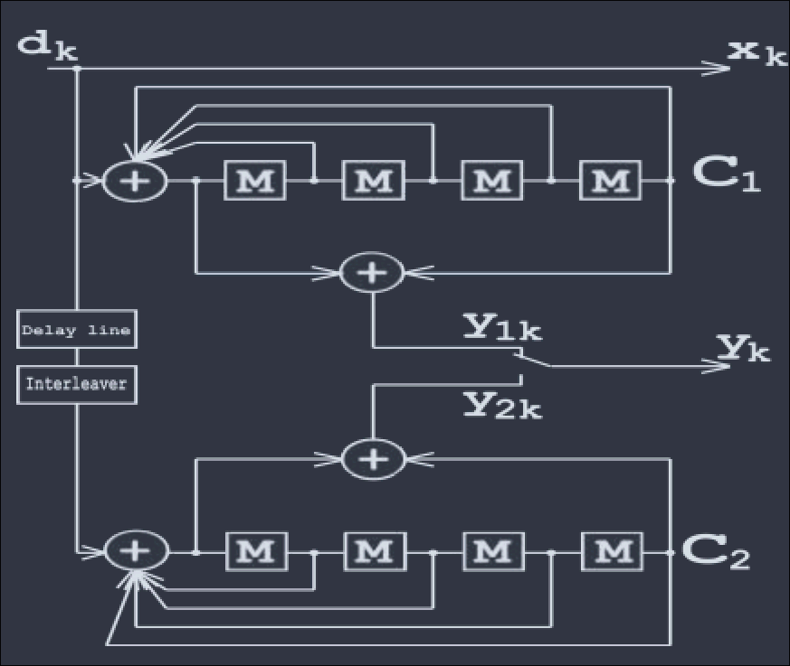

- `M` = Memory Register.
- The **Interleaver** reorders the input bits `d_k`, feeding the second encoder with a different, uncorrelated sequence.
- The systematic structure means the input bit `d_k` is passed directly as output `x_k`, along with parity bits `y_k` and `y_{2k}` from the two encoders.

## Recursive Systematic Convolutional (RSC) Code

- The component encoders used in turbo codes are Recursive Systematic Convolutional (RSC) encoders.
- Each RSC encoder produces a parity bit based on the current input and its internal state.  
    - 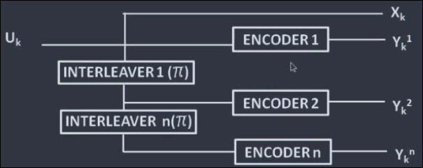

### Example: 1/3 Turbo Encoder

- Block Diagram
    - 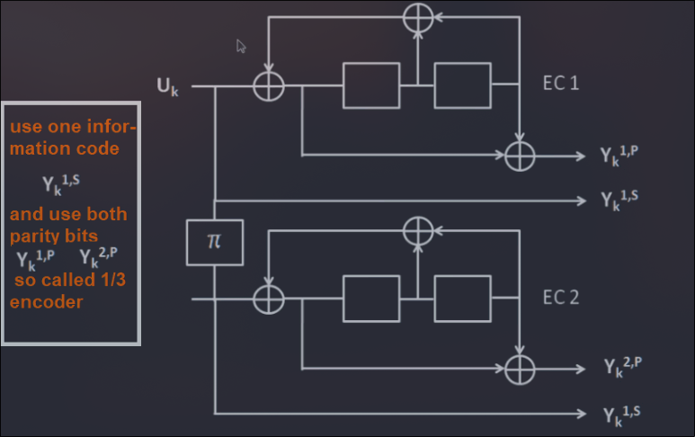
- For input 1010100
    - 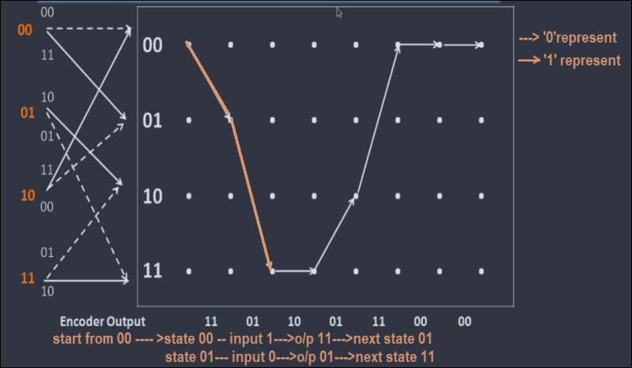
- in the two output bits for each input bit, the first bit is same as the input bit and the second bit is the parity bit.
- That is why it is called systematic code
- Output:
    - 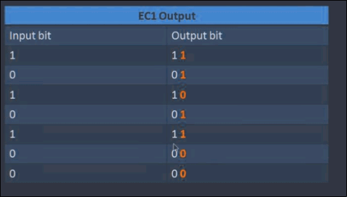

