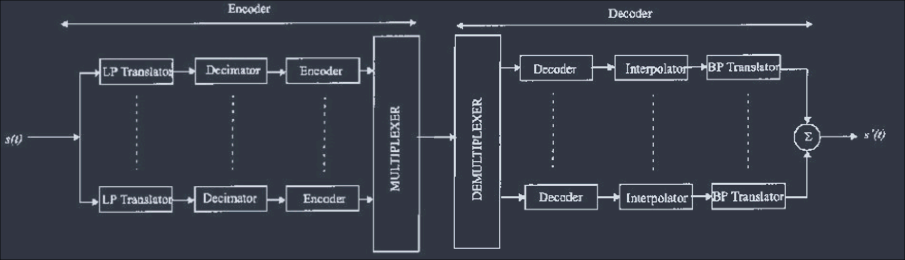
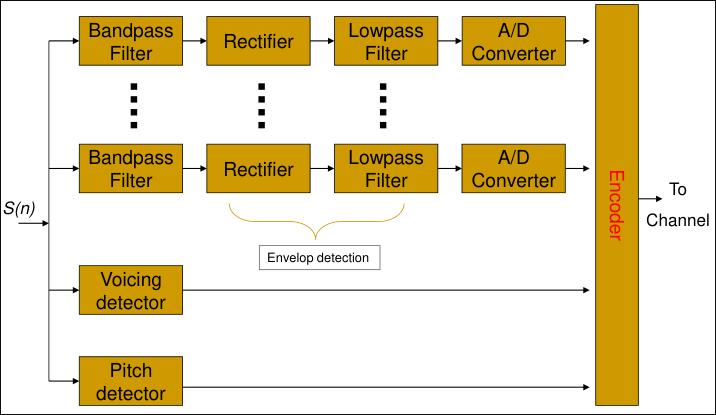
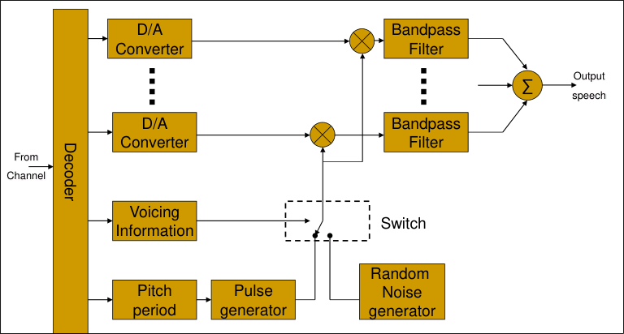
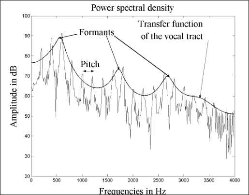
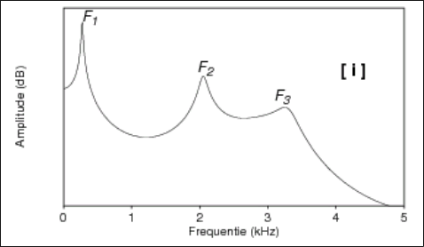
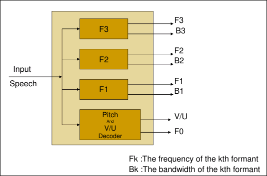
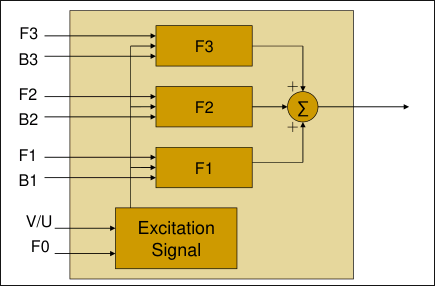
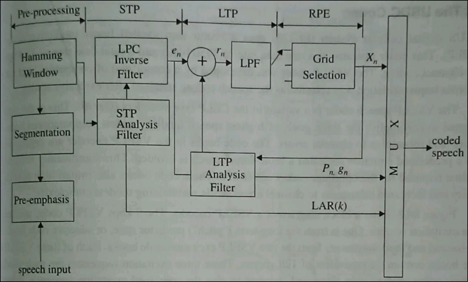
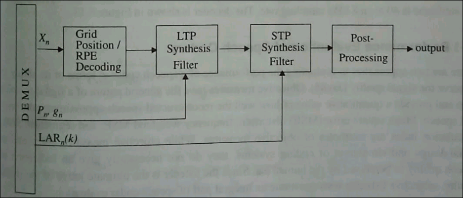

# Characteristics of Speech Signal

## Autocorrelation Function (ACF)
- In speech signal there exists much correlation between adjacent samples of the segment of speech.
    - This implies that in every sample of speech, there is a large componnet  that is easily predicted from the value of the precious samples with a small random error.
    - All differential and predictive coding schemes are based on exploiting this property.
- Formula:
    $$\begin{equation}
        C(k) = \dfrac1N \sum_{n=0}^{N-|k|-1} x(n)\cdot x(n+|k|)
    \end{equation}$$
    - Here, x(k) is k$^{th}$ sample of speech signal.
    - Typical signals have an adjacent sample correlation
    - as high as 0.85 to 0.9.

## PSDF

- Speech signal amplitude has a non-uniform probability density function (pdf) denoted by

    $$\begin{equation}
        p(x) = \frac{1}{\sqrt{2\sigma_x}} \exp\left(\frac{-\sqrt{2} |x|}{\sigma_x}\right)
    \end{equation}$$
- The pdf of a speech signal is in general characterized by a very high probability of near-zero amplitudes, a significant probability of very high amplitudes, and a monotonically decreasing function of amplitudes between these extremes.
- Non-uniform quantizers, including vector quantizers, are used to match the distribution by allocating more quanitization levels in the regions of high probability and fewer levels in the region where the probability is low.

## Power Spectral Density Function (PSD)

- Non-flat characteristic of the power spectral density of speech makes it possible to obtain significant compression by coding speech in the frequency domain.
- That is, coding the speech signal separately in different frequency bands can lead to significant coding gain.
- it should be noted that the high frequency components, through insignificant in energy are very important carrier of speech information and hence need to be adequately represented in the coding system.
- This can be called **Frequency Domain Coding of Speech**

# Frequency Domain Coding of Speech

- This coding can be thought of as a method of distributing quantization noise across the signal spectrum.
- The speech signal is divided into a set of frequency components which are quantized and encoded separately.
- The number of bits used to encode each frequency component can be dynammically varied and shared among the different bands.
- Different frequency domain coding algorithms are as follows.

## Sub-band Coding

- The speech signal is divided into many smaller sub-bands and encodes each band separately.
- The sub-band coding aims on controlling and distributing the quanitzation noise over the entire signal spectrum.
- Speech is typically divided into 4 or 8 sub-bands by a bank of filters and then sampled at bandpass Nyquist rate and finally encoded.
- Can be used for coding speech at bit rates in the range of **9.6 kbps to 32kbps**
- There are various schemes available to process sub-bands but one of the better method is to do low-pass translation of sub-band signals to zero frequency value by applying a modulation scheme that is similar to single sideband modulation.
    - By this method, it helps in sampling rate reduction.
- Figure
    - 
    - LP transistor is a simple low-pass filter with **4 frequency ranges**.
    - Decimation (signal processing) in digital processing:
        - decimation is the process of reducing the sampling rate of a signal.
        - Complementary to interpolation, which increases sampling rate
        - it is a specific case of sample rate conversion in a multi-rate digital signal processing system.

## Adaptive Transform Coding (ATC)

- Involves block transformations of window input segments of the speech waveform
    - i.e. a sequence of samples.
- Each segment is represented by a set of transform coefficients, which are spearately quantized with number of bits proportional to its perceptual significance.
- Can be used to encode speech at bit rates in the range **9.6 kbps to 20 kbps**
- One of the most frequently used transforms:
    - **The Discrete cosine transform**
    $$\begin{equation}
        X_C (k) = \sum_{n=0}^{N-1} x(n) g(k) \cos\left[\frac{(2n+1)k\pi}{2N} \right]\ \text{for } k = 0, 1, 2, \dots N-1
    \end{equation}$$
    - Where g(0) = 1 and g(k) = $\sqrt{2}$, k = 1, 2, $\dots$ N-1
    - The inverse DCT is defined as:
    $$\begin{equation}
        x(n) = \frac1N \sum_{k=0}^{N-1} X_C (k) \cos\left[ \frac{(2n+1)k\pi}{2N} \right]\ \text{for } n = 0, 1, 2, \dots N-1
    \end{equation}$$

# Vocoders

- Analyze the voice signal at transmitter
- Transmit parameters derived from analysis
- Then synthesize the voice at the receiver using those parameters.
- All vocoder systems try to model the speech generation process as a dynamic system and attempt to quantify certain physical constraints of the system.
- These physical constraints are then used to provide a faint description of the speech signal.
- In general, much more complex than the waveform coders and achieve high economy in transmission bit rate.
- However, less robust, and the performance tends to be talker dependent.
- The most popular among the voding schemes is the linear predictive coder (**LPC**)

## Channel Vocoders

- First analysis-synthesis system.
- It is a frequency domain vocoder that determines the envelope of speech signal for a number of frequency bands
    - then sample, encode and multiplex these samples
    - with the encoded output of other filters
- In addition to energy details about each frequency band
    - the voice/unvoiced decision and the pitch frequency for voiced speech are transmitted.
- The sampling is done at every 10ms to 30ms.

### Analyzer

- The channel vocoder employs a number of bandpass filters
    - each having a bandwidth between 100 Hz and 300 Hz
- The output of each filter is rectified and lowpass filtered.
    - the bandwidth of the LPF is selected to match:
    - the time variations in the characteristics of the vocal tract.
- For measurement of the spectral magnitudes, a voicing detector and a pitch estimator are included in teh speech analysis.
- Block Diagram
    - 

### Synthesizer

- At the receiver the signal samples are passed through D/A converters.
- The outputs of the D/As are multiplied by the voiced or unvoiced signal sources.
- The resulting signal are passed through bandpass filters.
- The outputs of the bandpass filters are summed to form the synthesized spech signal
- Block Diagram
    - 

## Formant Vocoder

- Format meaning, as described by the figure:
    - 
- Formants:
    - Formants are frequenc peaks which have, in the spectrum, a high degree of energy.
    - They are specially prominent in vowels.
    - Each formant corresponds to a resonance in the vocal tract
    - roughly speaking, the spectrum has a formant every 1000 Hz.
- Example:
    - Spectral envelope of an \[i\] pronounced by a male speaker.
    - F1, F2, and F3 are the first 3 formants.
    - 
- The spectral peaks of the sound spectrum | P(f) | are called formants.
- The formant vocoder can be viewed as a type of channel vocoder that:
    - estimates the first three or four formants in a segment of the speech.
- It is this information plus the pitch period that is encoded and transmitted to the receiver.
- Instead of sending samples of the power spectrum envelope,, the formant vocoder attempts to transmit the position of the peaks (formants) of the spectral envelope.
- Typically it must be able to identify at least three formants for representing the speech sounds, and also control the intensities of the formants.

### Analyzer

- Block Diagram
    - 

### Synthesizer

- Block Diagram
    - 

# Linear Predictive Coding (LPC)

- The objective of LP analysis is to estimate parameters of an all-pole model of the vocal tract.
- Several methods have been devised for generating the excitation sequence for speech synthesizers.
- LPC-type of speech analysis and synthesis are different in primarily in the type of excitation signal that is generated for speech synthesis.

## Linear Predictive Coders

- The time domain class of vocoders
- Attempts to extract the significant features of speech from the time waveform
- Computationally intensive, but by far the msot popular among the class of low bit rate vocoders.
- Possible to transmit good quality voice at **4.8kbps**
- It models the vocal tract as an all pole linear filter with a transfer function described by
    $$\begin{equation}
        H(z) = \frac{G}{1 + \sum_{k=1}^{M} b_k z^{-k}}
    \end{equation}$$
    - where G is the gain of the filter.

# GSM Codec

- Origin
    - The original speech coder used in the pan-European digital cellular standard GSM goves by a rather grandiose name of Regular Pulse Excited Long-Term Prediction (RPE-LTP) codec.
    - This codec has a net bit rate of 13 kbps and was chosen after conducting exhaustive subjective tests on various competing codecs.
    - More recent GSM upgrades have improved upon the original codec specification.
- Comparision
    - The RPE-LTP codec combines the adv of the earlier French proposed baseband RELP codec with those of the multipulse excited long-term prediction (MPE-LTP) codec proposed by germany.
    - The adv of the baseband RELP codec is that it porvides good quality spech at low complexity.
    - The speech quality of a RELP codec is however limited due to the tonal noise introduced by the process of high frequency regeneration and by the bit errors introduced during transmission.
    the MPE-LTP technique on the other hand produces excellent speech quality at high complixty and is not much affected by bit errors in the channel.
    - By modifying the RELP codec to incorporate certain features of the MPE-LTP codec, the net bit rate was reduced from 14.77 kkbps to 13.0 kbps without loss of quality.
    - The most important modification was the addition of a long-term prediction loop.
- Explanation: Encoder
    - The GSM codec is relatively complex and power hingry.
    - The block diagram is given below:
        - 
    - the encoder is comprised of four major processing blocks.
    - the speech sequence is first pre-emphasize, ordered into segments of 20ms duration, and tehn hamming-windowed.
    - This is followed by a short-term prdiction (STP) filtering analysis where the logarithmic area ratio (LARs) of the reflection coefficients $r_n (k)$ (eight in number) are computed
    - The eight LAR parameters have different dynamic ranges and probability distribution functions, and hence all of them are not encoded with the same number of bits for transmission. the LAR parameter are also decoded by the LPC inverse filter so as to minimize the error $e_n$.
- Analysis
    - LTP analysis which involves finding the pitch period $p_n$ and gain factor $g_n$ is then carried out such that the LTP residual $r_n$ is minimized.
    - To minimze $r_n$, pitch extraction is done by the LTP by determining the value of delay, $D$, which maximizes the cross-correlation between the current STP error sample, $e_n$ and a previous error sample $e_{n-D}.
    - The extracted pitch $p_n$ and gain are transmitted and encoded at a rate of 3.6 kbps.
    - The LTP residual, $r_n$ is weighted and decomposed into three candidate excitation sequences.
    - The energy is selected to represent the LTP residual.
    - The pulses in the excitation sequence are normalized to the highest amplitude, quantized and transmitted at 9.6 kbps.
- Decoder
    - Block diagram of GSM decoder
    - 
    - Decoder consists of 4 blocks which perform operations complementary to those of teh encoder.
    - The received excitation parameters are RPE decoded and passed to the LTP synthesis filter which which uses the pitch and gain parameter to synthesize the long-term signal.
    - Short-term synthesis is carried out using the received reflection coefficients to recreate the original spech.
- Forming Speech:
    - Every 260 bits of the coder output (i.e. 20ms blocks of speech) are ordered, depending on their importance, into groups of 50, 132 and 78 bits each.
    - the bits in the first group are very iportant bits called type $Ia$ bits.
    - The next 132 bits are important bits called $Ib$ bits, and the last 78 bits are called type $II$ bits.
    - Since type $Ia$ bits are the ones which effect the speech quality the most, they have error detection CRC bits added.
    - Both $Ia$ and $Ib$ bits are convolutionally encoded for forward error correction.
    - The least signficant type $II$ bits have no error correction or detection.

# Block Code

- A block code consists of a set of fixed length codewords.
- The fixed length of these codewords is called the block length and is typically denoted by $n$.
- A block code of size $M$ defined over an alphabet with $q$ symbols is a set of $M$ $q$-ary sequences, each of length $n$.
- In the special case that $q = 2$, the symbols are called bits and the code is said to be a binary code.
- Usually $M = q^k$ for some integer k, and we such a code an $(n, k)$ code.

## Some helpful definitions

- The minimum distance of a code is the minimum hamming distance between any two codewords
- If the code C consist of the set of codewords $\{c_i, i = 0, 1, \dots, M-1\}$ then the minimum distance of the code is given by $d' = \text{min } d(c_i, c_j)$
- The code rate of an (n, k) code is defined as teh ratio (k/n), and reflects the fraction of the codeword that consist of the information symbols.

## Linear Block Code (LBC)

- A linear code has the following properties
    - the sum of 2 codewords belonging to the code is also codeword belonging to the code.
    - the all-zero codeword is always a codeword
    - the minimum hamming distance between two codewords of a linear code is equal to the minimum weight of any non-zero codeword, i.e. $d' = w'$
- the minimum weight of a code is the smallest weight of any non-zero codeword, and is denoted by w'.
- the presence of an all-zero codeword is necessary but not a sufficient condition for linearity.
