# Exam Frequency Table (2070–2082 BS, 22 papers)

| Topic | Typical Marks | Frequency |
|---|---|---|
| CDMA: characteristics, advantages, limitations | 2–8 | Very High |
| FHMA: working, principle, block diagram, types | 4–7 | High |
| Hybrid multiple access techniques (mitigating near-far effect) | 4–10 | High |
| Near-far effect: definition + mitigation | 2–9 | High |
| Self-jamming problem in CDMA | 2 | Moderate |
| Hadamard/Walsh code construction (8×8), covered in Chapter 6 notes | 3–8 | Moderate–High |
| FDMA vs TDMA vs CDMA comparison (+/-) | 4–8 | Moderate |
| TDMA advantages over FDMA | 4 | Moderate |
| SDMA definition + hybrid SSMA mitigating near-far | 2–6 | Moderate |
| Duplexing types | 2–4 | Low–Moderate |
| GSM frame efficiency (numerical, deferred) | 4 | Moderate |
| Number of channels in FDMA/N-TDMA system (numericals, deferred) | 3–4 | Moderate |
| WLAN standards / WiFi (see Chapter 8) | 3–5 | Low |

**Reading tip:** CDMA (characteristics/advantages/limitations) is nearly every year. Pair it with the near-far effect and its hybrid-SSMA mitigation techniques, since these are consistently asked together. FHMA's working principle and block diagram are the next tier.

---

# 7.0 Narrowband and Wideband Systems

- **Narrowband systems**
    - The available radio spectrum is divided into a large number of narrowband channels.
    - The channels are usually operated using FDD.
- **Wideband systems**
    - Transmission bandwidth of the signal is much larger than the coherence bandwidth of the radio channel.
    - Frequency-selective fading occurs in only a small fraction of the signal bandwidth.
- Diagrammatic representation:
    - 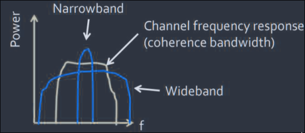

---

# 7.1 Frequency Division Multiple Access (FDMA)

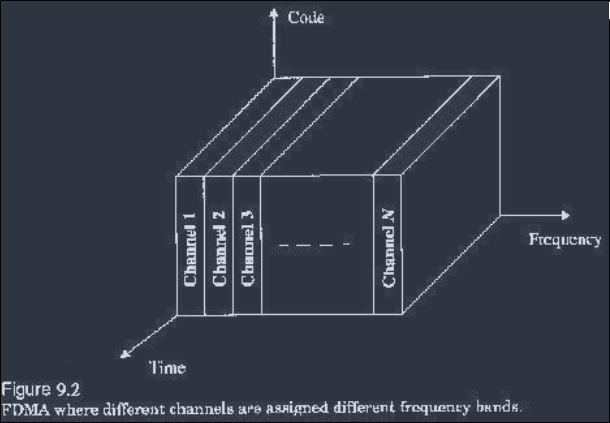

- FDMA assigns individual channels to individual users.
- Each user is allocated a unique frequency band or channel.
- The channels are assigned on demand to users who request service.
- During the period of the call, no other user can share the same channel.

## Features

- Usually implemented in narrowband systems.
- Carries only one phone circuit at a time.
- If an FDMA channel is not in use, it sits idle and cannot be shared by others to increase capacity.
- The symbol time is large relative to the average delay spread.
    - This implies that the amount of inter-symbol interference is low, and thus little or no equalization is required in FDMA narrowband systems.
- The complexity of FDMA mobile systems is lower compared to TDMA systems.
- Since FDMA is a continuous transmission scheme, fewer bits are needed for overhead purposes.
- The FDMA mobile unit uses duplexers, since both the transmitter and receiver operate at the same time.
    - This results in an increase in the cost of FDMA subscriber units and base stations.
- FDMA requires tight RF filtering to minimize adjacent channel interference.

## Number of Channels in FDMA

$$ N = \frac{B_t - 2B_{guard}}{B_c}$$

- where $B_t$ is the total spectrum allocation
- $B_{guard}$ is the guard band allocated at the edge of the spectrum
- $B_c$ is the channel bandwidth

---

# 7.2 Time Division Multiple Access (TDMA)

*(Frequently asked directly: "TDMA advantages over FDMA")*

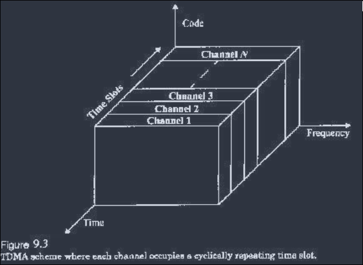

- TDMA shares a single carrier frequency with several users, where each user makes use of non-overlapping time slots.
- Data transmission for users of a TDMA system is not continuous but occurs in bursts, a specific amount of data sent or received in one intermittent operation.
    - This results in low battery consumption.
- Because of discontinuous transmissions in TDMA, the handoff process is much simpler for a subscriber unit, since it is able to listen for other base stations during idle time slots (MAHO).
- TDMA uses different time slots for transmission and reception, thus duplexers are not required, even when FDD is used.
- Equalization is usually necessary in TDMA systems, since transmission rates are generally very high compared to FDMA channels.
- High synchronization overhead is required in TDMA systems because of burst transmissions.
- TDMA has an advantage in that it is possible to allocate different numbers of time slots per frame to different users, adjustable bandwidth per user.

## Number of Channel Slots in a TDMA System

$$N = \dfrac{m(B_{tot} - 2B_{guard})}{B_c}$$

- where $m$ is the number of time slots on each channel
- $B_c$ is the carrier channel bandwidth in Hz

## TDMA Frame

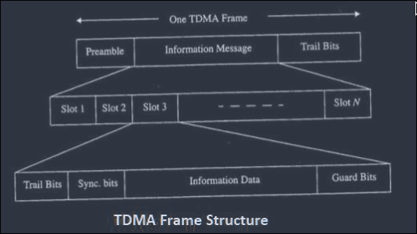

- The frame so-defined is split into time slots, and each user is assigned a time slot in which to transmit its information.
- The **preamble** contains the address and synchronization information that both the base station and the subscribers use to identify each other.
- **Guard times** (bits) between time slots help minimize interference due to propagation delay.
    - Guard time should be minimized; however, this could increase interference to adjacent channels.
- **Trail bits**: error correction bits (usually checksum or CRC).

## Efficiency of TDMA

*(Frequently paired with a GSM frame-efficiency numerical)*

- The efficiency of a TDMA system is a measure of the percentage of transmitted data that contains information, as opposed to overhead for the access scheme.
- The **frame efficiency**, $\eta_f$, is the percentage of bits per frame that contain transmitted data.
- Note that the transmitted data may include source and channel coding bits, so the raw end-user efficiency of a system is generally less than $\eta_f$.

The number of overhead bits per frame is:
$$b_{OH} = N_r b_r + N_t b_p + N_t b_g + N_r b_g$$

- where $N_r$ is the number of reference bursts per frame
- $N_t$ is the number of traffic bursts per frame
- $b_r$ is the number of overhead bits per reference burst
- $b_p$ is the number of overhead bits per preamble in each slot
- $b_g$ is the number of equivalent bits in each guard time interval

The total number of bits per frame $b_T$ is:
$$b_T = T_f R$$

- where $T_f$ is the frame duration and $R$ is the channel bit rate.

The frame efficiency $\eta_f$ is thus given as:
$$\eta_f = \left( 1 - \dfrac{b_{OH}}{b_T}\right)\times 100\%$$
# Features Summary (TDMA)

- Shares a single carrier frequency with several users.
- Data transmission for a user is not continuous:
    - low battery consumption (transmitter can be turned off when not in use)
    - MAHO: listening to other BTS when on an idle slot
- Different slots for transmission and reception: duplexers are not required even when FDD is used.
- Usually transmission rates are very high (equalization is needed).
- Guard time should be minimized, though this could increase interference to adjacent channels.
- High overhead bits (TDMA frame structure).
- Can allocate different numbers of slots to different users: adjustable bandwidth per user.

---

# 7.3 Spread Spectrum Multiple Access: CDMA, FHMA, Hybrids

## Code Division Multiple Access (CDMA)

*(One of the most repeated topics, nearly every paper)*

- CDMA technology is a spread-spectrum technique which allows users to occupy the same time and frequency allocation in a given band and space.
- The narrowband message signal is multiplied by a very large bandwidth signal called the **spreading signal**.
- Individual conversations are encoded with the help of a pseudo-random digital sequence.
- **Multiple access**: the use of spreading codes, independent for each user, along with synchronous reception, allows multiple users to access the same channel simultaneously.
- **Use of wide bandwidth**:
    - CDMA, like other spread-spectrum technologies, uses a wider bandwidth than would otherwise be needed for the transmission of data.
    - This results in a number of advantages, including increased immunity to interference and multiple user access.
- **Level of security**:
    - In order to receive the data, the receiver synchronizes the code to recover the data.
    - The use of independent data and synchronous reception allows multiple users to access the same frequency band at the same time.

### Working

- CDMA takes an entirely different approach from TDMA.
- After digitizing the data, CDMA spreads it out over the entire available bandwidth.
- Multiple calls are overlapped on a channel, each assigned a unique spreading code.
- CDMA is a form of spread-spectrum technique
    - data can be sent in small pieces over a number of frequencies available at any time in the specified range.
- All users' data can be transmitted similarly to a wideband chunk of the spectrum.
- Users' signals are spread over the entire bandwidth by a unique spreading code.
- At the receiver end, the same code is used to recover the signal.
- The CDMA system requires an accurate time stamp on each piece of signal.
- Eight to ten separate calls can be carried out in the same channel space as one analog call.

### Types (Spreading Methods used in CDMA)

- **Frequency Hopping**
    - The easiest of all spread-spectrum modulation techniques to use.
    - The idea is to transmit data across a broad spectrum; the frequency can be rapidly switched from one to another.
    - The transmitter and receiver are synchronized every time; an accurate clocking system and pseudo-generating system make this technique simple.
- **Direct Sequence**
    - The most famous spread-spectrum technique, in which the data signal is multiplied by a pseudo-random noise (PN) code.
    - A PN code is a sequence of chips, given values of −1 and 1 (bipolar) or 0 and 1 (unipolar).
    - The number of chips within one code is known as the **period** of that code.
    - The digital data is directly coded at a higher frequency, and the code is generated pseudo-randomly.
    - A receiver knows how to generate the same code and correlates the received signal with that code to extract the data.

### Features of CDMA

*(Frequently asked directly: "characteristics, advantages and limitations")*

- Many users of a CDMA system share the same frequency; either TDD or FDD may be used.
- CDMA has a **soft capacity limit**.
    - Increasing the number of users in a CDMA system raises the noise floor in a linear manner.
    - Thus, there is no absolute limit on the number of users in CDMA.
- Multipath fading may be substantially reduced, because the signal is spread over a large spectrum.
- If the spread spectrum bandwidth is greater than the coherence bandwidth of the channel, the inherent frequency diversity will mitigate the effects of small-scale fading.
- Since PN sequences have low autocorrelation, multipath delayed by more than a chip will appear as noise.
    - A **RAKE receiver** can be used to improve reception by collecting time-delayed versions of the required signal.
- In CDMA, **soft handoff** is performed by the MSC
    - the MSC may choose the best version of the signal at any time without switching frequencies.
- **Self-jamming** is a problem in CDMA.
    - Self-jamming arises because the spreading sequences of different users are not exactly orthogonal; hence, in the despreading of a particular PN code, non-zero contributions to the received signal for a desired user arise from the transmissions of other users in the system.
- The **near-far problem** occurs at a CDMA receiver if an undesired user has a higher detected power compared to the desired user (see §7.3.3 below for full treatment).

*(Note: Implementation of CDMA encoding/decoding with the Hadamard/Walsh code construction is covered in the earlier chapter on channel coding, refer there for the 8×8 Hadamard code construction and its conditions.)*

## Frequency Hopped Multiple Access (FHMA)

*(Frequently asked as its own topic, distinct from CDMA: a "working with block diagram" or "principle + types" style question)*

- FHMA is a digital multiple access system in which the carrier frequencies of the individual users are varied in a pseudorandom fashion within a wideband channel.
- Spectrum allocation:
    - 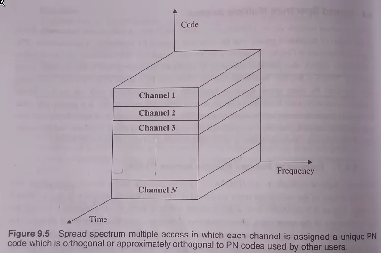
- Each user dwells at a specific narrowband channel at a particular instance of time, based on the particular PN code of the user.
- The digital data of each user is broken into uniform-sized bursts, which are transmitted on different channels within the allocated spectrum band.
- The instantaneous bandwidth of any one transmission burst is much smaller than the total spread bandwidth.
- The pseudo-random change of channel frequencies randomizes the occupancy of a specific channel at any given time, thereby allowing multiple access over a wide range of frequencies.
- In the FH receiver, a locally generated PN code is used to synchronize the receiver's instantaneous frequency with that of the transmitter.
- At any given point in time, a frequency-hopped signal only occupies a single, relatively narrow channel, since narrowband FM or FSK is used.
- The difference between FHMA and a traditional FDMA system is that the frequency-hopped signal changes channels at rapid intervals.

### Types of FHMA

- **Fast Frequency Hopping**: if the rate of change of the carrier frequency is greater than the symbol rate.
    - A fast frequency hopper may be thought of as an FDMA system which employs frequency diversity.
- **Slow Frequency Hopping**: if the channel changes at a rate less than or equal to the symbol rate.

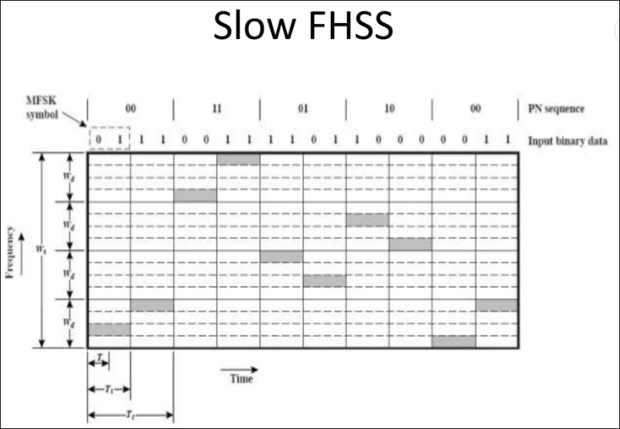

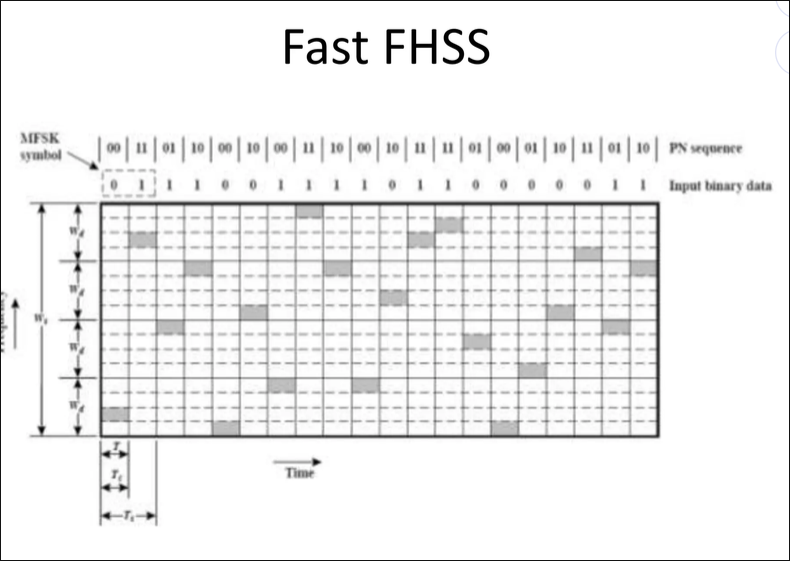

### Properties and Advantages

- FHMA systems often employ energy-efficient constant-envelope modulation.
- Inexpensive receivers may be built to provide non-coherent detection of FHMA
    - linearity is not an issue, and the power of multiple users at the receiver does not degrade FHMA performance.
- A frequency-hopped system provides a level of security, especially with a large number of channels, since an unintended (or intercepting) receiver that does not know the pseudo-random sequence of frequency slots must retune rapidly to search for the signal it wishes to intercept.
- The FH signal is somewhat immune to fading, since error control coding and interleaving can be used to protect the frequency-hopped signal against deep fades that occasionally occur during the hopping sequence.
- Error control coding and interleaving can also guard against **erasures**, which occur when two or more users transmit on the same channel at the same time.
- **Bluetooth** and **HomeRF** wireless technologies have adopted FHMA for power efficiency and low-cost implementation.

### FHSS as a Multiple Access Method

- FHSS is a method of transmitting radio signals by rapidly switching a carrier among many frequency channels, using a pseudorandom sequence known to both Tx and Rx.
- The data signal is modulated with a narrowband carrier signal that "hops" in a random but predictable sequence from frequency to frequency as a function of time over a wide band of frequencies.
- It is used as a multiple access method in the FH-CDMA scheme.
- Two types: Slow FHSS (S-FHSS) and Fast FHSS (F-FHSS), as described above.

**Uses**: Military communications, Bluetooth, Walkie-Talkie, other radios.

**Block diagram for transmission:**

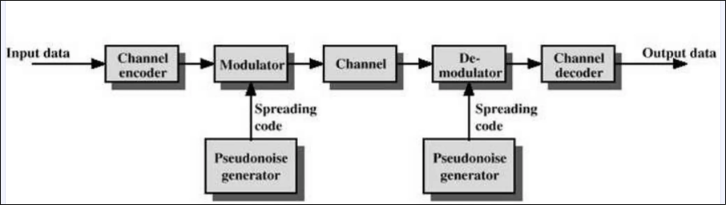

## The Near-Far Problem in CDMA

*(Frequently asked directly, and as a component of hybrid SSMA questions)*

- In CDMA, the power of multiple users at a receiver determines the noise floor after decorrelation.
- If the power of each user is not controlled, the **near-far problem** occurs.
- The near-far problem occurs when many mobile users share the same channel.
    - Since one transmission is another's noise, the SNR for the farther transmitter must be higher.
    - If the nearer transmitter's signal is orders of magnitude stronger, the farther transmitter's signal may fall below the required detection threshold, making it effectively undetectable, as though the farther transmitter were not transmitting at all.

### Problem Illustration

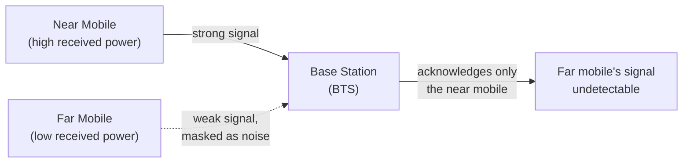

Illustrative Figure:

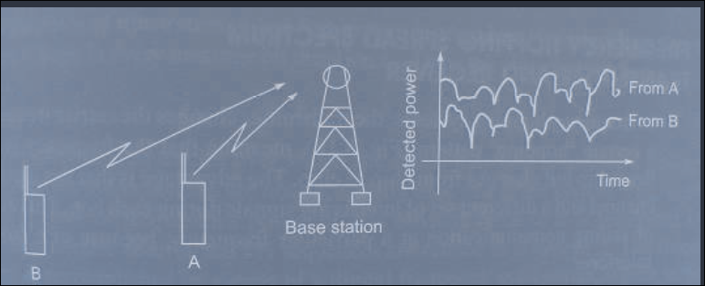

- With different transmitters at different distances, the BTS may fail to acknowledge the farther transmitter, since its signal is swamped by the near transmitter's stronger signal appearing as noise.

### Solution: Power Control Mechanism

- To overcome this problem, a **power control mechanism** is used.
- Power control is provided by each base station in a cellular system, and ensures that each mobile within the base station's coverage area delivers approximately the **same signal level** to the base station receiver, regardless of the mobile's actual distance from the BTS.
- In practice, this means:
    - Mobiles closer to the BTS are instructed to transmit at **lower power**.
    - Mobiles farther from the BTS are instructed to transmit at **higher power**.
    - The BTS continuously monitors received signal strength from each mobile and sends power-adjustment commands accordingly (closed-loop power control).
- This equalizes received power levels at the BTS across all users, preventing any single near user from dominating the noise floor and masking farther users.
- Beyond simple power control, **hybrid spread-spectrum multiple access techniques** (see below) also mitigate the near-far effect at a system-design level, e.g., DS/FH hybrid systems introduce frequency diversity so that not all interference sources fall on the same instantaneous channel, and TCDMA/TDFH restrict how many users can transmit simultaneously within a cell or slot, directly reducing near-far exposure.

---

# Hybrid Spread Spectrum Technologies

*(Frequently asked together with the near-far effect, "any two hybrid SSMA techniques that mitigate near-far", "hybrid multiple access +/-")*

- **Hybrid FDMA/CDMA**
    - This technique can be used as an alternative to DS-CDMA.
    - The available wideband spectrum is divided into a number of sub-spectra with smaller bandwidths.
    - Each of these smaller subchannels becomes a narrowband CDMA system, having a processing gain lower than the original CDMA system.
    - Different users can be allocated different sub-spectrum bandwidths depending on their requirements.
- Diagrammatic representation:
    - 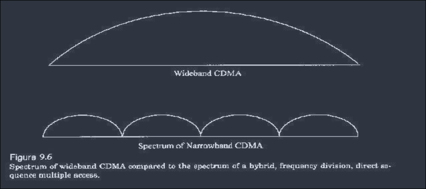

## Techniques

- **Hybrid Direct Sequence/Frequency Hopped (DS/FHMA)**
    - Consists of a direct-sequence modulated signal whose center frequency is made to hop periodically in a pseudorandom fashion.
    - Avoids the near-far problem, as frequency diversity is introduced.
    - Not adaptable to soft handoff, because the FH base station receivers are required to be synchronized to the multiple hopped signals.
    - Figure:
        - 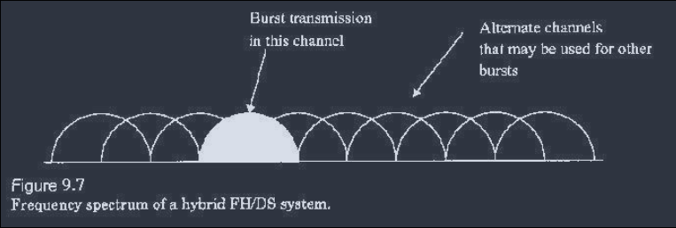
- **Time Division CDMA (TCDMA)**
    - Different spreading codes are assigned to different cells.
    - Only one user per cell is allotted a particular time slot.
    - It avoids the near-far effect, since only one user transmits at a time within a cell.
    - When a handoff takes place, the spreading code of the user is changed to that of the new cell.
- **Time Division Frequency Hopping (TDFH)**
    - The subscriber can hop to a new frequency at the start of a new TDMA frame, thus avoiding severe deep frequency-selective fading or co-channel interference.
    - The mobile subscriber can hop to a new frequency at the beginning of every TDMA frame.
    - At each time slot, the mobile subscriber is hopped to a new frequency according to a pseudo-random hopping sequence.

---

# 7.4 Space Division Multiple Access (SDMA)

- Controls the radiated energy for each user in space.
- That is, it serves different users by using **spot beam antennas**.
- The areas covered by the antenna beam may be served by the same frequency (in a TDMA or CDMA system) or different frequencies (in an FDMA system).
- Sectorized antennas are a primitive application of SDMA.
- Figure:
    - 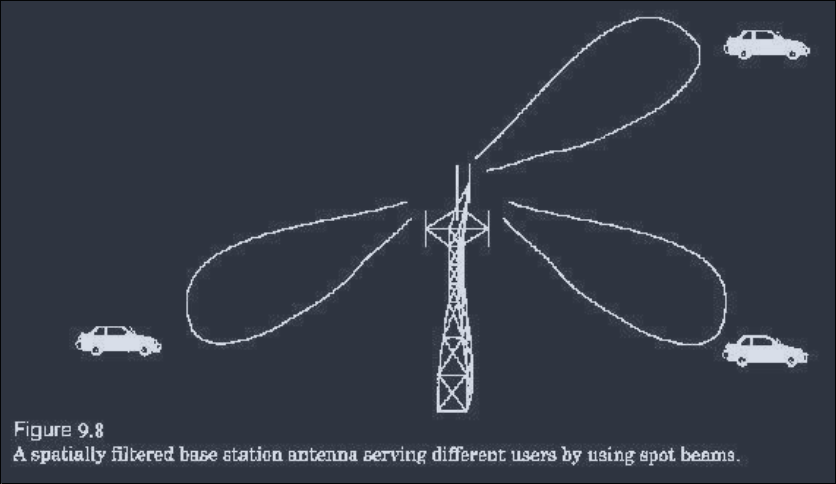

---

# 7.5 Multiple Access Comparison

*(Frequently asked directly: "Define multiple access; explain TDMA, CDMA and SDMA", "FDMA vs TDMA vs CDMA (+/-)", "merits and demerits of CDMA")*

## Duplexing Types (Recap)

- **FDD (Frequency Division Duplex)**: separate frequency bands are used for the forward (downlink) and reverse (uplink) channels, allowing simultaneous transmission and reception.
- **TDD (Time Division Duplex)**: a single frequency channel is shared in time between forward and reverse transmission
    - only one direction is active at a time, but switching is fast enough to appear simultaneous.
- Multiple access schemes (FDMA, TDMA, CDMA, SDMA) can be combined with either FDD or TDD.

## FDMA vs TDMA vs CDMA vs SDMA

| Aspect | FDMA | TDMA | CDMA | SDMA |
|---|---|---|---|---|
| Channel separation basis | Frequency | Time | Code (spreading sequence) | Space (spatial/beam direction) |
| Bandwidth per user | Narrowband, dedicated frequency slot | Shares one carrier via time slots | Shares entire bandwidth simultaneously via unique codes | Reuses same time/frequency/code via directional beams |
| Duplexer requirement | Required (Tx/Rx operate simultaneously) | Not required (different time slots for Tx/Rx) | Depends on implementation (often FDD or TDD combined with CDMA) | Depends on underlying access scheme used within each beam |
| Equalization need | Little to none (narrowband, low ISI) | Usually necessary (high data rate, more ISI) | Not typically needed in the traditional sense; RAKE receiver instead handles multipath | Depends on underlying access scheme |
| Capacity limit | Hard limit (fixed number of channels) | Hard limit (fixed number of slots) | Soft limit (capacity degrades gracefully as users increase, raising noise floor) | Increases capacity of underlying scheme via spatial reuse |
| Interference type of concern | Adjacent channel interference | Inter-slot interference minimized by guard time; co-channel interference between cells | Self-jamming (imperfect code orthogonality) and near-far problem | Beam overlap / imperfect spatial isolation |
| Handoff complexity | Frequency retuning at handoff | Simpler: MAHO possible via idle slot monitoring | Soft handoff possible: MSC selects best signal without switching codes/frequencies | Depends on underlying access scheme; beam-switching adds complexity |
| Typical example systems | AMPS | GSM, IS-136 | IS-95 (cdmaOne), UMTS/WCDMA | Used in conjunction with FDMA/TDMA/CDMA (e.g. smart antenna systems) |

## Merits and Demerits of CDMA

*(Frequently asked directly, sometimes as a standalone "merits and demerits" question)*

**Merits:**
- Soft capacity limit:
    - no hard cutoff on number of users; graceful degradation.
- Inherent resistance to multipath fading via frequency diversity and RAKE receiver exploitation.
- High level of security, since only a receiver with the correct PN code can recover the signal.
- Soft handoff capability improves call continuity at cell boundaries.
- Efficient spectrum utilization through universal frequency reuse (same frequency in every cell).

**Demerits:**
- Self-jamming due to imperfect orthogonality between users' spreading codes.
- Susceptible to the near-far problem, requiring tight and continuous power control.
- Higher receiver complexity (RAKE receiver, power control loops, code synchronization).
- Requires accurate synchronization and time-stamping of transmitted signals.

---

# Additional Info (Numericals to be revisited)

The following numerical problem types are frequently asked from this chapter but are deferred here per current study focus (theory-first). Revisit once theory is locked in:

- Number of channels available in an FDMA system given total spectrum, guard band, and channel bandwidth.
- Number of simultaneously transmitting users in an N-TDMA system given one-way bandwidth, channel bandwidth, and guard bands.
- GSM frame efficiency calculation given trailing bits, guard bits, training bits, and traffic burst sizes.
