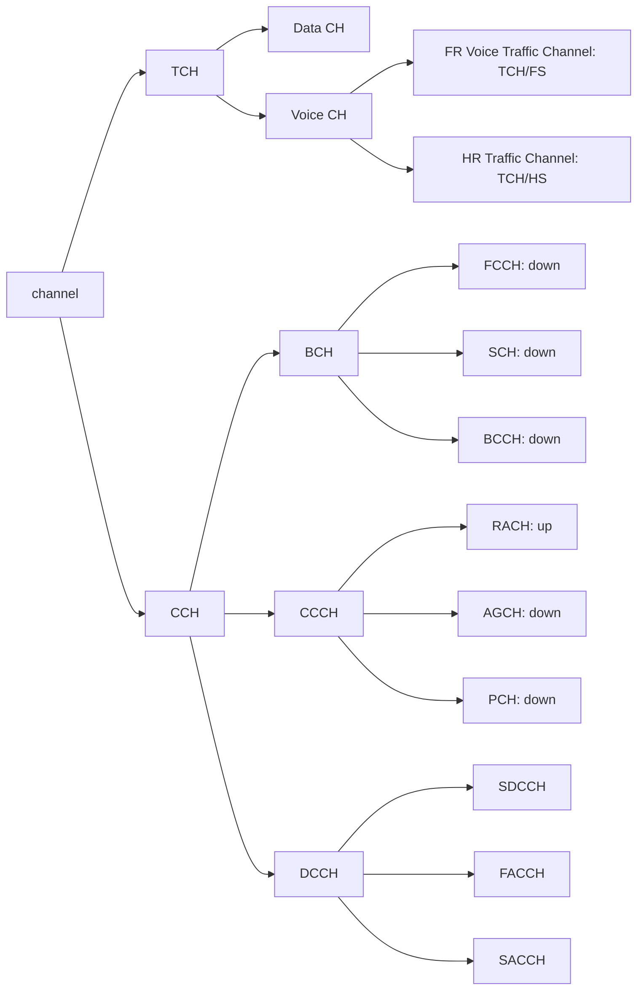

| Topic | Typical Marks | Frequency |
|---|---|---|
| GSM architecture: draw & explain (BSS, NSS, OSS) | 4–8 | Very High |
| GSM traffic & control channels | 4–8 | Very High |
| GSM frame structure / channel structure / frame hierarchy | 4–8 | High |
| Components of Network Switching Subsystem (HLR/VLR/AUC/EIR) | 4 | Moderate–High |
| Speech-to-radio signal processing operations in GSM | 8 | Moderate–High |
| BCH and CCCH in GSM | 4–5 | Moderate |
| Forward CDMA (IS-95) channel, draw & explain | 4–6 | High |
| Reverse CDMA (IS-95) channel, draw & explain | 4 | Moderate |
| Pilot and sync channels in IS-95 forward link | 6 | Moderate |
| GSM vs CDMA standards | 3–4 | Moderate |
| CDMA vs LTE system architecture; functions of entities | 8 | Low–Moderate |
| WiMAX | 3–5 | Moderate |
| LTE | 3 | Low–Moderate |
| Regulatory issues (spectrum allocation, licensing, tariffs) | 4–5 | Moderate |
| Significance of spectrum management; regulatory functions | 2–5 | Moderate |

**Reading tip:** GSM architecture and its traffic/control channel structure are the two highest-yield topics in the entire syllabus, nearly every year, often with a full frame-hierarchy diagram. IS-95 forward/reverse channel diagrams are the next tier. WiMAX theory is more heavily tested than LTE.

---

# 8.1 GSM: Architecture and Channels

## GSM System Overview

- Global System for Mobile Communications (GSM), introduced in 1991, was developed to solve the fragmentation problems of the first cellular systems in Europe.
- GSM standards were set by **ETSI** (European Telecommunication Standards Institute).
- **Services**:
    - Telephone services
    - Data services
    - Short message paging

## System Architecture

*(Frequently asked directly: "GSM architecture: draw & explain")*

- Three major subsystems:
    - Base Station Subsystem (BSS)
    - Network Switching Subsystem (NSS)
    - Public Networks
- Figure illustrating such networks:
    - 

### Radio Subsystem (Base Station Subsystem: BSS)

- Consists of Mobile Stations (MS), Base Transceiver Station (BTS), and the Base Station Controller (BSC).
- The mobile station contains **IMEI** (International Mobile Equipment Identity).
- The **IMSI** (International Mobile Subscriber Identity) is stored in the Subscriber Identity Module (SIM), the HLR, and the VLR database.
    - The IMSI is a unique identity used internationally and within the network to identify mobile subscribers.
- BSS provides and manages radio transmission paths between the MS and MSC.
- One BSC controls up to several BTSs.
- The BSC performs handover for MS under the control of the same BSC.

### Network and Switching Subsystem (NSS)

*(Frequently asked directly: "Components of the Network Switching Subsystem")*

- Consists of MSCs, Visitor Location Register (VLR), Home Location Register (HLR), Authentication Center (AUC), and Equipment Identity Register (EIR).
- Performs switching of GSM calls between external networks and the BSCs.
- **HLR**: contains subscriber information (IMSI) and location information for each user who resides in the same city as the MSC.
- **VLR**: temporarily stores the IMSI and customer information for each roaming subscriber visiting the coverage area of a particular MSC.
    - Once a roaming mobile is logged in the VLR, the MSC sends the necessary information to the visiting subscriber's HLR, so that calls to the roaming mobile can be appropriately routed over the PSTN by the roaming user's HLR.
- **AUC**: a strongly protected database which handles the authentication and encryption keys for every single subscriber in the HLR and VLR.
- **EIR**: when mobile equipment is stolen or lost, the owner can typically contact their local operator with a request that it be blocked.
    - If the local operator possesses an Equipment Identity Register (EIR), it puts the IMEI (accessed via `*#06#`) into it, and can optionally communicate this to the Central Equipment Identity Register (CEIR), which blacklists the device across all other operator switches that use the CEIR.

### Operation Support Subsystem (OSS)

- Supports the operation and maintenance of GSM, allowing system engineers to monitor, diagnose, and troubleshoot all aspects of the GSM system.
- Interacts with the other GSM subsystems.
- Handles charging and billing.

### Interfaces

## GSM Air Interface Specification Summary

| Parameter | Specification |
| --- | --- |
| Reverse channel frequency | 890–915 MHz |
| Forward channel frequency | 935–960 MHz |
| ARFCN Number | 0–124 and 975–1023 |
| Tx/Rx Frequency Spacing | 45 MHz |
| Tx/Rx Timeslot Spacing | 3 time slots |
| Modulation Data rate | 270.8333 kbps |
| Frame period | 4.615 ms |
| Users per frame (full rate) | 8 |
| Time slot period | 576.9 μs |
| Bit period | 3.692 μs |
| Modulation | 0.3 GMSK |
| ARFCN channel spacing | 200 kHz |
| Interleaving (max. delay) | 40 ms |
| Voice coder bit rate | 13.4 kbps |

## Frequency Domain

- The frequency band for uplink (reverse) is 890–915 MHz; downlink (forward) is 935–960 MHz.
- The bandwidth for the GSM system is 25 MHz, providing 125 carriers uplink/downlink, each with a bandwidth of 200 kHz.
    - The **ARFCN** (Absolute Radio Frequency Channel Number) denotes a forward and reverse channel pair, separated in frequency by 45 MHz.
- In practical implementations, a guard band of 100 kHz is provided at the upper and lower ends of the GSM spectrum, and only 124 (duplex) channels are implemented.
- There are a total of eight channels per carrier.
    - Every eighth timeslot on a TDMA channel, the user transmits or receives information.
- A second frequency band from 1710–1785 MHz and 1805–1880 MHz (three times as much as the primary 900 MHz) is also specified in 1900, a total of 374 duplex channels, **DCS 1800**.

## Time Domain

- The RF carrier channel is time-division multiple-accessed by users at different locations within a cell site.
- Frame duration is 4.615 ms, and each frame consists of 8 time-slots.
- Each time-slot is a traffic channel with a duration of 0.577 ms.

## Multiframe

- **26-frame multiframe** (traffic or speech): Traffic Channel (TCH), Slow Associated Control Channel (SACCH), Fast Associated Control Channel (FACCH).
- **51-frame multiframe** (control): Broadcast Common Control (BCCH), Stand Alone Dedicated Control Channels.
- **Superframe**: 51 traffic multiframes or 26 control multiframes.
- **Hyperframe**: 2048 superframes (3 hrs 28 min 52.76s), to support encryption with high security and frequency hopping.

## Timeslot and Frame Structure

*(Frequently asked directly: "GSM frame hierarchy")*

## Physical Channel & Logical Channel

- **Physical Channel**: specified by ARFCN and TN (time slot Number).
- **Logical Channel**: mapped onto the physical channel, e.g., TCHs and control channels.

<table>
    <tr>
        <th colspan="5">Logical channels
    </tr>
    <tr>
        <th colspan="2">Traffic channels (TCH) BTS &lt;-&gt; MS</th>
        <th colspan="3">Control Channels (CCHs)</th>
    </tr>
    <tr>
        <td>FEC-coded speech
        <td>FEC-coded data
        <td>BCHs BTS -&gt; MS
        <td>CCCHs
        <td>DCCHs BTS &lt;-&gt; MS
    </tr>
    <tr>
        <td>TCH/FS 22.8 kbps
        <td>TCH/F9.6 TCH/F4.8 TCH/F2.4 22.8 kbps
        <td>BCCH
        <td>PCH BTS -&gt; MS
        <td> SDCCH
    </tr>
    <tr>
        <td rowspan="2">TCH/HS 11.4 kbps
        <td rowspan="2">TCH/H4.8 TCH/H2.4 11.4 kbps
        <td>FCCH
        <td>RACH BTS &lt;- MS
        <td>SACCH
    </tr>
    <tr>
        <td>SCH
        <td>AGCH BTS -&gt; MS
        <td>FACCH
    </tr>
</table>

## Channel Type Overview

*(Frequently asked directly: "GSM traffic & control channels")*

### Traffic Channel (TCH)

- Traffic Channels carry digitally encoded user speech or user data.
    - Have identical functions and formats on both the forward and reverse link.
- **Full rate**: user data is contained within one TS per frame.
- **Half rate**: user data is mapped onto the same time slot but is sent in alternate frames.

### Traffic or Speech Multiframe

### Control Multiframe

### Control (Signaling) Channels

*(Frequently asked directly: "BCH and CCCH in GSM", "Broadcast Control Channel")*

- **Broadcast Channel (BCH)**
    - Used by the base station to provide the mobile station with sufficient information needed to synchronize with the network.
    - Three types can be distinguished:
        - **Broadcast Control Channel (BCCH)**: gives the mobile station the parameters needed to identify and access the network; broadcasts cell and network information; list of channels in use.
        - **Frequency Correction Channel (FCCH)**: occupies TS0 of first frame, repeated every 10th frame within a control channel multiframe; synchronization of the local RF oscillator to the base station oscillator.
        - **Synchronization Channel (SCH)**: broadcast in TS0 immediately following an FCCH frame; allows for frame synchronization; base station issues timing advancement commands.
- **Common Control Channel (CCCH)**
    - Helps establish calls from the mobile station or the network.
    - Occupies TS0 of every control frame not used by BCH or the Idle Frame.
    - Three types:
        - **Paging Channel (PCH)**: provides paging signals from base to mobiles; notifies specific mobile of incoming call.
        - **Random Access Channel (RACH)**: uplink channel; used by mobiles to acknowledge a page from PCH; used by mobiles to originate a call.
        - **Access Grant Channel (AGCH)**: used by the base station to inform the mobile station about which channel it should use; this is the base station's answer to a RACH from the mobile station; specifies time slot, radio channel, and dedicated control channel; is the final CCCH message before the mobile is moved off the control channel.
- **Dedicated Control Channel (DCCH)**
    - Bi-directional channels with the same format and function on uplink and downlink.
    - May exist in any time slot and on any radio channel except TS0 of the control radio channel.
    - **Stand-Alone Dedicated Control Channel (SDCCH)**: carries signaling data following the connection of the mobile with the BS; intermediate and temporary channel for mobiles while waiting for the BS to allocate a TCH channel; ensures mobile and base remain connected during authentication and resource allocation; may be assigned their own physical channel or occupy TS0 of the BCH if there is low demand for BCH/CCCH traffic.

### Associated Control Channel

- **Slow Associated Control Channel (SACCH)**
    - Always associated with a traffic channel.
    - On downlink, the SACCH carries power control and timing advance instructions.
    - On uplink, the SACCH carries signal strength and quality information.
    - SACCH is allocated every 13th frame of a traffic channel.
- **Fast Associated Control Channel (FACCH)**
    - Carries urgent messages to the mobile, e.g., handover.
    - FACCH gains access by stealing frames from TCH (e.g., data transmission slots are stolen).

### Location Updating Communication

| System Activity | Channel | Mobile Activity |
| --- | --- | --- |
| System overhead parameters and other overhead messages | BCCH→ | Mobile switched on, searches for base channel and synchronizes. Monitors BCCH for current location |
| Receive channel request | ←RACH | If current location different from that stored in SIM, generate a channel request |
| Assign stand-alone dedicated control channel | AGCH→ | Receive stand-alone dedicated control channel assignment and store in memory |
| Receive location updating request | ←SDCCH | Request for location updating (registering) |
| Request authentication from mobile | SDCCH→ | Receive authentication request |
| Receive and check authentication | ←SDCCH | Authenticator response |
| Request mobile to transmit in ciphered mode | SDCCH→ | Receive request and switch to ciphered mode |
| Receive acknowledgement | ←SDCCH | Acknowledge cipher mode request |
| Confirm location updating including the optional assignment of temporary identity (TMSI) | SDCCH→ | Receive location updating including TMSI and store in SIM |
| Receive acknowledgement | ←SDCCH | Acknowledge new location and TMSI |
| Send channel release | SDCCH→ | Switch to idle update mode, monitor BCCH and CCCH |

### Time Slot Bursts

- Time slot data bursts take on one of 5 formats according to the logical channel.
- A normal burst consists of 148 bits.
- Guard time of 8.25 bits allows for information overlap.
- Two batches of 57 bits are information bits.
- 26 training bits for equalization.
- Two stealing bits for FACCH.

## Example of a GSM Call

- By receiving the FCCH, SCH, and BCCH messages, the MS locks on to the appropriate BCH.
- To originate a call, the MS transmits a burst of RACH data, using the same ARFCN as the base station to which it is locked.
- The base station responds with an AGCH message on the CCCH, which assigns the MS to a new channel for SDCCH connection.
- The MS, monitoring slot 0 of the BCH, receives its ARFCN and slot assignment (for SDCCH) from the AGCH and immediately tunes to SDCCH.
- Upon receiving the timing advance and power level command over the SDCCH, the MS is ready to transmit normal bursts as required for speech traffic.
- SDCCH sends messages between MS and base station for authentication, while the PSTN connects the dialed party to the MSC, and the MSC switches the speech path to the serving base station.
- The MS is then commanded by the base station via SDCCH to tune to a new ARFCN and new slot for TCH assignment.
- Once tuned to the TCH, speech data is transferred in both directions, and the SDCCH is vacated.

## Signal Processing in GSM

*(Frequently asked directly: "Basic signal processing operations to convert a speech signal into a radio signal and back")*

### Speech Coding

- The GSM speech coder is based on the **Residually Excited Linear Predictor (RELP)**, enhanced by a **Long Term Predictor (LTP)**.
- The coder provides 260 speech codec bits for each 20 ms, i.e., the speech codec bit rate is 13 kbps.
- This speech coder was selected after extensive subjective evaluation of various candidate coders available in the late 1980s.
- Provisions for incorporating half-rate coders are included in the specifications (half-rate codec works at 6.5 kbps).
- The GSM speech coder takes advantage of the fact that, in a normal conversation, each person on average talks for less than 40% of the time.
- By incorporating a Voice Activity Detector (VAD) in the speech coder, GSM systems operate in a Discontinuous Transmission mode (DTX), which provides longer subscriber battery life and reduces instantaneous radio interference, since the GSM transmitter is not active during silent periods.
- A Comfort Noise Sub-system (CNS) at the receiving end introduces background acoustic noise to compensate for the annoying switched muting that occurs due to DTX.

### TCH/FS, SACCH, and FACCH Channel Coding

- The output bits of the speech coder are ordered into groups for error protection, based on their significance in contributing to speech quality.
- Out of the total 260 bits in a frame, the most important 50 bits, called **type Ia** bits, have 3 parity check (CRC) bits added to them.
    - This facilitates detection of non-correctable errors at the receiver.
- The next 132 bits, along with the first 53 (50 type Ia + 3 parity bits), are reordered and appended by four trailing zero bits, providing a data block of 189 bits.
- This block is encoded for error protection using a rate 1/2 convolutional encoder with constraint length K = 5, providing a sequence of 378 bits.
- The least important 78 bits do not have any error protection and are concatenated to the existing sequence to form a block of 456 bits in a 20 ms frame.
- This error protection coding scheme increases the gross data rate of the GSM speech signal, with channel coding, to 22.8 kbps.

### Channel Coding for Data Channels

- The coding provided for GSM full-rate data channels (TCH/F9.6) is based on handling 60 bits of user data at 5 ms intervals, in accordance with the modified CCITT V.110 modem standard.
- 240 bits of user data, with four trailing bits, are applied to a half-rate punctured convolutional coder with constraint length K = 5.
- The resulting 488 coded bits are reduced to 456 encoded data bits through puncturing (32 bits are not transmitted); the data is separated into four 114-bit data bursts applied in an interleaved fashion to consecutive time slots.

### Channel Coding for Control Channels

- GSM control channel messages are defined to be 184 bits long, and are encoded using a shortened binary cyclic **fire code**, followed by a half-rate convolutional coder.
- The fire code uses the generator polynomial:
    $$G_5(x) = (x^{23} + 1) (x^{17} + x^{3} + 1) = x^{40} + x^{26} + x^{23} + x^{17} + x^{3} + 1 $$
    which produces 184 message bits, followed by 40 parity bits.
- Four tail bits are added to clear the convolutional coder which follows, yielding a 228-bit data block.
- This block is applied to a half-rate K = 5 convolutional code using generator polynomials $G_0 = 1 + x^3 +x^4$ and $G_1 = 1 + x + x^3 + x^4$ (the same polynomials used to code TCH type Ia data bits).
- The resulting 456 encoded bits are interleaved onto eight consecutive frames in the same manner as TCH speech data.

### Interleaving

- To minimize the effect of sudden fades on the received data, the total of 456 encoded bits within each 20 ms speech frame or control message frame are broken into eight 57-bit sub-blocks.
- These 8 sub-blocks, which make up a single speech frame, are spread over eight consecutive TCH time slots (i.e., eight consecutive frames for a specific TS).
- If a burst is lost due to interference or fading, interleaved data helps spread the effect over a few error-correction frames, channel coding then ensures enough bits are still received correctly.
- Each TCH time slot carries two 57-bit blocks of data from two different 20 ms (456 bit) speech (or control) segments.
- TS 0 contains 57 bits of data from the 0th sub-block of the $n^{th}$ speech coder frame, and 57 bits of data from the 4th sub-block of the $(n-1)^{th}$ speech coder frame.

### Ciphering

- Ciphering modifies the contents of eight interleaved blocks through encryption techniques known only to the particular mobile station and base transceiver station.
- Security is further enhanced by the fact that the encryption algorithm changes from call to call.
- Two types of ciphering algorithms, called **A3** and **A5**, are used in GSM to prevent unauthorized network access and provide privacy for the radio transmission, respectively.
    - The **A3** algorithm authenticates each mobile by verifying the user's passcode within the SIM against the cryptographic key at the MSC.
    - The **A5** algorithm provides the scrambling for the 114 coded data bits sent in each TS.

### Burst Formatting

- Burst formatting adds binary data to the ciphered blocks to help with synchronization and equalization of the received signal.

### Modulation

- The modulation scheme used in GSM is **0.3 GMSK**, where 0.3 describes the 3 dB bandwidth of the Gaussian pulse-shaping filter with relation to the bit rate (i.e., BT = 0.3).
- GMSK is a special type of digital FM modulation.
- Binary ones and zeros are represented in GSM by shifting the RF carrier by ±67.708 kHz.
- The channel data rate reduces the bandwidth occupied by the modulation spectrum and hence improves channel capacity.
- The MSK-modulated signal is passed through a Gaussian filter to smooth the rapid frequency transitions, which would otherwise spread energy into adjacent channels.

### Frequency Hopping

- Under normal conditions, each data burst belonging to a particular physical channel is transmitted using the same carrier frequency.
- If users in a particular cell have severe multipath problems, the cell may be defined as a hopping cell by the network operator, in which case slow frequency hopping may be implemented to combat multipath or interference effects in that cell.
- Frequency hopping is carried out on a frame-by-frame basis, thus hopping occurs at a maximum rate of ~217.6 hops per second (1/0.004615 frame rate).
- As many as 64 different channels may be used before a hopping sequence is repeated.
- Frequency hopping is completely specified by the service provider.

### Equalization

- Equalization is performed at the receiver with the help of the training sequences transmitted in the midamble of every time slot.
- The type of equalizer for GSM is not specified and is left up to the manufacturer.

### Demodulation

- The portion of the transmitted forward channel signal of interest to a particular user is determined by the assigned TS and ARFCN.
- The appropriate TS is demodulated with the aid of synchronization data provided by the burst formatting.
- After demodulation, binary information is deciphered, de-interleaved, channel decoded, and speech decoded.

## Apparent Bandwidth Efficiency (Quick Reference)

- GSM bit rate = 270.83 kbps, bandwidth = 200 kHz → bandwidth efficiency = 1.354 bits/Hz.
- The speech codec rate for each time slot = 456 bits/20 ms = 22.8 kbps.
- Each voice channel is actually allocated 270.83/8 = 33.854 kbps.
- Number of bits/slot = 33.854 × 4.615 ≈ 156.25 bits (148 + 8.25 guard time).
- For each TDMA slot in each frame, 114 bits are transmitted, and only 24 data frames per 26 frames are transmitting; therefore, vocoder output rate = (114/0.004615) × (24/26) = 22.8 kbps.
- However, of the 114 bits in a slot, only 65 are raw speech codec bits:
    - raw data rate = 22.8 × 65/114 = 13 kbps (65 bits in 20 ms = 13 kbps).

---

# 8.2 CDMA Standards: IS-95 Forward and Reverse Channels

## Overview

- A US standard based on technology developed by Qualcomm.
- FDD using two 1.25 MHz simplex channels separated by 45 MHz.
- Uplink: 824 MHz – 849 MHz.
- Downlink: 869 MHz – 894 MHz.
- CDMA allows users within a cell and users in adjacent cells to use the same radio channel, no frequency planning is needed.

## Forward CDMA Channel

*(Frequently asked directly: "Draw the forward CDMA (IS-95) channel", "Pilot and sync channels in the IS-95 forward link")*

- Sixty-four 64-bit Walsh codes are used to provide 64 channels via spreading within a 1.25 MHz forward link.
- Comprises the following channels:
    1. **Pilot Channel (W0)**: timing acquisition, phase reference, signal strength measurement for handoff.
    2. **Synchronization Channel (W32)**: broadcasts synchronization messages.
    3. **Paging Channels (W1–W7)**: control information and paging messages.
    4. **Forward Traffic Channels**: user data and signaling (including power control commands).
- Figure:
    - 
- A long PN code (42 bits) is used for data scrambling or encryption.
- To avoid the near-far problem and achieve maximum efficiency, power control is very important to CDMA systems:
    - **Open loop power control**: the mobile measures the strength of the pilot signal and adjusts its power based on it.
    - **Closed loop power control**: the base station monitors received power from all mobiles and sends power control commands to each mobile.
- Each data symbol is spread by 64 chips of a user-specific Walsh code, known as **Walsh Covering**.
- The signal is fed into the I and Q channels and spread by a pair of short PN codes (15 bit).
    - This is used for cell identification, as each cell uses one of 512 possible phase offsets of the short PN codes.

## Reverse CDMA Channel

*(Frequently asked directly: "Draw the reverse CDMA (IS-95) channel")*

- The same long PN code is used to provide channels via spreading code within a 1.25 MHz reverse link.
- The long code can also provide encryption if needed.
- The reverse link comprises the following channels:
    - **Access Channels**: for the mobile to initiate a call and to respond to paging channel messages.
    - **Reverse Traffic Channels**: user data and signaling data.
- Figure:
    - 
- Data in each 20 ms frame is divided into 16 Power Control Groups (PCG), each with a period of 1.25 ms.
- Some PCGs are gated-ON while others are gated-OFF while passing through the Data Burst Randomizer.
- The major difference between forward/reverse channels is that the reverse traffic channel contains a **data burst randomizer**.
- The orthogonally modulated data is fed into the data burst randomizer.
- The function of the data burst randomizer is to take advantage of the voice activity factor on the reverse link.
- The forward link uses a different scheme to take advantage of the voice activity factor:
    - When the vocoder operates at a lower rate, the forward link transmits repeated symbols at reduced energy per symbol, thereby reducing forward-link power during any given period.
- EIRP (Gate-OFF) = EIRP(Gate-ON) − 20 dB, or Noise floor level, whichever is lower.
- If the user data rate is 9600 bps, transmission occurs on all 16 PCGs.
- If user data rate is 4800 bps, transmission occurs on 8 PCGs.
- If user data rate is 2400 bps, transmission occurs on 4 PCGs.
- If user data rate is 1200 bps, transmission occurs on 2 PCGs.

## GSM vs CDMA Standards

*(Frequently asked directly: "GSM Vs CDMA standards")*

| Aspect | GSM | CDMA (IS-95) |
|---|---|---|
| Multiple access technique | TDMA/FDD | CDMA/FDD |
| Channel bandwidth | 200 kHz per carrier | 1.25 MHz per carrier |
| Frequency reuse | Requires careful frequency planning (cluster-based reuse, N > 1) | Universal frequency reuse: same frequency in every cell, no frequency planning needed |
| Capacity limit | Hard limit (fixed number of time slots/channels) | Soft limit (capacity degrades gracefully as users increase, raising the noise floor) |
| Handoff type | Hard handoff ("break before make") | Soft handoff ("make before break"), assisted by the pilot channel |
| Voice coding | RELP-LTP based, 13 kbps full rate | Variable rate vocoders (e.g. CELP/EVRC), adapts to voice activity |
| Security | Ciphering via A3/A5 algorithms | Inherent security from spread-spectrum PN coding, plus long-code scrambling |
| Power control | Not as central a requirement | Central and critical: near-far problem must be actively managed via open/closed loop power control |
| Speech/channel coding | Convolutional coding with fire code (control) and rate-1/2 convolutional coding (speech) | Convolutional coding with Walsh code spreading for channelization |

## CDMA vs LTE System Architecture; Functions of the Entities

*(Directly asked: "CDMA Vs LTE system architecture; functions of the entities")*

| Aspect | CDMA (IS-95) System Architecture | LTE (E-UTRAN/EPC) System Architecture |
|---|---|---|
| Core switching philosophy | Primarily circuit-switched (voice-centric), with data support added via later revisions | Purely packet-switched: designed from the ground up for all-IP services |
| Radio access network | Base Transceiver Station (BTS) + Base Station Controller (BSC): two-node hierarchy | Evolved Node B (eNodeB / eNB): single-node radio access, simplifying the architecture |
| Core network entities | MSC (mobile switching), HLR/VLR (subscriber/location data), AUC (authentication) | Serving Gateway (SGW), Mobility Management Entity (MME), Packet Data Network Gateway (PDN GW) |
| Mobility management | Handled by MSC and BSC coordination, using HLR/VLR lookups | Handled by the MME: tracks idle-mode UEs, manages paging, and coordinates handovers |
| Data path / user-plane anchor | MSC connects calls to the PSTN; data handled less natively | SGW routes/forwards user data packets and acts as the mobility anchor during inter-eNB handovers |
| External network gateway | MSC (voice) with limited data gateway support | PDN GW: the single point of entry/exit for all UE traffic to external packet networks |
| Multiple access scheme | CDMA (code-division) | OFDMA (downlink) / SC-FDMA (uplink) |
| Overall architecture complexity | More layered/hierarchical, circuit-switched legacy elements remain | Flatter, simpler, IP-centric architecture ("System Architecture Evolution": SAE) |

### Functions of Key LTE Entities (for reference)

1. **Evolved Radio Access Network (E-UTRAN)**: consists of a single node type, the eNodeB (eNB), which interfaces directly with the User Equipment (UE).
2. **Serving Gateway (SGW)**: routes and forwards user data packets, while acting as the mobility anchor for the user plane during inter-eNB handovers, and as the anchor for mobility between LTE and other 3GPP technologies.
3. **Mobility Management Entity (MME)**: the key control-node for the LTE access network,
    - responsible for idle-mode UE tracking and paging (including retransmissions)
    - involved in bearer activation/deactivation
    - also responsible for choosing the SGW for a UE at initial attach and at intra-LTE handover involving Core Network (CN) node reallocation.
4. **Packet Data Network Gateway (PDN GW)**: provides connectivity from the UE to external packet data networks, acting as the point of exit and entry of traffic for the UE.

---

# 8.3 WiFi, WiMAX, LTE and Recent Trends

## WiFi

- WiFi stands for **Wireless Fidelity**.
- Based on the IEEE 802.11 family of standards; primarily a LAN technology designed to provide in-building broadband coverage.
- Current WiFi systems based on IEEE 802.11 a/g support a peak physical-layer data rate of 54 Mbps and typically provide indoor coverage over a distance of 100 feet.
- WiFi has become the de facto standard for last-feet broadband connectivity in homes, offices, and public hotspot locations.
- Systems can typically provide a coverage range of only about 1000 feet from the access point.
- WiFi offers remarkably higher peak data rates than 3G systems, primarily because it operates over a larger 20 MHz bandwidth, but WiFi systems are not designed to support high-speed mobility.

### Three Most Important Items for WiFi Operation

- Radio Signals
- WiFi card, which fits in a laptop/computer
- Hotspots, which create the WiFi network

Figure:

#### Radio Signals

- Radio signals make WiFi networking possible.
- These signals, transmitted from WiFi antennas, are picked up by WiFi receivers such as computers or cell phones equipped with their own WiFi cards.
- Whenever a computer receives any of the signals within range of a WiFi network usually 300–500 feet for antennas
    - the WiFi card reads the signals and creates an internet connection between the user and the network, without the use of a cord.
- Access points, which consist of antennas and routers, are the main source that transmits and receives radio waves.

#### WiFi Cards

- Can be thought of as an "invisible cable" that connects a computer to the antenna for a direct connection to the internet.
- Can be external or internal, e.g., onboard built-in card, USB dongle, PCMCIA card, etc.

#### WiFi Hotspots

- A WiFi hotspot is created by installing an access point at an internet connection.
- The access point transmits a wireless signal over a short distance, typically around 300 feet.
- When a WiFi-enabled device (such as a Pocket PC) encounters a hotspot, the device can then connect to that network wirelessly.

#### Security Features

- Wired Equivalent Privacy (WEP)
- WiFi Protected Access (WPA)
- IEEE 802.11i/WPA2

## WiMAX

*(Frequently asked directly, moderately weighted 3–5 marks)*

- WiMAX (**Worldwide Interoperability for Microwave Access**) is a standardized wireless version of Ethernet, intended primarily as an alternative to wired technologies (Cable Modems, DSL, T1/E1 links) for providing broadband access to customer premises.
- Operates similarly to WiFi, but at higher speeds, over greater distances, and for a greater number of users.
- Has the ability to provide service even in areas that are difficult for wired infrastructure to reach, overcoming the physical limitations of traditional wired infrastructure.
- Based on Wireless MAN technology.
- A wireless technology optimized for the delivery of IP-centric services over a wide area.
- A scalable wireless platform for constructing alternative and complementary broadband networks.
- A certification that denotes the interoperability of equipment built to the IEEE 802.16 (or compatible) standard.
- The IEEE 802.16 working group develops standards that address two usage models:
    - A fixed usage model (IEEE 802.16-2004)
    - A portable usage model (IEEE 802.16e)
- The 802.16a standard for 2–11 GHz is a wireless MAN technology providing broadband wireless to fixed, portable, and nomadic devices.
- Can be used to connect 802.11 hotspots to the Internet, provide campus connectivity, and serve as a wireless alternative to cable/DSL for last-mile broadband access.

### Features of WiMAX

1. **OFDM-based physical layer**
    - The WiMAX PHY is based on Orthogonal Frequency Division Multiplexing, a scheme offering good resistance to multipath and allowing WiMAX to operate in NLOS (non-line-of-sight) conditions.
2. **Very high peak data rates**
    - Peak PHY data rate can be as high as 74 Mbps when operating using a 20 MHz wide spectrum.
    - More typically, using a 10 MHz spectrum operating with TDD and a 3:1 downlink-to-uplink ratio, the peak PHY data rate is about 25 Mbps (downlink) and 6.7 Mbps (uplink).
3. **Scalable bandwidth and data-rate support**
    - WiMAX has a scalable physical layer architecture allowing data rate to scale easily with available channel bandwidth.
    - E.g., a WiMAX system may use 128, 512, or 1,048-bit FFTs based on whether the channel is 1.25 MHz, 5 MHz, or 10 MHz respectively.
    - This scaling may be done dynamically to support user roaming across networks with different bandwidth allocations.
4. **Support for TDD and FDD**
    - IEEE 802.16-2004 and IEEE 802.16e-2005 support both TDD and FDD, as well as half-duplex FDD, allowing for low-cost system implementation.
5. **Quality-of-Service support**
    - The WiMAX MAC layer has a connection-oriented architecture designed to support a variety of applications, including voice and multimedia services.
    - Offers support for constant bit rate, variable bit rate, real-time, and non-real-time traffic flows, in addition to best-effort data traffic.
    - The WiMAX MAC is designed to support a large number of users, with multiple connections per terminal, each with its own QoS requirement.
6. **IP-based architecture**
    - The WiMAX Forum has defined a reference network architecture based on an all-IP platform.
    - All end-to-end services are delivered over IP architecture, relying on IP-based protocols for end-to-end transport, QoS, session management, security, and mobility.
7. **WiMAX building blocks**: consists of two major parts:
    - **WiMAX Base Station**:
        - Consists of indoor electronics and a WiMAX tower, similar in concept to a cell-phone tower.
        - Can provide coverage to a very large area, up to a radius of 6 miles.
        - Any wireless device within the coverage area would be able to access the internet.
        - Uses the MAC layer defined in the standard
            - a common interface that makes the network interoperable
            - and allocates uplink/downlink bandwidth to subscribers according to their needs, on essentially real-time basis.
        - Each base station provides wireless coverage over an area called a cell.
        - Theoretically, the maximum radius of a cell is 50 km (30 miles); however, practical considerations limit it to about 10 km (6 miles).
    - **WiMAX Receiver**:
        - May have a separate antenna or could be a stand-alone box or PCMCIA card sitting in a laptop/computer or any other device.
        - Also referred to as Customer Premise Equipment (CPE).
        - Similar to accessing a wireless access point in a WiFi network, but coverage is greater.
8. **Backhaul**
    - A WiMAX tower station can connect directly to the internet using a high-bandwidth, wired connection (e.g., a T3 line).
    - It can also connect to another WiMAX tower using an LOS microwave link.
    - Backhaul refers both to the connection from the access point back to the base station, and to the connection from the base station to the core network.
    - It is possible to connect several base stations to one another using high-speed backhaul microwave links.
    - This also allows roaming by a WiMAX subscriber from one base station's coverage to another, similar to roaming enabled by cell phones.

## Long Term Evolution (LTE)

- In contrast to the circuit-switched model of previous cellular systems, LTE has been designed to support **only packet-switched services**.
- Aims to provide seamless IP connectivity between the User Equipment (UE) and the Packet Data Network (PDN), without any disruption to the end user's application during mobility.
- While the term LTE encompasses the evolution of the Universal Mobile Telecommunication System (UMTS) radio access through the Evolved UTRAN (E-UTRAN):
    - It is accompanied by an evolution of the non-radio aspects under the term **System Architecture Evolution (SAE)**, which includes the **Evolved Packet Core (EPC)** network.
    - Together, LTE and SAE comprise the **Evolved Packet System (EPS)**.

### Performance Requirements

| Metric | Requirement |
| --- | --- |
| Peak data rate | DL: 1000 Mbps, UL: 5 Mbps (20 MHz spectrum) |
| Mobility support | Up to 500 km/hr |
| Control plane latency | < 100 ms (for idle to active) |
| User plane latency | < 5 ms |
| Control plane capacity | > 200 users per cell (for 5 MHz spectrum) |
| Coverage | 5 to 100 km, with slight degradation after 30 km |
| Spectrum flexibility | 1.25, 2.5, 5, 10, 15, and 20 MHz |

### Architecture

1. **Evolved Radio Access Network (E-UTRAN)**
    - Consists of a single node, the eNodeB (eNB), which interfaces with the UE.
2. **Serving Gateway (SGW)**
    - Routes and forwards user data packets, while also acting as the mobility anchor for the user plane during inter-eNB handovers, and as the anchor for mobility between LTE and other 3GPP technologies.
3. **Mobility Management Entity (MME)**
    - The key control-node for the LTE access network.
    - Responsible for idle-mode UE tracking and paging procedures, including retransmissions.
    - Involved in the bearer activation/deactivation process, and also responsible for choosing the SGW for a UE at initial attach and at the time of intra-LTE handover involving Core Network (CN) node reallocation.
4. **Packet Data Network Gateway (PDN GW)**
    - Provides connectivity from the UE to external packet data networks, being the point of exit and entry of traffic for the UE.

---

# 8.4 Regulatory Issues

## Spectrum Management

*(Frequently asked directly: "Significance of spectrum management; functions of the regulatory")*

- Spectrum management is an international and national effort to regulate the use of the electromagnetic (EM) spectrum.
- The EM spectrum is the main way that entities communicate wirelessly, but spectrum is a **finite resource**.
- Issues can arise when different parties wish to use the same frequency in the same geographical location at the same time.
- To combat this problem, governments around the world regulate who can use what part of the spectrum, in what locations.
- These rules govern all spectrum-based operations, whether for cellular, satellite, or other wireless services.

## Regulatory Approach: Functions

*(Frequently asked directly: "Regulatory issues in wireless communication")*

Regulatory Functions:
1. Inspection and investigation of the affairs of telecom operators and internet service providers.
2. Settling disputes between licensees, or between a licensee and a customer, relating to telecommunication service.
3. Determining the quality and standard of machines, equipment, and facilities relating to telecommunications and telecommunications services.
4. Licensing of telecom operators and internet service providers.
5. Approval of tariffs for telecom services: fixed tariffs, maximum tariffs, and non-regulated tariffs.

## Key Regulatory Issue Areas (Named Sub-Topics)

- **Spectrum Allocation**
    - The process by which regulators designate specific frequency bands for specific services (e.g., cellular, broadcasting, satellite, military use), preventing harmful interference between different services and operators.
    - Typically coordinated internationally (e.g., via the ITU) and nationally by a country's telecom regulatory body.
- **Spectrum Pricing**
    - The mechanism by which the right to use allocated spectrum is priced
        - commonly through auctions, administrative fees, or beauty contests (comparative selection).
    - Pricing balances the goals of generating government revenue, ensuring efficient use of a scarce resource, and keeping market entry viable for operators.
- **Licensing**
    - The regulatory process of granting operators formal permission (a license) to establish and operate telecom networks and provide services, often tied to specific spectrum bands, geographic areas, and service obligations.
    - Includes licensing of telecom operators, ISPs, and equipment used in the network.
- **Tariff Regulation**
    - Government or regulatory oversight of the prices (tariffs) operators charge customers for telecom services.
    - May include fixed tariffs, maximum price caps, or non-regulated (market-driven) tariffs, depending on the level of market competition and regulatory policy.
- **Interconnection Issues**
    - Rules governing how different network operators must interconnect their networks so that subscribers on one network can communicate with subscribers on another (e.g., calls between two different mobile operators, or between mobile and PSTN networks).
    - Interconnection regulation typically covers technical standards for interconnection, and the fees operators charge each other for carrying traffic that originates or terminates on another operator's network.

## Significance of Spectrum Management

- Ensures efficient, interference-free use of a scarce and finite national/international resource.
- Enables fair competition among multiple operators by allocating spectrum transparently.
- Protects consumers through licensing conditions, quality standards, and tariff oversight.
- Supports the introduction of new technologies and services (e.g., allocating new bands for 4G/5G) in a coordinated fashion.
- Facilitates interoperability and interconnection between different operators' networks, ensuring seamless communication across the national telecom ecosystem.
