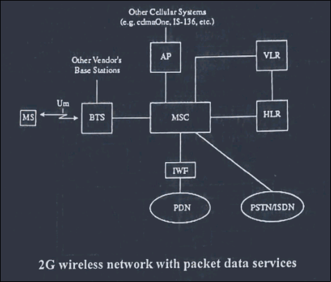
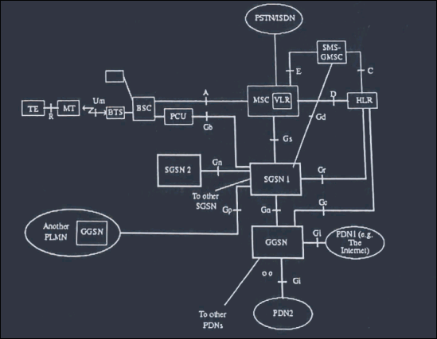
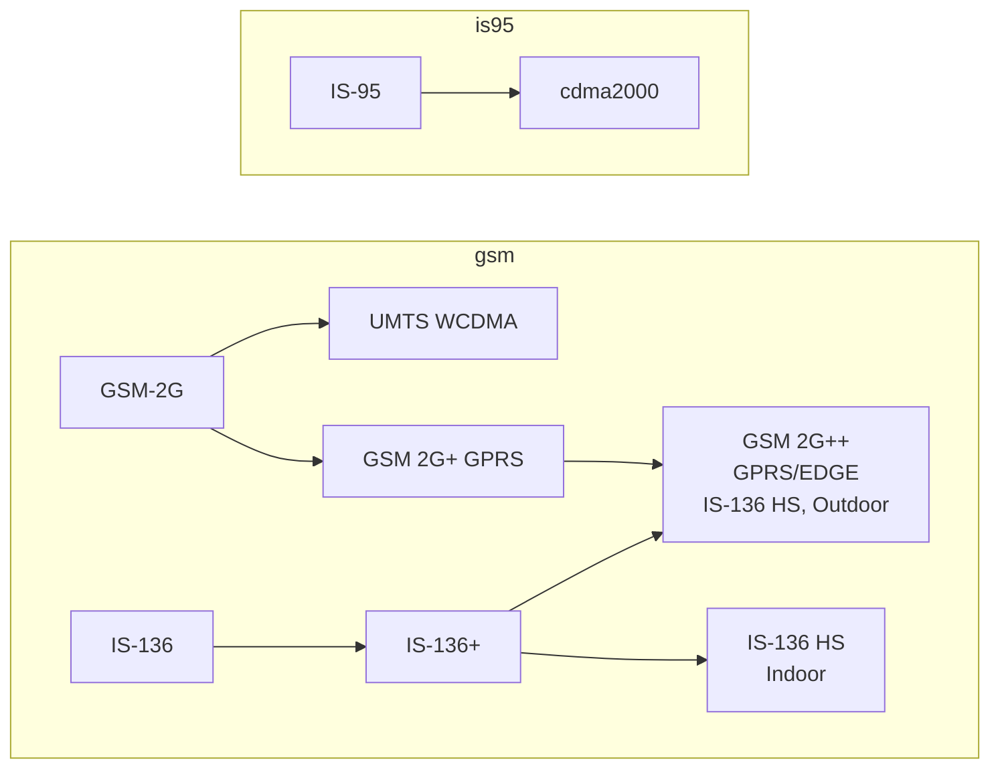

# Evolution of Mobile Communication

- The first version of cellular telephony to be commercially deployed in the 1980s consisted of analog systems,
    - where frequency modulation is used for analog voice
    - and FSK for signaling and control data
- The bandwidth of each channel allocated to an individual user is 30 kHz.
- These systems which had no user data transport capability,
    - were later followed by TDMA systems, 
    - where a channel is divided into a number of synchronized slots, each allocated to a single user.
- The TDMA systems installed in US are based on standards IS-54 and IS-36
    - use a channel spacing of 30 kHz and provide six slots, per frame,
    - eventually tripling the capacity compared to the older analog system.
- GSM, which is used in much of Europe and many other countries of the world, is also based on the TDMA technology,
    - where each channel has a bandwidth of 200 kHz and each frame consists of eight slots.
- A distinctive feature of these systems is their support of SMS and circuit-switched data.
- An enhanced data service called GPRS is also now available in GSM.
- CDMA systems, which use direct sequence spread spectrum technology, has been deployed in many country since 1995.
- Standards for 3G wireless services were published in 1999.
- Support for high-speed data at rates from 144 kb/s for urban and suburban outdoor environments
    - to 2,048 Mb/s for indoor or low-range outdoor environments is one of the most important features of 3G.
- Because of the many advantages that is offers, CDMA technology forms the basis of 3G systems.

## Chronology of important developments in mobile communications

| Date | Event |
| --- | --- |
| 1946 | First domestic public land mobile service introudced in St. Lous. The system perated at 150 MHz and had only three channels.|
| 1956 | First use of a 450 MHz system. Users had to use a push-to-talk button and always needed operator assistance|
| 1970 | FCC sets aside 75 MHz for high-capacity mobile telecommunication systems |
| 1974 | FCC grants common carriers 40 MHz for development of cellular systems.|
| 1978 | First cellular system called AMPS was introduced in Chicago on a trial basis|
| 1981 | Cellular systems deployed in Europe |
| 1983 | First commercial deployment of cellular system in Chicago. It is an analog system and does not have a user data transport capability. Analog systems around 450 and 900 MHz band were also introduced in many countries of Europe during 1981-90|
| 1989 | FCC grants another 10 MHz bandwidth for cellular systems, thus giving a total of 50 MHz |
| 1991 | GSM introduced in Europe and other countries of the world. |
| 1993 | TDMA system called IS-54 introduced in US. SMS available in GSM. |
| 1995 | CDMA cellular and PCS technology introduced in the US |
| 1997 | ETSI publishes GPRS standard |
| 1999 | Standards of 3G wireless services published |

## First Generation Network

- Network reference model of Telecommunication Industry Association/Electronics Industry Association (TIA/EIA) standard IS-41
    - IS-41 Block diagram
        - 
- This also represents the network for the first generation systems that support only voice and no data.
- This reference model is similar to GSM architecture.
- The MSC performs mobile switching functions and interfaces the cellular network to a PSTN, Integrated Services Digital Network (ISDN), or another MSC.
- Home Location Register (HLR) contains a centralized database of all subscribers to the home system.
- This database includes such information as
    - the Electronic Serial Number (ESN), 
    - directory number (DN), 
    - the service profile subscribed by this user 
        - such as roaming restriction, if any, supplementary services that this mobile has subscribed to, and so on
    - and its current location
- Similarly, Visitor Location Register (VLR) contains a database of all visitors to this particular system.
- Whenever a mobile station moves into a Foreign Service area, its MSC saves all pertinent information of that mobile station in its VLR.
- The home MSC is also notified so that incoming calls to this mobile can be forwarded to the foreign MSC.
- The information in the VLR is really the same as that of HLR.
- However, when the mobile moves out of this foreign serving area,
    - its MSC removes database of this visitor from its VLR.
- The equipment identity register (EIR) contains the equipment identification number
- The authentication center (AC) manages user data-encryption-related functions such as ciphering keys, and so on.

## Second Generation Network

- An important feature of the second-generation (2G) system is their data service capability.
- For example, IS-95 supports circuit-switched data and digital fax, IP, mobile IP and cellular digital packet data (CDPD).
- GSM provides the short messaging service and circuit switched data at rates upto 9.6 kb/s per slot.
- Figure below shows network architecture of the first generation except for its interface to a public data network (PDN).
    - 
- This interface to tthe PDN is via an interworking function labeled IWF
    - which actually performs some protocol conversion that might be necessary
    - because of the differences in the protocols used on the mobile stations and the PDN.

## 2G+ Networks

- Except for the A interface between a BS and an MSC, the core network is circuit-switched.
- Equipment from many different manufacturers is now available in the market that can support packet mode data in a core network.
- One possible architecture around which many new networks are being built is shown in figure below.
    - 

The salient features of this architecture are the following:
- First it consists of a backbone network that is based on IP/ATM
- Second, it interfaces to legacy networks in rather straightforward way.
    - For example, the media gateway performs the necessary protocol conversion between the backhaul ATM network and the circuit-switched PSTN or ISDN.
    - The IP routers are used to route packets to/from IP-based packet data networks.
    - The mobility server, which is based on IP, 
        - supports mobility management, connection control, and signaling gateway functions
        - to help provide seamless roaming capability across different networks
        - with centralized directory management and, if needed, end-to-end security.
    - As such, the functional entities of the mobility server would include, among other things, call control, HLR and VLR databases, and radio resource management
- Third, it allows for distributed processing,
    - this offloading the core network, and provides a platform where 
    - new services, features, and applications can be 
    - developed, tested and installed in the network when necessary.
    - Finally, the architecture is compatible with an all-IP network that appears to be the trend of the future.
- GPRS, which has already been introduced in the 2G+ version of GSM, supports packet mode data at rates upto 171 kb/s.
    - The core network consists of
        - a number of serving GPRS support nodes (SGNs)
        - a gateway GPRS support node (GGSN)
        - and a packet control unit (PCU)
    - The SGSN, which is actually a router, connects to a BSC via a PCU, which implements the link layer protocol.
    - There may be more than one serving GSN in any public land mobile network (PLMN)
    - Two separate PLMNs are connected through a GGSN.
    - The GGSN is also a router and is the first entry point of the core network from any external packet data network (such as the Internet).
    - The short messaging serving gateway MSC (SMS-GMSC) provides the necessary protocol conversion for handling SMS through the GPRS network (instead of the traditional GSM network).

## Third Generation (3G) Wireless Technology

- As mentioned earlier, the first-generation mobile telecommunication systems to be introduced in the 1980s were analog.
- These systems, which are still in service, do not have any user data transport capability.
- To provide data services in these analog systems, a anew platform, say Cellular Digital Packet Data (CDPD), has to be overlaid on the cellular system.
- However, even this arragement supports only slow-speed data.
- The second-generation systems, IS-136, cdmaOne, and GSM, are digital and have data transport capabilities but only to a limited extent.
- For example, GSM supports SMSs and user data at rates only upto 9.6 kb/s
- With IS-95B, it is possible to provide data rates in teh range of 64 to 115 kb/s in increments of 8 kb/s over a 1.25 MHz channel.
- In 1997, to provide for dual mode data services in GSM, ETSI defined a new standard called General Packet Radio Service (GPRS), whereby a single time slot may be shared by multiple users for transferring packet mode data.
- In GPRS, each slot can handle up to 21.4 kb/s.
- Because each user may be allocated up to 8 slots, data rates up to about 171.2 kb/s per user are possible.
- To support high speed data rates and to be able to provide for multimedia services,
    - the International Telecommunications Union-Radio Communication Sector (ITU-R)
    - undertook the task of defining a set of recommendations for
    - International Mobile Telecommunication in the year 2000 (IMT-2000).
- Thus, eventually, there were only 4 systems for 3G mobile communications:
    - cdma2000, UWC-136, WCDMA UMTS FDD and WCDMA UMTS TDD.
- cdma2000 is required to comply with EIA/TIA IS-41 and WCDMA UMTS with GSM MAP intersystem networking standards.

## 3G Requirements

- 3G systems are reequierd to operate in many different radio envrionments, such as indoor or outdoor, urban, suburban, or rural.
- The end users may be fixed or moving at various speeds.
- For example, servies many involve:
    - Stationary users or pedestrian (0 to 10kmph)
    - Ordinary vehicular applciations up to 100 kmph
    - High-speed vehicular applciations upto 500 kmph
    - Aeronautical applications up to 1500 kmph
    - Satellites up to 27000 kmph
- The infrastructure used to deliver 3G services may be either terrestrail or staellite based.
- The informaiton types may include speech, audio, text, image and video.
- Radio interfaces must be designed to provide voice band data and variable bit rate services to end users.
- Both circuit and packet mode data must be supported.
- The data rates may be
    - 144 kbps or more in vehicular operation
    - at least 384 kbps for pedestrians
    - about 2.048 mbps for indoor or low-range outdoor applications.

## 3G standards envisage different types of user traffic

1. Constant bit rate traffic, such as speech, high-quality audio, video telephony, full-motion video, and so on, which are sensitive to delays and, more importantly, delay variations.
2. Real-time variable bit rate traffic, such as variable bit-rate encoded audio, interactive MPEG video, and so on.
    - This type of traffic requries variable bandwidths and is also sensitive to delays and delay variations
3. non-real-timee variable bit rate traffic, such as interactive and large file transfers, that can tolerate delays or delay variations

## Some possible applications that appear commercially attractive

- Conversational voice, video phone and video conferencing, interactive games and two way process control and telemetry information
- High-speed internet access applications, such as web browsing, e-mail, data transfer/from server, transaction services, and so on
- Audio streaming, one-way video, still images, large-volume data transfer, tele-metering information for monitoring purposes at an operations and maintenance center
- Entertainment-quality audio
- Inquiries/reservation (such as plane tickket ordering, etc)

# Evolution path to 3G systems

