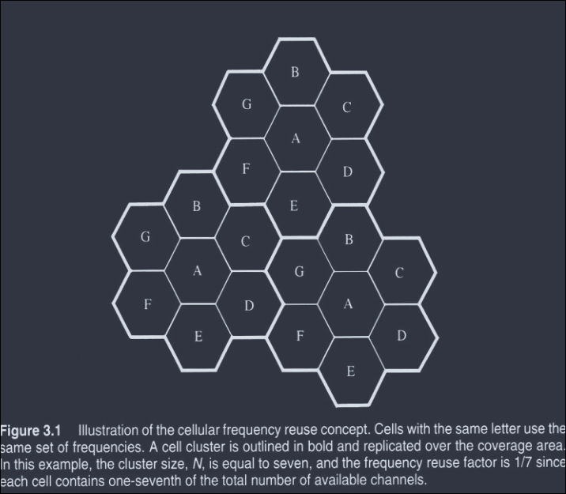
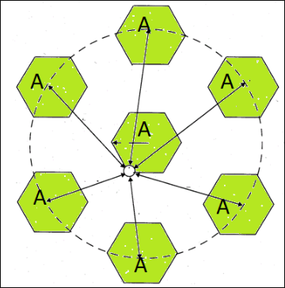
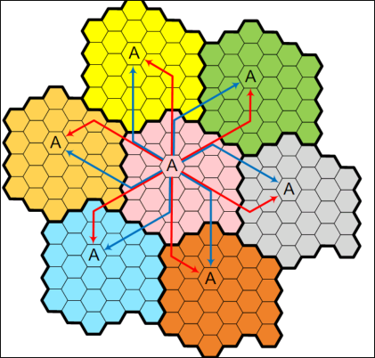

# Background

- in wireless telephony, a **cell** is the geographical area covered by a cellular telephone transmitter.
- the transmitter facility tiself is called the **cell site**.
- teh cellular conept was a amjor breakthrough in solving the problem of **spectral congestion** and **user capacity**.
- It offered very high capacity in a limited sepctrum allocation without any major technological changes

## Cellular Concept

The cellular concept has the following system level ideas
- replacing a single, high power tranmitter with many low power transmistters, each providing coverage to only a small area.
- Neighboring cells are assigned different groups of channels in order to minimize interference
- The same set of channels is then reused at different geographical locations.
- each base station (**BS**) is allocated a portion of total no. of channels avialable to entire system.
- nearby base station are assigned different groups of channels so that all the avialable channels are assigned to a relatively small no. of neighboring base stations.
- Nearby BS are assigned different groups of channel so that interference between BS is minimized.
- When designing a cellular mobile communication system, it is important to provide good coverage and services in a high user-density area.
- Cellular advantage:
    - the use of low power transmitter
    - an allowance for frequency reuse.

## Cell Footprint

- The actual radio coverage of a cell is known as cell footprint
- Irregular cell structure and irregular placing of the transmitter may not be acceptable in the initial system in the initial system design.
- However, as traffic grows, where new cells and channels need to be added,
    - it may lead to inability to reuse frequencies because of co-channel interference.
- For systematic cell planning, a regular shape is assumed for the footprint
- Coverage contour should be circular.
    - However, it is impractical because it provides ambiguous areas with either multiple or no coverage.
- Due to economic reasons, the hexagon has been chosen due to its maximum area coverage.
- Hence a conventional cellular layout is often defeind by a uniform grid of regular hexagons.

# Frequency Reuse

- each cellular base station is allocated a group of radio channels within a small geographic area called a cell.
- Neighboring cells are assigned different channel groups.
- By limiting the coverage area to within the boundary of the cell, teh channel groups may be reused to cover different cells.
- Keep interference levels within tolerable limits.

Real world planning
- Consider a cellular system which has a total of $S$ duplex channels
- Each cell is associated with a group of $k$ channels, $k < S$.
- The $S$ channels are divided among $N$ cells.
- The total number of available radio channels: $S = kN$
- The $N$ cells which use the complete set of channel is called cluster.
- The cluster can be repeated $M$ times within the system.
- The total number of channels, $C$, is used as a measure of capacity.
    $$C = MkN = MS$$
- The capacity is directly proportional to the number of replication, $M$.
- The cluster size, $N$, is typically equal to 4, 7, 12.
- Small $N$ is desirable to maximize capacity.
- The frequency reuse factor is given by $1/N$
- for small $N$, we have to consider the co-channel interference.

## Terminology

- Cluster Size
    - The $N$ cells which collectively use teh complete set of avialable frequency is called the cluster size.
    - 
- Co-channel cell
    - the set of cells using the same set of frequencies as the target cell.
- Interference Tier
    - a set of co-channel cells at the same distance from the reference cell is called an interference tier.
    - The set of closet-co-channel cell is called first tier.
    - There is always 6 co-channel cells in the first tier.
    - example as a figure:
    - 
- Cluster Size
    - given by $N = i^2 + ij + j^2$
    - where, i = movement in perpendicular direction to any of 6 surfaces of original cell
    - j = movement of $60^0$ counter-clockwise/clock-wise to reach adjacent co-channel cell.
    - 

## Channel Assignment Strategies

- Frequency reuse scheme
    - increases capacity
    - minimze interference
- Channel assignment strategy
    - fixed channel assignment
    - dynamic channel assignment
- Fixed channel assignment
    - each 
