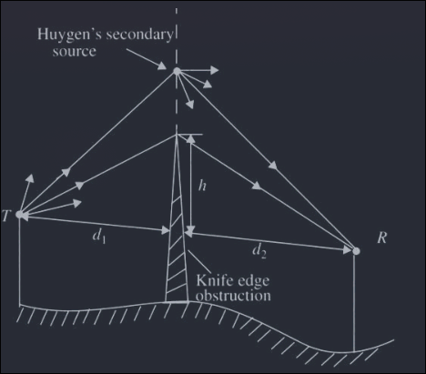
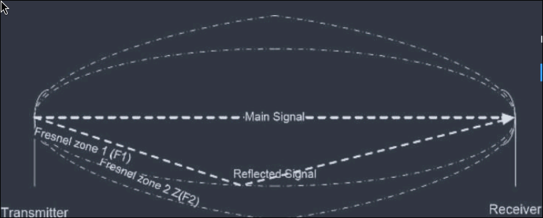
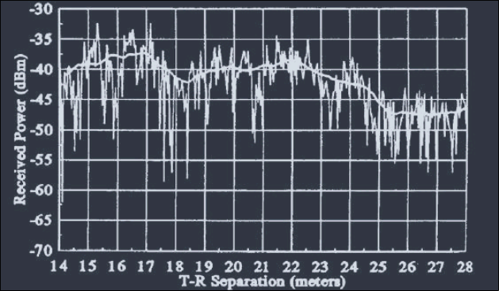
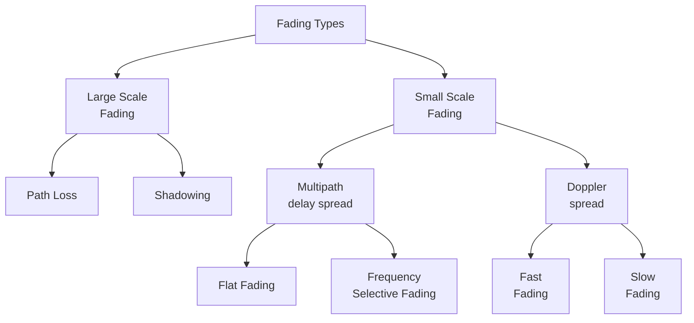
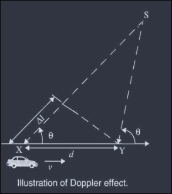
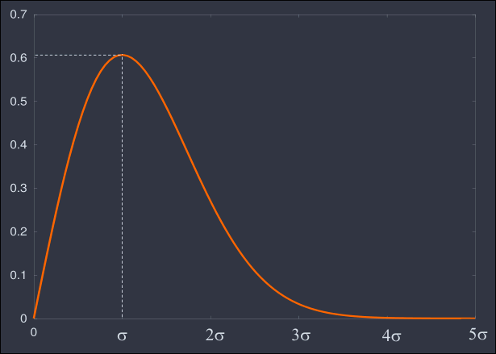
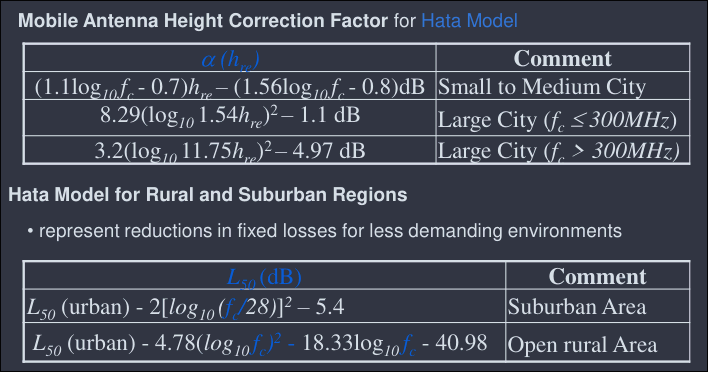
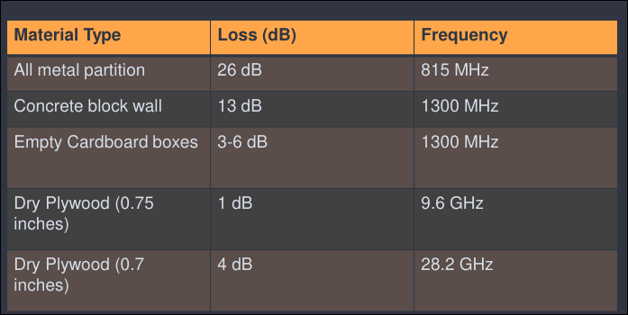
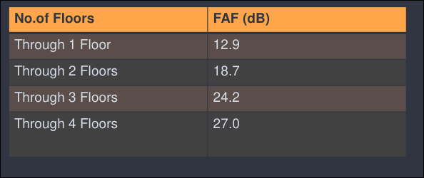
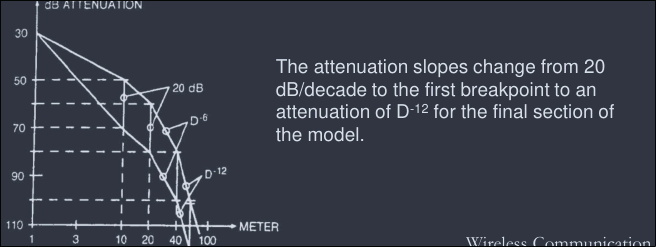

# Concept of Free Space Propagation

- Channels:
    - Wired Chanel
    - Wireless or Radio Channel
- The free space is propagation model used to predict received signal strength at a particular location when the Tx and Rx have a clear and unobstructed LoS path
    - e.g., Satellite communication, Microwave Communication
- Propagation is completed via Tx antenna
    - To convert the electrical modulated signal into electromagnetic field
    - to radiate the EM energy in desired directions
- Let us consider an isotropic radiating source $P_t$
- The radiated power uniformly distributed over the surface are $4\pi d^2$
    - where $d$ is the distance (in meter) from the source
- Power density is given by $P_d = \dfrac{P_t}{4\pi d^2}$

## Key Terms

### Effective Isotropic Radiated Power (EIRP)

- Product of the transmitted power, $P_t$ and the power gain of the transmitting antenna, $G_t$
    - i.e., EIRP = $P_t G_t$ watts

### Effective Aperture

- significant in receiving antenna
- defined as teh ratio of power available at antenna terminal to the power per unit area of the appropriately polarized incident electromagnetic wave
    $$A_c = \dfrac{\lambda^2 G}{4\pi}$$
    - where, $\lambda$ is the wavelength of the carrier, and is given by
    - $\lambda = c/f$

### Power Received

- The power received at a distance is given by the power flux density times the effective aperture of teh receiver antenna
    $$P_d = \frac{P_t G_t}{4\pi d^2} = \frac{\text{EIRP}}{4\pi d^2} = \frac{|E|^2}{120 \pi}\ W/m^2$$

## Basic Propagation Equation

- Let us consider a transmitting antenna with an EIRP defined in equation.
- So power density is defined as
    $$\begin{equation}
        P_d = \frac{\text{EIRP}}{4\pi d^2}
    \end{equation}$$
    - where d is the distance between receiving and transmitting antenna
- Now, **Receiving Antenna Power ($P_r$)** is product of power density and antenna's effective area or aperture
- Thus, $P_r = P_d \cdot A_e$
- Further deriving:
    $$P_r = \left(\frac{\text{EIRP}}{4\pi d^2} \right) A_e$$
- and substituting value of $A_e$
    $$P_r = \frac{P_t G_t A_e}{4\pi d^2}\ watts$$
- Finally, we resolve to
    $$P_r = P_t G_t G_r \left(\frac{\lambda}{4\pi d^2}\right)$$
- Where,
    - $P_t$ = transmitted power radiated by an isotropic source
    - $G_t$ = transmitting antenna gain
    - $G_r$ = receiving antenna gain
    - d = distance between transmitting and receiving antenna
    - $\lambda$ = wavelength of the carrier signal
- This equation is called Friis Free-space equation.

## Path Loss for free space model

- The free space propagation model is used to predict received signal strength when the transmitter and receiver have a clear LoS path between them.
    - Satellite comm
    - microwave LoS radio link
- The loesses $L$ (L $\ge$ 1) are usually due to transmission line attenuation, filter losses, and antenna losses in the commmunication system.
- A value of $L = 1$ indicates no loss in the system hardware.
- Path loss of the free space model with antenna gains
    $$PL(dB) = 10\log\frac{P_t}{P_r} = -10\log\left(\frac{G_t G_r \lambda^2}{(4\pi)^2 d^2}\right)
- When antenna gains are excluded
    $$PL(dB) = 10\log\frac{P_t}{P_r} = -10\log\left(\frac{\lambda^2}{(4\pi)^2 d^2}\right)$$
- The Friis free space model is only a valid predictor of $d$ which is in the far-field (Fraunhofer region) of teh transmission antenna.

## Significance of Free Space Path Loss Model

- The minus sign associated with the first term in eqn signifies the fact that this term represents a gain
- The second term, due to the collection of terms $(4\pi d/\lambda)^2$, is called the free space loss, denoted by $L_{\text{freespace}}$
- Increasing the distance $d$ separating the receiving antenna from the transmitting antenna causes the free-space loss to increase, which, in turn, compels us to operate the radio ocmm link to lower frequencies to maintain the path loss at a manageable level.
- The Friis free space equation enables us to calculate the path loss $PL$ for specified values of power gains, $G_t, G_r$, the carrier wavelength $\lambda$ and distance $d$.
- The far-field region of a transmitting antenna is defined as the region beyond the far-field distance
    $$d_f = \frac{2D^2}{\lambda}$$
    - where D is the largest physical linear dimension of the antenna.
- To be in the far-field region, the following equation must be satisfied:
    $$d_f >> D\ \text{and }\ d_f >> \lambda$$
- Furthermore, the equation does not hold for d=0.
- Use close-in distance $d_0$ and a known received power $P_r(d_0)$ at that point
    $$P_r(d) = P_r (d_0) \left( \frac{d_t}{d}^2\right)\ \text{for }\ d \ge d_0 \ge d_f$$
- in dB form:
    $$P_r(dBm) = 10\log\left[ \frac{P_r(d_0)}{0.001W} \right] + 20\log\left( \frac{d_0}{d} \right)\ \text{for }\ d \ge d_0 \ge d_f$$
    - where $P_r(d_0)$ is in units of watts.

## The Propagation Attenuation

- In general, the propagation path loss increases with
    - frequency of transmission, $f_c$
    - as well as the distance between teh cell sites and mobile, $R$.
- Adequate bandwidth is available at much higher frequencies (around 1GHz and greater than a few GHz).
- However, at such frequencies, the radio signals suffer a greater signal strength loss at shorter distance, and also suffer larger signal strength losses while passing through obstacles such as walls.
- Hence, the propagation path loss and the received signal power are reciprocal to each other, assuming all the other factors constant, we can say that the received carrier signal power, P$_r$ is inversely proportional to $d^n$, i.e.
    $$P_r \propto d^{-n}$$
- $d$ = distance between transmitter and receiver
- $n$ = path loss exponent, which varies between 2 and 6.

# Propagation Mechanisms

- In a wireless signal propagation environment, apart from direct waves, the receiver will get a number of reflected waves, diffracted waves and scattered waves.
- The vectorical addition of these waves constitutes the resultant wave which will vary in strength in real time.
- Basic propagation mechanisms
    - Reflection
        - occurs when a propagating electromagnetic wave impinges upon an object which has very large dimensions when compared to wavelength ,e.g., buildings, walls.
    - Diffraction
        - occurs when the radio path between the transmitter and receiver is obstructed by a surface that has sharp edges
    - Scattering
        - occurs when the medium through which the wave travels consists of objects with dimensions, that are small, compared to the wavelength
        - e.g., Water, rain drops.

## Ground Reflection (Two-Ray) Model

- This mdoel found reasonably accurate when compared with free space propagation
- 2 ray model assumes both LoS and reflected signal for modeling the path loss.
- With given figure's geometry:
    - 
    - $h_t$ = height of Tx antenna
    - $h_r$ = height of Rx antenna
    - $E_{LoS}$ = E-field LoS signal
    - $E_g$ = E-field of reference signal
    - $d$ = distance between Tx and Rx
- Assumptions:
    - $h_t, h_r >> \lambda$
    - $h_t, h_r << d$
- Parameters to be estimated:
    - E-field for both E-LOS and E-g.
    - Path difference ($\Delta$)
    - Phase difference ($\theta_\Delta$)
    - Time delay ($T_d$)
- General equation for plane wave in free space is given by
    $$E(Z, t) = E_0\cdot e^{-\alpha Z}\cdot \cos(\omega t- \beta Z) \hat a_x$$
- Let us rewrite the above equation with our own variables
    $$E\left(d,t\right)=\frac{E_{0}d_{0}}{d}\cdot \cos \left(\omega _{c}\left(t-\frac{d}{c}\right)\right)$$
- Calculating of E-field for LoS signal and reflected signal
    $$E_{LoS}\left(d',t\right)=\frac{E_{0}d_{0}}{d'}\cdot \cos \left(\omega _{c}\left(t-\frac{d'}{c}\right)\right)$$
    - and for reflected, with $\Gamma$ as reflection coefficient
    $$Eg\left(d'',t\right)=\Gamma \frac{E_{0}d_{0}}{d''}\cdot \cos \left(\omega _{c}\left(t-\frac{d''}{c}\right)\right)$$
- An ideal receiver just adds up all the received signal so the total E field Equation is given by
    $$\left|E_{tot}\right|=\left|E_{LoS}\right|+\left|E_{g}\right|$$
    $$\left|E_{tot}\right|=\frac{E_{0}d_{0}}{d'}\cdot \cos \left(\omega _{c}\left(t-\frac{d'}{c}\right)\right)+\Gamma \frac{E_{0}d_{0}}{d''}\cdot \cos \left(\omega _{c}\left(t-\frac{d''}{c}\right)\right)$$
- We know that the from laws of reflection in dielectrics, the reflection coefficient is (-1)
    $$\left|E_{tot}\right|=\frac{E_{0}d_{0}}{d'}\cdot \cos \left(\omega _{c}\left(t-\frac{d'}{c}\right)\right)-\frac{E_{0}d_{0}}{d''}\cdot \cos \left(\omega _{c}\left(t-\frac{d''}{c}\right)\right)$$
### Calculating Path Difference
- Since the path taken by two rays are different and they travel different distances.
- Therefore it is important to calculat the Path difference.
- To find the path difference between 2 waves, we use method of imaging.
- so that:
    - $d''=\sqrt{\left(h_{t}+h_{r}\right)^{2}+d^{2}}$
    - $d'=\sqrt{\left(h_{t}-h_{r}\right)^{2}+d^{2}}$
- And $\Delta$ as the path difference:
    - $\Delta =d\sqrt{1+\left(\frac{h_{t}+h_{r}}{d}\right)^{2}}-d\sqrt{1+\left(\frac{h_{t}-h_{r}}{d}\right)^{2}}$
    - $=d\left\{\left(1+\frac{1}{2}\left(\frac{h_{t}+h_{r}}{d}\right)^{2}\right)-\left(1+\frac{1}{2}\left(\frac{h_{t}+h_{r}}{d}\right)^{2}\right)\right\}$
    - $=d\cdot \dfrac{4h_{t}h_{r}}{2d^{2}}$
    - $=\dfrac{2h_{t}h_{r}}{d}$
- Phase Difference ($\theta_\Delta$)
    - $\theta_\Delta = \dfrac{2\pi \Delta}{\lambda} = \dfrac{2\pi \Delta}{c/f} = \dfrac{2\pi f \Delta}{c} = \dfrac{\omega_c \Delta}{c}$
- Time Delay ($T_d$)
    - $T_d = \dfrac{\Delta}{c} = \dfrac{\theta_\Delta}{2\pi f}$

Notes:
- When d becomes large, the difference between the distance d' and d'' become very small, and the amplitude $E_{LoS}$ and $E_g$ are virtually identical and differ only in phase
- If the received E-field is evaluated at some time, let, t = d''/c, then the equation is given by:
    $$\begin{align}
        \left|E_{tot}\right|&=\frac{E_{0}d_{0}}{d'}\cdot \cos \left(\omega _{c}\left(\frac{d''}{c}-\frac{d'}{c}\right)\right)-\frac{E_{0}d_{0}}{d''}\cdot \cos \left(\omega _{c}\left(\frac{d''}{c}-\frac{d''}{c}\right)\right)\\
        \left|E_{tot}\right|&=\frac{E_{0}d_{0}}{d'}\cdot \cos \left(\omega _{c}\left(\frac{\Delta }{c}\right)\right)-\frac{E_{0}d_{0}}{d''}\cdot \cos \left(0\right)\\
        \left|E_{tot}\right|&=\frac{E_{0}d_{0}}{d'}\left(\cos \left(\theta _{\Delta }\right)-\cos \left(0\right)\right)\\
    \end{align}$$
    - By using trignometric identitiy and simplifying further
    $$\begin{align}
        \left|E_{tot}\right|&=\frac{E_{0}d_{0}}{d'}\cdot 2\sin \left(\frac{1}{2}\ \frac{\omega _{c}\Delta }{c}\right)\\
        \left|E_{tot}\right|&=\frac{E_{0}d_{0}}{d'}\cdot 2\sin \left(\frac{1}{2}\ \frac{1}{c}\cdot 2\pi f\cdot \frac{2h_{t}h_{r}}{d}\right)\\
        \left|E_{tot}\right|&=\frac{2E_{0}d_{0}}{d'}\sin \left(\frac{2\pi h_{t}h_{r}}{\lambda d}\right)\\
    \end{align}$$
    - By small angle approximation
    $$\begin{align}
        \left|E_{tot}\right|&=\frac{2E_{0}d_{0}}{d'}\frac{2\pi h_{t}h_{r}}{\lambda d}\\
        \left|E_{tot}\right|&=E_{0}d_{0}\left(\frac{4\pi h_{t}h_{r}}{\lambda d^{2}}\right)\\
    \end{align}$$
    - For received power at distance d
    $$\begin{align}
        P_{r}&=\frac{E_{tot}}{120\pi }A_{e}\\
        P_{r}&=\left(E_{0}d_{0}\left(\frac{4\pi h_{t}h_{r}}{\lambda d^{2}}\right)\right)^{2}\cdot \frac{A_{e}}{120\pi }\\
        P_{r}&=\left(E_{0}d_{0}\left(\frac{4\pi h_{t}h_{r}}{\lambda d^{2}}\right)\right)^{2}\cdot \frac{P_{t}G_{t}G_{r}\lambda ^{2}}{\left(4\pi \right)^{2}d^{2}}\\
        P_{r}&=P_{t}G_{t}G_{r}\cdot \left(\frac{h_{t}h_{r}}{d^{2}}\right)^{2}\\
    \end{align}$$
- So path loss as $P_t/P_r$:
    $$\frac{P_{t}}{P_{r}}=\frac{d^{4}}{G_{t}G_{r}\left(h_{t}h_{r}\right)^{2}}$$
- in db form:
    $$PL\left(dB\right)=40\log \left(d\right)-\left(10\log \left(G_{t}\right)+10\log \left(G_{r}\right)+20\log \left(h_{t}\right)+20\log \left(h_{r}\right)\right)$$

## Diffraction

- Occurs when the radio path between the transmitter and receiver is obstructed by a surface that has sharp irregularities (edges).
- Explains how radio signals can travel in urban and rural environments without a line of sight path.
- Diffraction can be explained by Huygen's principle:
    - all points on a wavefront can be considered as point sources for the production of secondary wavelets.

### Knife Edge Diffraction Geometry

- Geometry:
    - 

### Fresnel Zone

- Fresnel zones are used by propagation theory to calculate reflections and dffraction loss between a transmitter and receiver.
- Fresnel zones are numbered and are called F1, F2, F3, etc.
- Though there are infinite, we concern only 3.
- A Fresnel zone is a cylindrical ellipse drawn between transmitter and receiver.
- the size of the ellipse is determined by the frequency of operation and the distance between the two sites.
- The Fresnel-Kirchoff Diffraction parameter is given by
    $$v=h\sqrt{\frac{2\left(d_{1}+d_{2}\right)}{\lambda d_{1}d_{2}}}$$
- Fresnel Zone figure:
    - 

## Scattering

- occurs when the medium has object that are smaller or comparable to the wavelength (small objects, rough surfaces and other irregularities on the cahnnel)
- Folllows the same principles as diffraction
- Causes the transmitter energey to be radiated in many directions.
- e.g., foliage, street signs, lamp posts

# Radio Propagation Models

- Need models to characterize the signal strength received at the receiver after undergoing reflections,  diffraction and scattering
    - small scale propagation models
    - large scale propagation models
- Radio propagation models can be derived by
    - using empirical methods: collect measurement, fit curves
    - using analytical methods: model the propagation mechanisms mathematically and derive equations for path loss

# Fading

- rapid fluctuations of received signal strength over short time intervals and/or travel distances
- Caused by interference from multiple copies of Tx signal arriving at Rx at slightly different times.
- Three most important effects:
    1. Rapid changes in signal strengths over small distances or short time period
    2. Changes in the frequency of signals
    3. Multiple signals arriving at different times (time dispersion)
- when added together at the antenna, signals are spread out in time.
- this can cause a smearing of the signal and interference between bits that are received.
- Even stationary Tx/Rx wireless links can experience fading due to motion of objects (cars, people, trees, etc.) in surrounding environment off which come the reflections
- Multipath signals have randomly distributed amplitudes, phases & direction of arrival.
    - vector summation of ($A\angle\theta$) at Rx of multipath leads to constructive/destructive interference as mobile Rx moves in space with respect to time.
- Fading occurs around received signal strength predicted from a large-scale path loss models
- Effect of fading
    - 

## Types of Fading

- Large scale fading
    - is the result of signal attenuation due to signal propagation over large distances and diffraction around large objects in the propagation path.
    - It is due to the followig reasons
        - **Attenuation** in free space: power degrades with $1/d^2$
        - **Shadows**: signal are blocked by obstructing structures.
- Small-scale fading models
    - characterize the rapid fluctuations of the received signal strength over very short travel distance or short time duration.
    - rapid fluctuation due to:
        - sum of many contributions from different directions with different phases
        - random frequency modulation due to varying Doppler shifts on different multipath signals
    - As the mobile moves over small distances, the instantaneous received signal will fluctuate rapidly giving rise to small-scale fading
        - the reason is that the signal is the sum of many contributors coming from different directions
        - Since the phases of these signals are random, the sum behaves like a "noise"
    - the received signal power may change as much as 3/4 orders of magnitude (30dB or 40dB), when the receiver is only moved a fraction of the wavelength
    - Multipath in the radio channel produces small scale fading effects
    - Important effects
        - rapid changes in signal strength over a small travel distance or time interval
        - radom frequency modulation due to varying Doppler's shifts on different multipath signals
        - Time Dispersion (echoes) caused by multipath propagation delays.
        - Small scale fading occurs specially in heavily populated urban areas.
- The shift in received signal frequency due to motion is called **Dopler's shift and is directly proportional to velocity and direction of the mobile with respect to the direction of arrival of the received multipath wave.

## Factors influencing Small-scale fading

1. Multipath propagation
    - the random phase and amplitude of the different multipath components cause fluctuation in signal strength thereby inducing small scale fading.
    - multipath propagation often lengthens the time required for the baseband portion of the signal to reach the receiver which can cause signal smearing (blur) due to inter-symbol interference
2. Speed of the mobile
    - relative motion between BS and MS cause random frequency modulation due to Doppler shift ($f_d$)
    - different multipath components may have different frequency shifts.
3. Speed of surrounding objects
    - if the surrounding objects move at a greater rate than the mobile, then this effect dominates the small-scale fading
4. The transmission bandwidth of the signal
    - if Tx signal's bandwidth > bandwidth of the multipath channel
    - this means, received signal will be distorted.
    - but the received signal will not fade much mover a local area 
        - the small scale fading is not significant
    - however, Tx signa's bandwidth < bandwidth of the multipath channel, the amplitude of signal will change rapidly, but the signal will not be distorted in time.
5. Transmitted signal bandwidth
    - The mobile radio channel (MRC) is modeled as filter with specific bandwidth (BW)
    - The relationship between the signal BW & the MRC BW will affect fading rates and distortion, and so will determine
        - if small scale fading is significant
        - if time distortion of signal leads to inter-symbol interference (ISI)
    - An MRC can cause distortion/ISI or small-scaale fading typically one or the other.

## Doppler Shift

- motion causes frequency modulation due to doppler shift $(f_d)$
- Receiver moving forward the source (receiving frequency is higher) or
- receiver movign away from the source (receiving frequency is lower).
- this resulting effect is the dopller shift
- consider a mobile moving at a constant velocity v, along a path segment having length d between points X and Y, while it receives signals from remote source S, as in figure:
    - 
    - the differnece in path lengths travelled by the wave from source S to the mobile at points X and Y is $\Delta l = d \cos(\theta) = v \Delta t \cos(\theta)$ where $\Delta t$ is the time required for the mbile to travel from X to Y, and $\theta$ is assumed to be very far away

### Some formulas

- Phase change due to difference in path length
    - $$\Delta \phi =\frac{2\pi \Delta l}{\lambda }=\frac{2\pi v\Delta t}{\lambda }\cos \left(\theta \right)$$
- Apparent change in frequency, or Doppler Shift
    - $$f_{d}=\frac{1}{2\pi }\cdot \frac{\Delta \phi }{\Delta t}=\frac{v}{\lambda }\cdot \cos \left(\theta \right)$$
- where:
    - $v$ = velocity (m/s)
    - $\lambda$ = wavelength (m)
    - $\theta$ = angle between mobile direction
- and arrival direction of RF energy
    - `+` shift $\leftarrow$ mobile moving towards S
    - `-` shift $\rightarrow$ mobile moving away from S

## Time and Frequency Dispersions

- Time Dispersion
    - when the received signal has a longer duration than htat of the transmitted signal, due to different delays of the signal paths, i.e.
    - delay spread into the received signal.
- Frequency Dispersion
    - When the received signal has a larger bandwidth than that of transmitted signal due to the different doppler shifts introduced by the multipath components i.e., 
    - Doppler Spread into the received signal.

## Delay Spread

- Delay spread effect is mainly due to small-sacle fading.
- Because multiple reflections of the transmitted signal may arrive at the receiver at the different time and all get added constructively or destructively.
- This can cause a smearing of the signal and interference between bits that are received.
- Representative figure
    - 

### Power Delay Profile

- Random and complicated radio-propagation channels can be characterized using the impulse response approach.
- If the input signal is a unit impulse response, which can be written as
    $$h\left(t\right)=\sum_{n=1}^{N}A_{n}\exp \left(-j\phi _{n}\right)\delta \left(t-\tau _{n}\right)$$
- where $A_n, \tau_n$ and $\phi_n$ are the attenuation, delay in time of arrival and phase, corresponding to path n respectively
- Multipath propagation causes severe dispersion of the transmitted signal and the expected degree of dispersion is determined through the measurement of teh power-delay profile of the channel.
- The power-delay profile provides an indication of the dispersion or distribution of transmitted power over various paths in a multipath model
    - the delay profiles is the expected power variation per unit of time received with a certain excess delay.
    - it is obtained by averaging a large set of impulse responses.

### Parameters characterizing delay spread categories

1. First-Arrival Delay ($\tau_A$)
    - this is a time delay corresponding to the arrival of the first transmitted signal at the receiver.
    - It is usually measured at the receiver
    - This delay is set by the minimum possible propagation path delay from the transmitter to the receiver.
    - it serves as a reference, and all delay measurements are made relative to it.
    - Any measured delay longer than this reference delay is called an excess delay.
2. Mean access delay
3. RMS Delay Spread
4. Excess delay spread

## Perforamance Parameters

- The time dispersion of the channel is called multipath delay spread which is one of the important parameter
- A common measure of multipath delay spread is root mean square (RMS delay spread $T_{RMS}$)
    - The $T_{RMS}$ is the standard deviations or RMS value of the delay of reflections, weighted proportional to the energy in the reflected waves.
- Maximum excess delay ($T_m$)
    - there is some delay between the time when the antenna receives the first copy of the signal on the shortest path and hwen it receives the last copy of the same signal on the longest path.
    - The maximum delay time spread $T_m$ is the total time interval, during which reflections with significant energy arrive.
    - in practice, we use RMS delay spread more over $T_m$

# Coherence Time and Coherence Bandwidth

## Coherence time:

- measure of expected time duration over which channel appears highly correlative
- i.e. the coherence time is a measure of the length of time for which channel can be assumed to be nearly constant.

## Coherence bandwidth
- it is a measure of the approximate bandwidth within which the channel can be assumed to be nearly constant.
- range of frequencies over which the channel can be considered flat
    - i.e. channel passess all spectral components with equal gain and linear phase
    - it is a definition that depends on RMS delay spread
- Two sinusoids with frequency separation greater  than Bandwidth Coherence ($B_c$) are affected quite differently by the channel.
- Frequency correlation between two sinusoids: $0 \le C_{r1, r2} \le 1$.
- if we define coherence bandwidth ($B_c$) as the range of the frequencies over which the frequency correlatino is above 0.9, then
    $$B_c = \frac{1}{50\sigma_\tau}$$
    - where, $\sigma_\tau$ is rms delay spread
- If we define coherence bandwidth as the range of frequencies over which the frequency correlation is above 0.5, then,
    $$B_c = \frac{1}{5\sigma_\tau}$$
    - this is called 50\% coherence bandwidth.
- example
    - for a multipath channel, $\sigma_\tau$ is given as 1.37ms
    - the 50% coherence bandwidth is given as: $\dfrac{1}{5\sigma_\tau}$ = 146kHz.
        - this means that for a good transmission from a Tx to a Rx
        - the range of Tx frequency (channel bandwidth) should not exceed 146kHz, so that all frequencies in this band experience the same channel characterisitics.
        - equalizers are needed in order to use transmission frequencies that are separated larger than this value.
        - This coherence bandwidth is enough for an AMPS channel (30kHz) band needed for a channel), but is not enough for a GSM channel (200 kHz needed per channel).

### Doppler Spread and Coherence Time

- Delay Spread and Coherence bandwidth describe the time dispersive nature of the channel in a local area.
    - they don't offer information about the time varying nature of teh channel caused by relative motion of Tx and Rx
- Doppler spread and coherence time are parameters which describe the time varying nature of teh channel in a small scale region.

#### Doppler Spread

- Measure of spectral broadening caused by the time rate of change of the mobile radio channel.
- Dopller spread, $B_D$, is defined as maximum doppler shift: $f_m = v/\lambda$
- Characterizes **frequency-dispersiveness** of the channel, or the spreading of transmitted frequency due to different Doppler shifts.

#### Coherence Time

- Coherence time is the time duration over whcih the channel impulse response is essentially time invariant.
- If the symbol period of the base band signal (reciprocal of teh baseband signal bandwidth) is greater than the coherence time, then the signal will dsitort.
    - due to channel will change during the transmission of the signal.
- Coherence time ($T_C$) and doppler spread are inversely proportion to one another and is defined as:
    $$T_c \approx 1/f_m$$
- Also defined as:
    $$T_c \approx \sqrt{\frac{9}{16\pi f_m^2}}$$
- Coherence time definition implies that 2 signals arriving with a time separation greater than $T_C$ are effected ifferently by the channel
- Large coherence time implies that the channel changes slowly.

## Types of Small-Scale Fading

Based on multipath time delay spread:
1. Flat Fading
    1. BW of signal < BW of channel
    2. Delay spread < symbol period
        - i.e. BS << BC $\leftrightarrow$ $\sigma_\tau$ << TS
    3. Spectral Characteristics of the transmitted signal is preserved
2. Frequency selective fading
    1. BW of signal > BW of channel
    2. Delay spread > symbol period
        - i.e., BS > BC $\leftrightarrow$ $\sigma_\tau$ >> TS
    3. Spectral characterisitics of Tx signal is not preserved.

Based on Doppler Spread

1. Fast Fading
    1. High Doppler Spread
    2. Coherence time < Symbol period
    3. Channel variations faster than baseband signal variations
        - i.e. $T_C < T_S$
2. Slow Fading
    1. Low Dopller spread
    2. Coherence time > Symbol period
    3. Channel variations slower than baseband signal variations
        - i.e. $T_C >> T_S$

## Frequency Flat Fading

- Occurs when symbol period of the transmitted signal is much larger than the Delay Spread of the channel
    - bandwidth of the applied signal is narrow
- May cause deep fades.
    - inrease the transmit power to combat this situation

## Fast Fading

- occurs due to dopller spread
    - rate of change of the channel characteristics is larger than the rate of change of the transmitted signal
    - the channel changes during a symbol period
    - the channel changes because of relative motion between the receiver and the baseband signal
    - coherence time ($T_C$) of the channel is smaller than the symbol period ($T_S$) of the transmitter signal
- occurs when:
    $B_S < B_D$ and $T_S > T_C$
- where
    - $B_S$: bandwidth of the signal
    - $B_D$: doppler spread
    - $T_S$: symbol period
    - $B_C$: coherence bandwidth

## Slow Fading

- Due to doppler spread
    - rate of change of the channel characterisitics is much smaller than the rate of change of the transmitted signal.
- occurs when
    - $B_S >> B_D$ and $T_S << T_C$
- where
    - $B_S$: bandwidth of the signal
    - $B_D$: doppler spread
    - $T_S$: symbol period
    - $B_C$: coherence bandwidth

### Fast/Slow Fading

- velocity of the mobile (or the velocity of objects in the channel)
    - and the baseband signaling
- determines whether a signal undergoes fast fading or slow fading.

## Fading Distributions

- Describes how the received signal amplitude changes with time
    - remember that the received signal is combination of multiple signals arriving from different directions, phases and amplitudes
- it is a statistical characterization of the variation of the envelope of the received signal over time.
- two most common distributions
    - rayleigh fading
    - ricean fading

### Rayleigh Fading

- If all the multipath componennts have approximately the same amplitude, i.e., MS is far from BS, the envelope of teh receieved signal is Rayleigh Distributed
- No dominant signal component (such as the LoS component)
- Rayleigh Distribution has the probability density function (PDF) given by:
    $$p(r) = 
    \begin{cases}
    \dfrac{r}{\sigma^2} e^{-\dfrac{r^2}{2\sigma^2}}\ &(0 \le r \le \infty)\\
    0 & (r \lt 0)
    \end{cases}$$
- $\sigma$ is the rms value of the received voltage signal before envelope detection
- $\sigma^2$ is the time average power of the received signal before envelope detection.
- Its graph looks like:
    - 

### Ricean Fading

- When there is a stationary (non-fading) LoS signal present, then the envelope distribution is Ricean
- The Ricean distibution degenerates to Rayleigh when the dominant component fades away.
- The ricean distribution is given by
    $$p(r) = 
    \begin{cases}
    \dfrac{r}{\sigma^2} e^{-\dfrac{r^2+A^2}{2\sigma^2}} I_0\left( \dfrac{Ar}{\sigma^2} \right)\ &(0 \le r \lt \infty)\\
    0 & (r \le 0)
    \end{cases}$$
    - where A denotes the peak amplitude of the dominant signal, and
    - I0 denotes the zeroth order bessel function of the first kind.
- the ricean distribution is often described in terms of paraketer K (ricean k-factor)
- K = A^2/(2$\sigma^2$)
- in terms of dB, K(dB) = 10log($\dfrac{A^2}{2\sigma^2}) dB
- for K >> 1, the ricean distributino tends to gaussian distribution about the mean.
- Its graph looks like
    - 

# Large Scale Propagation models

- As the mobile moves away from the transmitter over large distances, the local average received signal will gradually decrease.
- This is called large-scale path loss
- Typically the local average received power is computed by averaging signal measurements over a measurement track of 5$\lambda$ to 40$\lambda$
    - this means 1m - 10 m track
- the models that predict the mean signal strength for an arbitrary-receiver transmitter (T-R) separation distance are called large-scale propagation models.
- Large T-R separation distances (several hundreds of thousands of meters)
- Main propagation mechanism: reflections
- attenuation of signal strength due to power loss along distance traveled: shadowing
- small fluctuations around a slowly varying mean
- useful in estimating the radio coverage of a transmitter

### Need for propagation models

- determining the coverage area of a transmitter
    - determine the transmitter power requiremenet
    - determine the battery lifetime
- finding modulation adn coding schemes to improve the channel quality

# Practical Link Budget Design Using Path Loss Models

- Log distance path model
    - Both Theoretical and measruement based models show that the received signal power decreaes logaithmically with distance.
    - both for indoor and outdoor channels
    - the average large scale path loss for an arbitrary T-R separation is expressed as a functino of distance by using a path loss exponent n.
- n characterized the propagation environment
    - for free space it is 2.
    - when obstructions are present, it has a larger value.
- the link budget is a summary of the transmitted power long with all the gains and losses in teh sytem and this enables the strength of the received signal to be calculated.

## Log-distance path loss model

- Average large-scale path loss at
    $$\overline{PL} (d) \propto \left(\frac{d}{d_{0}}\right)^{n}\ d\ge d_{0}$$
- in dB form
    $$\overline{PL} (dB) = \overline{PL}(d_0) + 10n \log \left(\frac{d}{d_{0}}\right)$$
- where
    - $\overline{PL}$ is the total path loss measured in decibel
    - $d$ is the length of the path
    - $d_0$ is the reference distance, usually 1km or 1 mile for large cell and 1m to 10m for microcell
- path loss exponent

| Environment | Path Loss exponent |
| --- | --- | 
| Free space | 2 | 
| Urban area cellular radio | 2.7 to 3.5|
| Shadowed urban cellular radio | 3 to 5 |
|in building LoS | 1.6 to 1.8 |
| obstructed in building | 4 to 6 |
| obstructed in factories | 2 to 3 |

# Log-normal Shadowing

- The path loss equation for log-distance model does not consider the fact the surrounding environment may be vastly different at two locations having the same T-R separation.
- This leads to measurements that are different than the predicted average values obtained using the equations shown
- Measurements show that for any value d, the path loss PL(d) in dBm at a location is random and distributed log-normally.
- The log normal distributino describes the random shadowing effects due to cluttering on the propagation path, a factor is added as follows:
    $$PL(d)(d) = \overline{PL}(d) + X_\sigma$$
- in dB form
    $$PL(d)(dB) = \overline{PL}(d_0) + 10n \log\left(\frac{d}{d_0}\right) + X_\sigma$$
- $X_\sigma$ is a zero mean gaussian (normal) distributed random variable (in dB) with standard deviation $\sigma$ (also in dB)
    $$P_r(d)(dBm) = P_t(dBm) - PL(d)(dB)$$
- and
    $$P_r(d)(dBm) = P_t(dBm) - \left[ \overline{PL}(d_0)(dB) + 10n\log\left(\frac{d}{d_0}\right) + X_\sigma(dB)\right]

# Outdoor Propagation models

- outdoor radio transmission takes place over irregular terrain
- the terrain profile must be taken into consideration for estimating path loss
- trees, buildings, hill etc. must be taken into consideration.
- in early days, the models were based on empirical studeies
- okumura did comprehensive measurements in 1968 and came up with a model
- discovered that a good model for path loss was a simple power law where the exponent n is  afunction of frequency, antenna heights, etc.
- one of the most widely used models for signal predition in urban areas
- applicable to
    - frequencies: 150 MHz to 1920 MHz
    - can be extrapolated up-to 3GHz
    - Distance: 1km to 100 km
    - Base station antenna heights: 30m to 100m
- Okumura developed a set of curves giving the medium attenuation relative to free space in an urban area over quasi-smooth terrain.
- Formula
    $$L_{50}\left(dB\right)=L_{F}+A_{mu}\left(f,d\right)-G\left(h_{te}\right)-G\left(h_{re}\right)-G_{AREA}$$
- where
    - $L_{50}$ = 50\% of propagation path loss (median)
    - $L_{F}$ = free space propagation loss
    - $A_{mu}\left(f,d\right)$ = median attenuation relative to  free space
    - $G\left(h_{te}\right)$ = base station antenna height gain factor = $20\log \dfrac{h_{te}}{200}$ for 30m to 1000m of $h_{te}$
    - $G\left(h_{re}\right)$ = mobile antenna height gain factor = $10\log\dfrac{h_{re}}{3}$ for 0 to 3m of $h_{re}$
    - $G_{AREA}$ = gain due to type of environment = $20 \log \dfrac{h_{re}}{3}$ for 3m to 10m of $h_{re}$

Explanation
- Okumura developed a set of curves giving the median attenuation relative to free space ($A_{mu}$) in an urban area over a quasi-smooth terrain with a base station effective antenna height ($h_{te}$) of 200m and a mobile antenna height ($h_{re}$) of 3m.
- These curves were developed from extensive measurements using vertical omni-directional antennas at both the base and mobile, and are plotted as a function of frequency.
- Okumura's mdoel is wholly based on measured data and does not provide any analytical explanation.
- For many situations, extrapolations of the derived curves can be made to obtain values outside the measurement range, although the validity of such extrapolations depends on the circumstances and the smoothness of the curve in question
- Okumura's model is considered to be amon the simplest and best in terms of accuracy in path loss prediction for mature cellular and land mobile radio systems in cluttered environments
- the major disadvantages with the model is its slow response to rapid changes in terrain,, therefore the model is fairly good in urban and suburban areas but not as good in rural areas.

## Hata Model

- The hata model is the empirical formulation of the graphical path loss data provided by Okumura and is valid fom 150 MHz to 1.5 MHz
- The median path loss in urban areas is given by
    - $L_{50}$(dB) = 69.55 + 26.16$\log_{10} f_c$ (MHz) - 13.82$\log_{10}(h_{te})$ - $\alpha(h_{re}(m)) + (44.9 - 6.55 \log h_{te}(m))\log_{10}d(km)$
- Parameters:

| parameter | comment |
| --- | --- |
| $L_{50}$ | 50th % value (median) propagation path loss (urban) |
| $f_c$ | frequency from 150 MHz-1.5 GHz |
| $h_{te}, h_{re}$ | base station (30 to 200m) and mobile antenna (1 to 10m) height |
| $\alpha(h_{re})$ | corection factor for $h_{re}$, affected by coveraeg area| 
| d | Tx-Rx separation in km | 

Correction factors for Hata mdoel:

## Lonley Rice Model

- The longley rice model is normally available as a computer program that takes as input:
    - transmission frequency
    - path leght
    - polarizatino
    - antenna heights
    - surface reflectivity
    - ground conductivity and dielectric constant
    - climatic factors
- the main drawback of the Longley-Rice propagation model is that it does not consider the effect of multipath, buildings, foliage and other environmental factors.

# Indoor Propagation Models (1)

- Indoor channels are different from traditional mobile radio channels in 2 different ways
    - the distance covered are much smaller
    - the varaibility of the environment is much greater for a much smaller range of Tx and Rx separation distances
- the propagation inside a building is influenced by
    - layout of the building
    - construction materials
    - building type: office area, residentail home, factory, etc.
- indoor propagation is dominated by the same mechanisms as outdoor:
    - reflection, scattering, diffractin
- however, conditions are much more vairable
    - doors, windows open or not
    - the mounting place of antenna: desk, ceiling
    - the level of loors
- the indoor chanels are classified as
    - LoS
    - Obstructed (OBS) with varyyingdegrees of cluster
- temporal fading for fixed and moving terminals
    - portable receiver exeperience in general
        - rayliegh rading for OBS propagation paths
        - ricean fading for LOS paths.
- Multipath delay spread
    - buildings with fewer metals and hard partitions typically have small rms delay spread: 30 to 60 ns
    - can support data rates excess of several Mbps without equalization
- larger buildings with great amount of metal and open aisles may have rm delay spreads as large as 300ns
    - cannot support data rates more tahn a new hundred kbps without equalization
- path loss:
    - the following formula that we have seen earlier also descibres the indoor path loss:
    $$PL(d)(dB) = \overline{PL}(d_0) + 10n \log\left(\frac{d}{d_0}\right) + X_\sigma$$
    - n and $\sigma$ depends on the type of the building
    - smaller value of $\sigma$ indicates better accuracy of the path loss model.
- in building path loss factors
    - parititon lossess (same floor)
        - 2 kinds
            - hard partitions: walls of the room
            - soft parititions: moveable partitions that do not span to the ceiling
        - path loss depends on the type of parititions
        - various losses:
            - 
    - partitiotn losses between floors
        - depends on:
            - external dimensions and materials of the building 
            - type of construction used to create floors
            - external surroundings
            - number of windows
            - presence of tintinig on windows
        - various losses:
            - 
    - signal penetration into buildings

# Ericsson Multiple Breakpoint Model

- measurements in multi-floor office building
- uses uniform distribution to generate path loss values betwee minimum and maximum range, relative to distance
- 4 breakpoints consider upper and lower bound on path loss
- assumes 30 dB attenuation at $d_0$ = 1m
    - accurate for f = 900 MHz and unity gain antenna
- provides determinisitc limit on the range of path loss at a given distance
- Diagram of its graph
    - 

# Attenuation Factor Model

- Obtained by measurement in a multiple floor office building
    $$\overline{PL}(d)(dB) = \overline{PL}(d_0)(dB) + 10n_{SF}\log\left(\dfrac{d}{d_0}\right) + FAF(dB) + \sum PAF (dB)$$
    - where $n_{SF}$ = path loss exponnent of the same floor
    - FAF = floor attenuation factor
    - PAF = partition attenuatino factor

