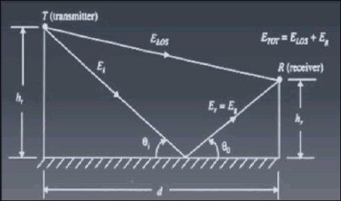

# Concept of Free Space Propagation

- Channels:
    - Wired Chanel
    - Wireless or Radio Channel
- The free space is propagation model used to predict received signal strength at a particular location when the Tx and Rx have a clear and unobstructed LoS path
    - e.g., Satellite communication, Microwave Communication
- Propagation is completed via Tx antenna
    - To convert the electrical modulated signal into electromagnetic field
    - to radiate the EM energy in desired directions
- Let us consider an isotropic radiating source $P_t$
- The radiated power uniformly distributed over the surface are $4\pi d^2$
    - where $d$ is the distance (in meter) from the source
- Power density is given by $P_d = \dfrac{P_t}{4\pi d^2}$

## Key Terms

### Effective Isotropic Radiated Power (EIRP)

- Product of the transmitted power, $P_t$ and the power gain of the transmitting antenna, $G_t$
    - i.e., EIRP = $P_t G_t$ watts

### Effective Aperture

- significant in receiving antenna
- defined as teh ratio of power available at antenna terminal to the power per unit area of the appropriately polarized incident electromagnetic wave
    $$A_c = \dfrac{\lambda^2 G}{4\pi}$$
    - where, $\lambda$ is the wavelength of the carrier, and is given by
    - $\lambda = c/f$

### Power Received

- The power received at a distance is given by the power flux density times the effective aperture of teh receiver antenna
    $$P_d = \frac{P_t G_t}{4\pi d^2} = \frac{\text{EIRP}}{4\pi d^2} = \frac{|E|^2}{120 \pi}\ W/m^2$$

## Basic Propagation Equation

- Let us consider a transmitting antenna with an EIRP defined in equation.
- So power density is defined as
    $$\begin{equation}
        P_d = \frac{\text{EIRP}}{4\pi d^2}
    \end{equation}$$
    - where d is the distance between receiving and transmitting antenna
- Now, **Receiving Antenna Power ($P_r$)** is product of power density and antenna's effective area or aperture
- Thus, $P_r = P_d \cdot A_e$
- Further deriving:
    $$P_r = \left(\frac{\text{EIRP}}{4\pi d^2} \right) A_e$$
- and substituting value of $A_e$
    $$P_r = \frac{P_t G_t A_e}{4\pi d^2}\ watts$$
- Finally, we resolve to
    $$P_r = P_t G_t G_r \left(\frac{\lambda}{4\pi d^2}\right)$$
- Where,
    - $P_t$ = transmitted power radiated by an isotropic source
    - $G_t$ = transmitting antenna gain
    - $G_r$ = receiving antenna gain
    - d = distance between transmitting and receiving antenna
    - $\lambda$ = wavelength of the carrier signal
- This equation is called Friis Free-space equation.

## Path Loss for free space model

- The free space propagation model is used to predict received signal strength when the transmitter and receiver have a clear LoS path between them.
    - Satellite comm
    - microwave LoS radio link
- The loesses $L$ (L $\ge$ 1) are usually due to transmission line attenuation, filter losses, and antenna losses in the commmunication system.
- A value of $L = 1$ indicates no loss in the system hardware.
- Path loss of the free space model with antenna gains
    $$PL(dB) = 10\log\frac{P_t}{P_r} = -10\log\left(\frac{G_t G_r \lambda^2}{(4\pi)^2 d^2}\right)
- When antenna gains are excluded
    $$PL(dB) = 10\log\frac{P_t}{P_r} = -10\log\left(\frac{\lambda^2}{(4\pi)^2 d^2}\right)$$
- The Friis free space model is only a valid predictor of $d$ which is in the far-field (Fraunhofer region) of teh transmission antenna.

## Significance of Free Space Path Loss Model

- The minus sign associated with the first term in eqn signifies the fact that this term represents a gain
- The second term, due to the collection of terms $(4\pi d/\lambda)^2$, is called the free space loss, denoted by $L_{\text{freespace}}$
- Increasing the distance $d$ separating the receiving antenna from the transmitting antenna causes the free-space loss to increase, which, in turn, compels us to operate the radio ocmm link to lower frequencies to maintain the path loss at a manageable level.
- The Friis free space equation enables us to calculate the path loss $PL$ for specified values of power gains, $G_t, G_r$, the carrier wavelength $\lambda$ and distance $d$.
- The far-field region of a transmitting antenna is defined as the region beyond the far-field distance
    $$d_f = \frac{2D^2}{\lambda}$$
    - where D is the largest physical linear dimension of the antenna.
- To be in the far-field region, the following equation must be satisfied:
    $$d_f >> D\ \text{and }\ d_f >> \lambda$$
- Furthermore, the equation does not hold for d=0.
- Use close-in distance $d_0$ and a known received power $P_r(d_0)$ at that point
    $$P_r(d) = P_r (d_0) \left( \frac{d_t}{d}^2\right)\ \text{for }\ d \ge d_0 \ge d_f$$
- in dB form:
    $$P_r(dBm) = 10\log\left[ \frac{P_r(d_0)}{0.001W} \right] + 20\log\left( \frac{d_0}{d} \right)\ \text{for }\ d \ge d_0 \ge d_f$$
    - where $P_r(d_0)$ is in units of watts.

## The Propagation Attenuation

- In general, the propagation path loss increases with
    - frequency of transmission, $f_c$
    - as well as the distance between teh cell sites and mobile, $R$.
- Adequate bandwidth is available at much higher frequencies (around 1GHz and greater than a few GHz).
- However, at such frequencies, the radio signals suffer a greater signal strength loss at shorter distance, and also suffer larger signal strength losses while passing through obstacles such as walls.
- Hence, the propagation path loss and the received signal power are reciprocal to each other, assuming all the other factors constant, we can say that the received carrier signal power, P$_r$ is inversely proportional to $d^n$, i.e.
    $$P_r \propto d^{-n}$$
- $d$ = distance between transmitter and receiver
- $n$ = path loss exponent, which varies between 2 and 6.

# Propagation Mechanisms

- In a wireless signal propagation environment, apart from direct waves, the receiver will get a number of reflected waves, diffracted waves and scattered waves.
- The vectorical addition of these waves constitutes the resultant wave which will vary in strength in real time.
- Basic propagation mechanisms
    - Reflection
        - occurs when a propagating electromagnetic wave impinges upon an object which has very large dimensions when compared to wavelength ,e.g., buildings, walls.
    - Diffraction
        - occurs when the radio path between the transmitter and receiver is obstructed by a surface that has sharp edges
    - Scattering
        - occurs when the medium through which the wave travels consists of objects with dimensions, that are small, compared to the wavelength
        - e.g., Water, rain drops.

## Ground Reflection (Two-Ray) Model

- This mdoel found reasonably accurate when compared with free space propagation
- 2 ray model assumes both LoS and reflected signal for modeling the path loss.
- With given figure's geometry:
    - 
    - $h_t$ = height of Tx antenna
    - $h_r$ = height of Rx antenna
    - $E_{LoS}$ = E-field LoS signal
    - $E_g$ = E-field of reference signal
    - $d$ = distance between Tx and Rx
- Assumptions:
    - $h_t, h_r >> \lambda$
    - $h_t, h_r << d$
- Parameters to be estimated:
    - E-field for both E-LOS and E-g.
    - Path difference ($\Delta$)
    - Phase difference ($\theta_\Delta$)
    - Time delay ($T_d$)
- General equation for plane wave in free space is given by

