# Chapter 4: Modulation

## ANALOG VS DIGITAL Modulation

### ASK (Amplitude Shift Keying)

### FSK (Frequency Shift Keying)
- Frequency is varied depending on the digital data.

### PSK (Phase Shift Keying)

#### BPSK (Binary Phase Shift Keying)

#### QPSK (Quadrature Phase Shift Keying)
- In QPSK, we take digital data and divide it into even and odd parts.
- Even data are sent using sine and odd data are sent using cosine carrier.
- Thus we have Phase Quadrature and Bandwidth is efficient.

### MSK (Minimum Shift Keying)

#### Need for MSK
- In MSK (Minimum Shift Keying): 
  - Phase is continuous and smooth.
  - Band-pass filters are not required because in MSK, it has smaller side lobes and thinner main lobes whereas QPSK has thicker main lobe.
- 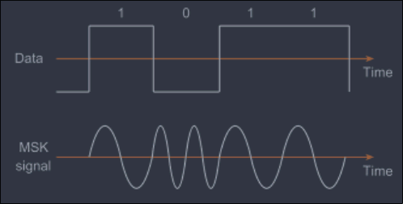

### Important Points of MSK

- MSK is known to be a special type of continuous phase FSK.
- Peak frequency deviation is ¼ the bitrate and modulation index is kept at 0.5 to make signal orthogonal.
- Orthogonality makes the signal more uncorrelated so that it is easy to separate at the receiver end.

- - MSK provides good envelope
- - Good Spectral Efficiency
- - Good BER performance
- - MSK also called Fast FSK i.e., freq shift is only half that of used in FSK

## GMSK (Gaussian Minimum Shift Keying)

### GMSK, as it’s name implies, is based on MSK and is developed to improve the spectral property of MSK by using a pre-modulation Gaussian filter.
- The transfer function of the pre-modulation Low pass filter/Gaussian filter is given by:
  $$
  h(t) = \frac{1}{\sqrt{2\pi B_0^2}} \exp\left(-\frac{t^2}{2B_0^2}\right)
  $$
  - Where, $B_0$ is the 3dB bandwidth.
- The GMSK filter is completely defined from $B$ and baseband symbol duration $T$.
  Therefore, GMSK is defined by its BT product.

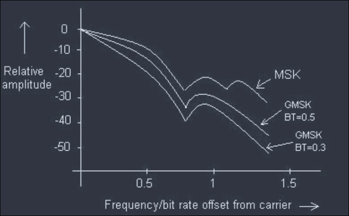

- Power spectral density of MSK does not fall fast hence will not reduce interference completely between adjacent channels.
- Hence GMSK is designed with various BT factors
- It is clear that the smaller the BT, the tighter
  the spectrum i.e. the side-lobe levels fall off Very rapidly.
- However,reducing BT increases the error rate produced by the low-pass filter due to ISI
- GSM uses BT = 0.3.

## GMSK Transmitter

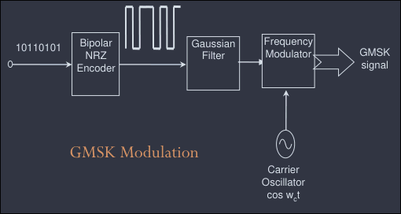

1. Bipolar NRZ Encoder
2. GMSK Signal
3. Gaussian Filter
4. Frequency Modulator
5. Carrier Oscillator: $\cos(\omega t)$

### GMSK Modulation Using I-Q Modulation

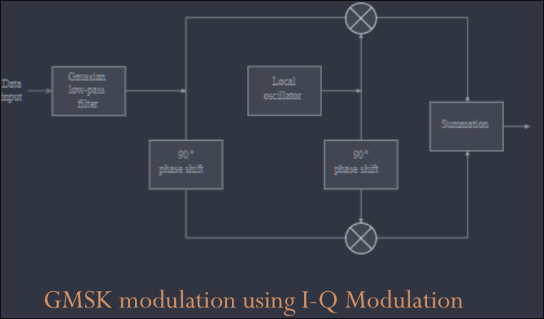

- The Quadrature modulator uses one signal that is said to be in-phase and another that is in quadrature.
- Using this type of modulator the modulation index can be maintained at exactly 0.5 without the need for any settings or adjustments.

## GMSK DETECTOR

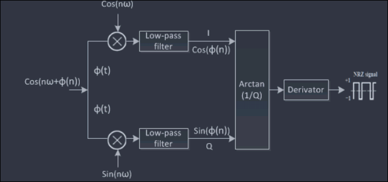

- GMSK is highly useful in wireless transmission
- GMSK is highly useful in wireless data communication protocols and two such systems using it are cellular digital packet data (CDPD) and Mobitex (a dedicated data system).
- GMSK signal can be detected using orthogonal coherent detectors or with simple non-coherent detectors such as FM discriminators.

## M-ARY QUADRATURE AMPLITUDE MODULATION

### Signal Constellation
- The signal constellation is the physical diagram used to describe all the possible symbols used by a signaling system to transmit data and an aid in designing better communication systems.
- The distance of a point from the origin represents a measure of the amplitude or power of the signal.

#### QAM (Quadrature Amplitude Modulation)
- A form of digital modulation where the digital information is contained in both the amplitude and the phase of the modulated signal. Examples include 4-QAM, 16-QAM, 64-QAM.
- The advantage of moving to higher order formats is that there are more points within the constellation, therefore it is possible to transmit more bits per symbol.
- The minimum distance between symbols determine the immunity of noise
- The maximum distance to the origin determine the maximum required signal power.

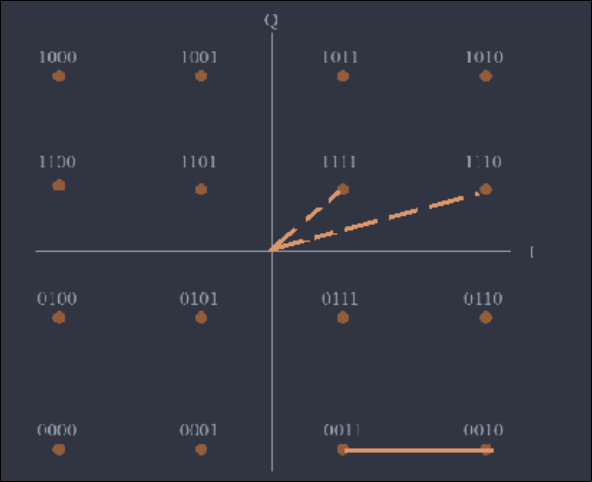

### Comparison between 16-PSK and 16-QAM

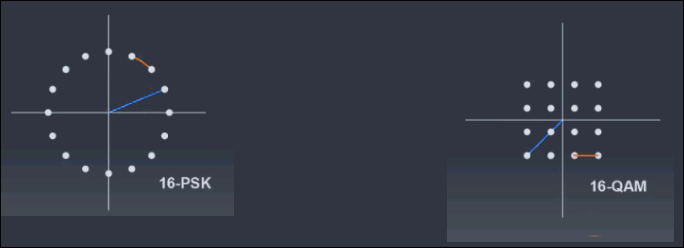
- Noise immunity is same
- Bandwidth is same. Both transmitting same no of 4-bits.
- 16-PSK (difficult to change amplitude level) require more power than 16-QAM.
  - NOTE: with the same minimum Euclidean distance, 16-QAM requires 1.6dB less peak power.

## SPREAD SPECTRUM

### Problems Definition
- How to utilize the channel bandwidth efficiently?
- How to minimize the amount of transmitted power?
- But importantly other problems are also encountered:
  - a. Information has to be secured.
  - b. To avoid jam, channel should be immune to any external interference.

These problems can be successfully solved by using spread spectrum modulation technique.

## SPREAD SPECTRUM

- The spread signal occupies a larger bandwidth than that of normal signals.
- It uses some kind of coding in transmitter (spreading) and receiver (de-spreading) to obtain the original signal.
- The codeword associated with spread spectrum is independent to the information provided by the signal.
- Most important; Spread signal is pseudorandom in nature.
- Specifically designed receiver can only demodulate it to recover original information.
- In SS, we combine signals from different sources to fit into a larger bandwidth
    - but our goals are to prevent eavesdropping (secretly listen to conversation) and jamming
- To achieve these goals, spread spectrum techniques add redundancy.

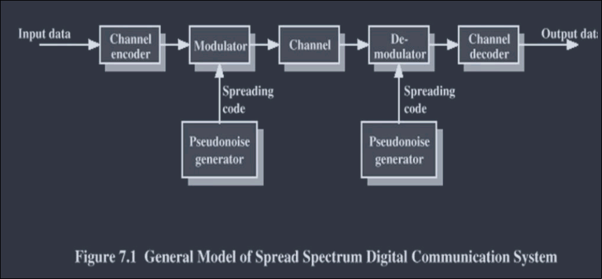

Spread Spectrum achieves through two principles
- The bandwidth allocated to each station needs to be larger than what is needed
- The spreading process occurs after the signal is created by the source.

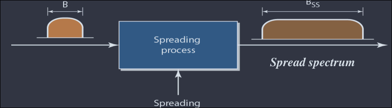

### Pseudo-Noise (PN) Sequences

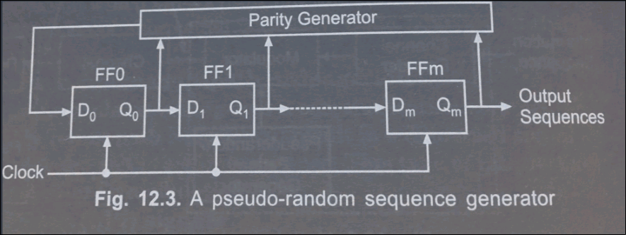

- This is basically a shift register. Type D flip-flop is connected to the Q output of the previous flip-flop.
- The input $D_0$ of the first flip-flop has been connected to the output of the parity generator.
- A parity generator generally consists of Ex-OR gates.

### PN Sequences Properties

- Pseudo-noise (PN) sequences may be defined as a coded sequence of 1s and 0s with certain auto-correlation properties
- 1s and 0s in a equal probability.
- Adding a shift version to a PN sequence give same PN sequence (in different phase).
- High auto correlation function and low cross correlation.
- Easy to generate and synchronize.

### SPREAD SPECTRUM

In general SS modulation techniques can be categorized into:
- **a. Direct Sequence Spread Spectrum (DSSS)**
    - In DSSS, we replace each data bit with n bits using a spreading code.
        - Each bit is assigned a code of $n$ bits, called chips, where the chip rate is $n$ times that of the data bit.
    - Block diagram
        - 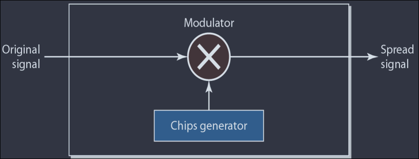
    - example
        - 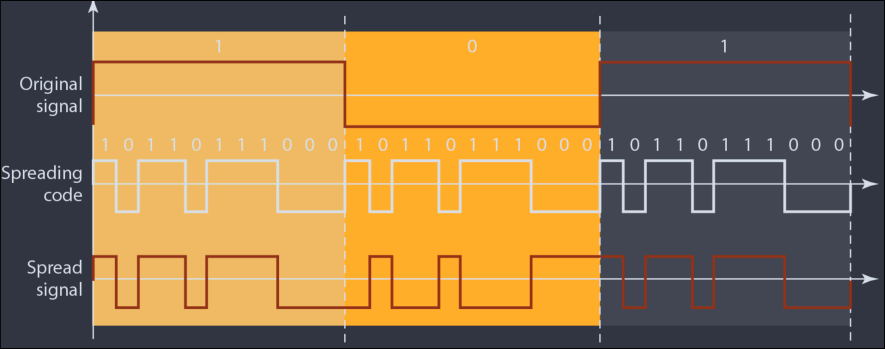
- **b. Frequency hopping Spread Spectrum (FHSS)**
    - FHSS uses $M$ different carrier frequencies that are modulated by the source signal.
        - At one moment, the signal modulates one carrier frequency;
        - At the next moment, the signal modulates another carrier frequency.
    - Block Diagram
        - 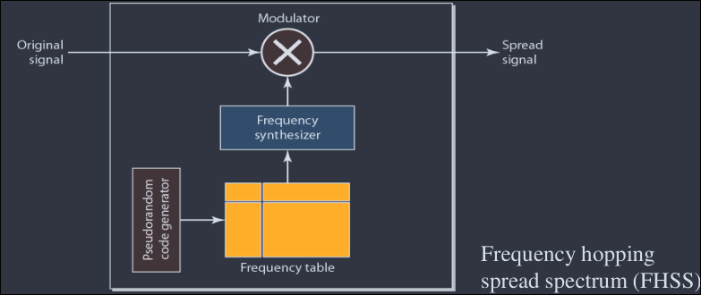
- If PSK is used, then the PN sequence generated at the modulator is used along with tthe PSK modulation to shift the phase of the PSK signal pseudo randomly.
    - the resulting signal at the modulator outptu is called as DDSS.
- If binary or M-ary FSK is being used, then the frequency of the FSK signal is shifted pseudo randomly.
    - This resulting signal at the modulator output is called FHSS.

#### Frequency hopping spread spectrum (FHSS)
  - The binary data sequence is applied to M-ary FSK modulator.
  - Frequency synthesizer produces the range of frequencies from single reference frequency.
  - The synthesizer output at a given instant of time is the frequency hop.
  - Each frequency hop is mixed with MFSK signal to produce the transmitted signal.
  - In this system, the data is used to modulate a carrier. The data-modulated carrier is then randomly hopped from one frequency to another.
  - Because of this, the spectrum of the transmitted signal is spreaded sequentially rather than instantaneously.

### FHSS

- The binary data sequence is applied to M-ary FSK modulator.
- Frequency synthesizer produces the range of frequencies from a single reference frequency.
- The synthesizer output at a given instant of time is the frequency hop.
- Each frequency hop is mixed with an MFSK signal to produce the transmitted signal.
- In this system, the data is used to modulate a carrier. The data-modulated carrier is then randomly hopped from one frequency to another.
- Because of this, the spectrum of the transmitted signal is spreaded sequentially rather than instantaneously.

## Frequency selection in FHSS

