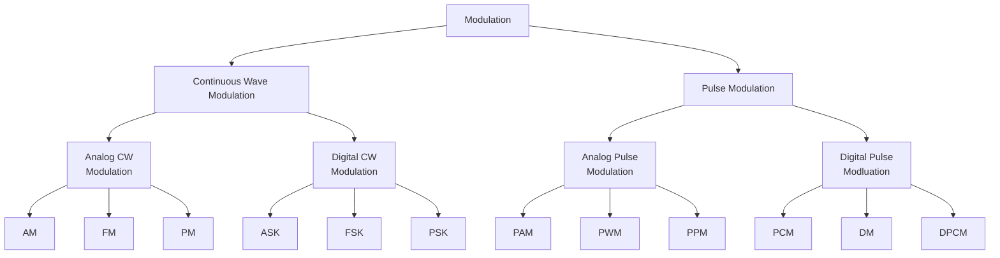

In baseband digital system, the information bearing signals are transmitted without any changes in spectral components of the signal. Since the baseband signal power is localized at low frequencies, it would require impractically large size antenna to radiate the low-freuency spectrum of the signal efficiently.
Hence, for wireless communications, the signal spectrum must be shifted to higher frequency range by employing modulation techniques.

In digital communication, the message signal (aka modulating signal) consists of
digital data.
If we change amplitude, frequency, phase of high frequency sinusoidal carrier signal
according to the modulating signal, then the modluation is called ASK, FSK and PSK respectively.
The waveform of ASK, FSK and PSK are given below:

In M-ary signaling, the modulator produces one of an available set of M (i.e.) equal to ($2^n$) distinct signals in response to n bits of source data at a time.
Binary modluation is a special case of M-ary modulation with M=2

At receiver, demodulation can be performed by either coherent or non-coherent detection methods as in case of analog modluation

# Geometric Representation and Constellation diagram of Digital Modulation

Digital modulation involves choosing a particular analog signal waveform s(t) from a finite set S of possible signal waveforms based on the information bits applied to the modulator.
FOr example, in binary modluation schemes, a binary information is directly mapped to a signal and set S contains only 2 signals, representing 0 and 1.
Similarly, for M-ary scheme, set S contains mopre than two signals and each represent more than a single bit of information.
Any element of set S (i.e. s(t) = {s1(t), s2(t) ..., sM(t)}), can be represented as a point in a vector space whose coordinates are basis signal $\phi_1(t)$ (i.e. $\phi_1(t), \phi_2(t), ..., \phi_N(t)$) such that function $\phi(t)$ are orthogonal over the interval $T$ as expressed as follows:
$$\int_T \phi_i(t)\phi_j(t) = \begin{cases} 1\  \text{ if } i = j \\ 0\ \text{ if } i \ne j\end{cases}$$
Now, $s_i(t)$ can be represented as a linear combination of the basis signals.
$$s_i(t)=\sum_{j=1}^{N} s_{ij}\ \phi_j(t)$$
for $0 \le t \le T$ and $i = 1, 2, ..., M$

## Example

$$s_{BPSK}(t) = \begin{cases}
\sqrt{\dfrac{2E_b}{T_b}} \cos(2\pi f_c t);\ \text{ symbol 1}\\
-\sqrt{\dfrac{2E_b}{T_b}} \cos(2\pi f_c t);\ \text{ symbol 0}
\end{cases}$$
Where, $E_b$ is energy per bit and $T_b$ is bit period

For this signal set, there is a single basis signal
$$\phi_1(t) = \pm \sqrt{\dfrac{2}{T_b}} cos(2\pi f_c t)$$
$$s_{BPSK} = \left\{\left[ \sqrt{E_b} \phi_1(t) \right], \left[ - \sqrt{E_b} \phi_1(t)  \right]\right\} $$

Constellation Diagram is a graphical representation of the complex envelope of each possible signal.
In the given example, the x-axis represents the in-phase component and the y-axis rerpresents the quadrature component of the complex envlope.
The distance between signals 'd' on a constellation diagram relates to how different modluation waveforms are differentiated by the receiver from random noise present.

# ASK

In Amplitude Shift Keying system, the binary symbol '1' is represented by transmitting a
sinusoidal carrier wave of fixed amplitude A and fixed frequency $f_c$ for a bit duration of $T_b$ seconds.
Whereas, binary symbol '0' is represented by aswitching off the carrier for $T_b$ seconds.
This signal can be generated by simply turning the carrier ON and OFF for prescribed period.
That is why it is called ON-OFF Keying (OOK)

Let the sinusoidal carrier be represented by:
$$s_c (t) = A \cos(2\pi f_c t)$$
The ASK signal can be represented by
$$s(t) = \begin{cases}
A \cos(2\pi f_c t);&\ \text{ symbol 1}\\
0;&\ \text{ symbol 0}
\end{cases}$$

In more general form
$$s(t) = x(t)\cdot A\cos(2\pi f_c t)\hspace{1cm} 0 \le t \le T_b$$
where x(t) is '1' or '0'

The signal has power
$$P = \frac{A^2}{2}$$
So,
$$A = \sqrt{2P}$$
and
$$\begin{align}
s(t) = &\sqrt{2P} \cos(2\pi f_c t) \\
= &\sqrt{PT_s} \sqrt{\dfrac{2}{T_b}} \cos(2\pi f_c t) \\
= &\sqrt{E_b} \sqrt{\dfrac{2}{T_b}} \cos(2\pi f_c t) \\
\end{align}$$
where $E_b = PT_b$ is the energy contained in a bit duration

## Signal Space diagram of ASK

The ASK waveform can be represented by the following constellation diagram

## Generation of ASK signal

ASK signal can be generated by applying the incoming binary data (should be the unipolar
format) and the sinusoidal carrier to the two inputs of the product modulator (Balanced
Modulator) as shown above.
ASK signal allows the carrier signal for input message bit '1' and stops carrier signal for message bit '0'

## Detection of ASK

### Coherent

ASK signals can be detected coherently or non-coherently.
In coherent detection, exact replicas (carrier waves) of the possible arriving signals 
are available at the receiver.
This received signal is then cross related with each fo teh replicas of the received
signal and decision is made based on comparison with preselected thresholds.

The block of coherent detector of ASK signal is shown above.
Cross-correlation of incoming ASK signal and locally generated un-modulated carrier
signal is estimated with the help of product modulator and the integrator  block.
The output of the integrator is then applied tot he decision making device that
compares the output with a preset threshold.
The decision is made in favor of symbol '1' if the threshold is exceeded and in
favor of symbol '0' otherwise.
In this method, it is assumed that the local carrier is in perfect synchronization
with the ccarrier used in the transmitter.
This means the frequency and phase of the locally generated carrier is same as those
of the carrier used in the transmitter.

### Non-Coherent

In non-coherent detection as shown above, the prior knowledge of the phase and
frequency is not required.
ASK can be demodulated using non-coherent detector using a simple envelope detector.
Basically, if envelope is detected, it means bit '1' has been transmitted and no
envelope means '0' bit.

# Phase Shift Keying (PSK)

PSK is more efficient than ASk, and is used for high bit rates data transmission.
In binary PSK system, a sinusoidal carrier wave of fixed amplitude and fixed frequecny
$f_c$ is used to reprresent both symbols '1' and '0', except the carrier phase of each
symbol differs by $180^0$ (i.e. $\pi$ radians)
Let the unmodulated carrier be represented by
$$s_c(t) = A \cos(2\pi f_c t)$$
Then the PSK signal can be represented by
$$
s(t) = \begin{cases}
A \cos(3\pi f_c t); &\ \text{ symbol 1}\\
A \cos(2\pi f_c t + \pi); &\ \text{ symbol 0}
\end{cases}
$$

The signal has power
$$P = \frac{A^2}{2}$$
So,
$$A = \sqrt{2P}$$
So, simplest definition of PSK:
$$s(t) = b(t) \sqrt{\dfrac{2E_b}{T_b}} \cos(2\pi f_c t)$$
where $b(t)$ is +1 for '1' symbol and -1 for '0' for '0' symbol

## Signal Space Diagram of PSK

## Generation of PSK signal

PSK signal may be generated by appying carrier signal to a product or balanced modulator.
The binary data signal (0's and 1's) is converted into a polar from.
THe PSK signal can be generated by using the same scheme as the generation of ASK.
The only difference is that the incoming binary data should be in the polar form.

THe bandwdith requirement of ASK and PSK is same.
But the most significant difference between the two is that ASK is a linear modulation
whereas PSK is a non-linear modualtion scheme.

## Detection of PSK

The same coherent detector as in case of ASK can be used to detect the BPSK.
The only difference is the threshold level.
In ASK, the threshold level is set to d/2, whereas in BPSK the threshold level is 0.

In case of phase shift keying (PSK), the non-coherent demodulation is not possible as,
the envelope detection will produce same level of signal at the output for both 1 and 0.
However, there is a pseudo PSK technique known as DPSK (Differential PSK) which can be
viewed as the non-coherent form of PSK

# Frequency Shift Keying (FSK)

In FSK system, two sinusoidal carrier waves of the same amplitude $A$.
But with different frequencies $f_{c_1}$ and $f_{c_2}$ are used to represent binary symbol
'1' and '0' respectively.

The FSK wave s(t) may be viewed as
$$
s(t) = \begin{cases}
A \cos(2\pi f_{c_1} t);&\ \text{ symbol 1}\\
A \cos(2\pi f_{c_2} t);&\ \text{ symbol 0}
\end{cases}
$$

Generally it is represented by

$$
s_i(t) = \begin{cases}
\sqrt{\dfrac{2E_b}{T_b}} \cos(2\pi f_{c_i} t);&\ 0 \le t \le T_b\\
0; &\ \text{elsewhere}
\end{cases}
$$
where, i = 1 and 2 and $E_b$ is transmitted signal energy per bit

The transmitted frequency is computed as:
$$f_c = \frac{n_c + i}{T_b}$$
for some fixed integer $n_c$

FSK system has signal space that is 2 dimensional with 2 message points.

## Generation of FSK

The binary sequence is represented in polar form, with symbol '1' represented by a 
constant amplitude of $\sqrt{E_b}$ volts and symbol '0' is represented by zero volts.
When symbol '1' is at the input, the oscillator with frequency $f_{c_1}$ in the upper
channel is switched on, while the oscillator with $f_{c_2}$ in the lower channel is
switched off, resulting in frequency $f_{c_1}$ being transmitted.
Similarly, when symbol '0' is at the input, the oscillator in the upper channel is
switched off, and the oscillator in the lower channel is switched on, resulting in
frequency $f_{c_2}$ being transmitted.
As with analog FM, the bandwidth requirement of FSK is higher than that of ASK and PSK.

## Detection of FSK signal

### Coherent Detection

The coherent detector arrangement for demodulation of binary FSK is shown above.
It consists of two correlators with a common binary FSK signal input.
They are correlated with locally generated coherent reference signal
$\sqrt{\dfrac{2}{T_b}} \cos(2\pi f_{c_1} t)$ and 
$\sqrt{\dfrac{2}{T_b}} \cos(2\pi f_{c_2} t)$.
The decision making device is essentially a comparator with compares output $F_1$ (in
the upper channel) and output $F_2$ (in the lower path).
The decision logic is: $F_1 \gt F_2$ so symbol '1', and $F_2 \gt F_1$ so symbol '0'.

### Non-coherent Detection

The arrangement for non-coherent demodulation of FSK is shown above.
The received FSK signal is applied to 2 bandpass filters.
The upper filter is tuned to frequency $f_{c_1}$ and lower filter to $f_{c_2}$
Each filter is followed by an envelope detector.
The resulting outputs of the two enevelope detectors are sampled at clock duration and then compared with each other with same logic as in coherent detection.

# M-ary signaling

In an M-ary signaling scheme, we may send one of M possible signals, during each
signaling interval of duration T seconds.
The number of possible signals i.e., M is given by $M = 2^n$ where $n$ is an integer.
The symbol duration is $n T_s$, where $T_s$ is the bit duration
THese signals are generated by changing the amplitude, phase of frequency of a carrier
in $M$ discrete steps.

The equivalent data rate $R_{min}$ M-ary signaling is $\log_2(M)$ times faster than the
binary signaling.
The bandwidth requirement in M-ary is same as in binary, but the power requirement is
higher.

## Quadriphase Shift Keying (QPSK)

All the modulationtechniques are not much efficient in bandwidth.
This section deals with 2 efficient modulation schemes for transmission of binary data.
They are both examples of quadrature carrier multiplexing system, which produces a
modulated wave as follows
$$
s(t) = s_I(t) \cos(2\pi f_c t) - s_Q(t) \sin(2\pi f_c t)
$$
where, $s_I$ is in phase component and $s_Q$ is quadrature phase component of modulated
wave.

The QPSK system is an example of M-ary PSK with M = 4.
In PSK, the basic idea is to transmit the information in the phase change of carrier.
in QPSK, the phase of the carrier takes on one fo the four equally spaced values such as $\pi/4, 3\pi/4 5\pi/4 7\pi/5$, as shown by
$$s_i(t) = \sqrt{\dfrac{2E}{T}} \cos(2\pi f_c t + \phi_i (t))$$
where phase $\phi_i(t) = (2i - 1) \pi/4$ for i = 1 to 4.
Now the equation can be expressed as
$$\sqrt{\frac{2E}{T}}\left[\cos \left(\phi _{i}\left(t\right)\right)\ \cos \left(2\pi f_{c}t\right)-\sin \left(\phi _{i}\left(t\right)\right)\sin \left(2\pi f_{c}t\right)\right]$$
Here, cos component is in-phase and sine component is quadrature-phase.

Each possible value of phase corresponds to a unique pair of two bits called dibits.
Here we have complete discription in the table below.
Here the codes are gray codes, 10, 00, 01 and 11.

| Input dibit | Phase oF QPSK | Coordinates of | message points |
| :--- | :--- | :---: | :---: |
| | | $s_{i1}$ | $s_{i2}$ |
| 10 | $\pi/4$ | + $\sqrt{E/2}$ | - $\sqrt{E/2}$ |
| 00 | $3\pi/4$ | - $\sqrt{E/2}$ | - $\sqrt{E/2}$ |
| 01 | $5\pi/4$ | - $\sqrt{E/2}$ | + $\sqrt{E/2}$ |
| 11 | $7\pi/4$ | + $\sqrt{E/2}$ | + $\sqrt{E/2}$ |

## Constellation Diagram

A QPSK signal is characterized by having a 2d signal constellation and four message points.

## Modulator

The input binary sequence to QPSK modulator is represented in polar form.
This binary sequence is divided into odd and even numbered bits using a demultiplexer.
Now, even numbered bits (representing the in-phase component of input) is multiplied
by $\sin(2\pi f_c t)$.
Then these two streams are added to get QPSK signal.
Note that the symbol duration T of a QPSK wave is twise as long as the bit duration\
$T_b$, of the input binary wave.
That is, for a given bit rate $1/T_s$, a QPSK wave requires half of the transmission
bandwidth.
ALternatively, given transmission bandiwdth, a QPSK wave carries twice as many bits of
information as the corresponding binary PSK wave.

## Demodulator

The QPSK signal can be detected by using a pair of correlators (Multiplier-followed by
integrator) in parallel.
The correlator in the upper path computes the cosine of the carrier wave whereas the
lower path computes the sine of teh carrier wave
The correlator outputs $x_1$, and $x_2$ are each compared with a threshold of zero
volt.
If $x_1 \gt 0$, a decision is made in favor of symbol '1' for the upper 'or' in phase
channel output.
But if $x_1 \lt 0$, a decision is made in favor of symbol '0'.
Similarly, if $x_2 \gt 0$, a decision is made in favour of symbol '1' for the lower or
quadrature channel output.
But if $x_2 \lt 0$, a decision is favor of symbol '0'.
Finally, these two binary sequences at the in-phase and quadrature channel outputs are
combined in a multiplexer to reproduce the original binary sequence at the
transmitter input.

## Minimum Shift Keying (MSK)

The bandwidth requirement of QPSK and BPSK is high as there is rapid fluctuation when
signal changes.
This is overcome with the MSK which generates an output waveform which is continuous
in phase and thus avoids the abrupt fluctuation in amplitude.
MSK replaces the rectangular pulse in amplitude with a half-cycle sinusoidal pulse.
The MSK signal is defined as:

$$S(t) = d(t) \cos(\pi t/2T)\cos(2\pi f t) + d(t) \sin(\pi t/2T) \sin(2\pi f t)$$

The MSK modulation makes the phase change linear and limited to $\pm \frac{\pi}{2}$
over a bit interval T.
This enables MSK to provide a significant improvement over QPSK.
Because of the effect of the linear phase change, the power spectral density has low
side lobes that help to control adjacent channel interference. However, the main lobe
becomes wider than the QPSK.

# GMSK

A Gaussian-shaped impulse response filter generates a signal with low side lobes and
narrower main lobe than the rectangular pulse. The input NRZ bit sequence is passed
through a Gaussian shape LPF. 
$$ H(f) = e^{-\left(\dfrac{-\log(2f^2)}{2W^2}\right)} $$
where $W$ is the 3dB bandwidth of baseband signal.

### Constellation Diagram

Constellation Diagram is a graphical representation of the complex envelope of each possible signal. In Fig. 1 of Example.5.1, the x-axis represents the in-phase component and the y-axis represents the quadrature component of the complex envelope. The distance between signals \( d \) on a constellation diagram relates to how different modulation waveforms are differentiated by the receiver from random noise present.

### Amplitude Shift Keying (ASK)

In Amplitude Shift Keying (ASK) system, binary symbol '1' is represented by transmitting a sinusoidal carrier wave of fixed amplitude \( cA \) and fixed frequency \( cf \) for a bit duration of \( bT \) seconds. Whereas, binary symbol '0' is represented by switching off the carrier for \( bT \) seconds. This signal can be generated simply by turning the carrier ON and OFF for prescribed period, that is why it is called ON-OFF Keying (OOK).

### ASK Signal Representation

\[ s(t) = A_c \cos(2\pi f_c t) u(t) \]

where \( u(t) \) is a unit step function.

The signal can be represented as:
- For symbol '1': 
  \[ s(t) = A_c \cos(2\pi f_c t) u(t) \]
- For symbol '0':
  \[ s(t) = 0 \]

This signal has power \( P = A_c^2 / 2 \).

### Signal Space Diagram of ASK

The ASK waveform for symbol '1' can be represented as:
\[ s(t) = A_c \cos(2\pi f_c t) u(t) \]
which corresponds to the phase shift \( \phi_1 = 0 \).

#### QPSK Modulator and Demodulator

The input binary sequence to the QPSK modulator is represented in polar form. This binary sequence is divided into odd and even numbered bits using a demultiplexer. Now, even-numbered bits (representing the in-phase component of input \( b_e \)) are multiplied by \( A_c \cos(2\pi f_c t) \). Odd-numbered bits (representing the out-of-phase component of input \( b_o \)) are multiplied by \( A_c \sin(2\pi f_c t) \). Then these two streams are added to get QPSK signal. Note that the symbol duration \( T \) of a QPSK wave is twice as long as the bit duration \( bT \), of the input binary wave. That is, for a given bit rate \( 1/bT \), a QPSK wave requires half of the transmission bandwidth. Alternately, for given transmission bandwidth, a QPSK wave carries twice as many bits of information as the corresponding binary PSK wave.

### QPSK Demodulator

The QPSK signal can be detected by using a pair of correlators (Multiplier-followed-by-integrator) in parallel. The circuit diagram is shown in Fig. 5.18.

- Upper Path: Computes the cosine of the carrier wave.
- Lower Path: Computes the sine of the carrier wave.

The correlator outputs are compared with a threshold of zero volt:
- If \( x_1 > 0 \), a decision is made in favor of symbol '1' for the upper (or) in-phase channel output.
- But if \( x_1 < 0 \), a decision is made in favor of symbol '0'.
- Similarly, if \( x_2 > 0 \), a decision is made in favor of symbol ‘1’ for the lower or quadrature channel output.
- But if \( x_2 < 0 \), a decision is favored towards symbol '0'. Finally, these two binary sequences at the in-phase and quadrature channel outputs are combined in a multiplexer to reproduce the original binary sequence at the transmitter input.

## Minimum Shift Keying (MSK)

Fig. 5.17 shows QPSK Modulator.
The input binary sequence is divided into odd and even numbered bits using a demultiplexer. Even-numbered bits (representing the in-phase component of input \( b_e \)) are multiplied by \( A_c \cos(2\pi f_c t) \). Odd-numbered bits (representing the out-of-phase component of input \( b_o \)) are multiplied by \( A_c \sin(2\pi f_c t) \). Then these two streams are added to get QPSK signal. Note that the symbol duration \( T \) of a QPSK wave is twice as long as the bit duration \( bT \), of the input binary wave.

Fig. 5.18 shows QPSK Demodulation.
The correlator in the upper path computes the cosine of the carrier wave, and the lower path computes the sine of the carrier wave. The correlator outputs are compared with a threshold of zero volt:
- If \( x_1 > 0 \), a decision is made in favor of symbol '1' for the upper (or) in-phase channel output.
- But if \( x_1 < 0 \), a decision is made in favor of symbol '0'.
- Similarly, if \( x_2 > 0 \), a decision is made in favor of symbol ‘1’ for the lower or quadrature channel output.
- But if \( x_2 < 0 \), a decision is favored towards symbol '0'. Finally, these two binary sequences at the in-phase and quadrature channel outputs are combined in a multiplexer to reproduce the original binary sequence at the transmitter input.

