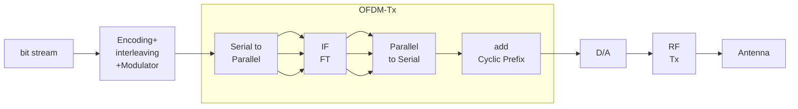
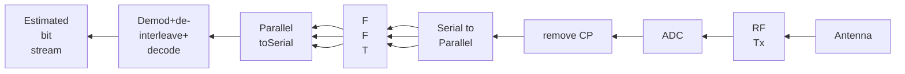

# DPSK

Differential PSK is a non-coherent form of phase shift keying which avoids the need for a coherent reference sigal at the receiver.
Noncoherent receivers are easy and cheap to buld and hence are widely used in wireless communications.
In DPSK systems, the input binary sequence is first differentially encoded and then modulated using a BPSK modulator.
The differentially encoded sequence { $d_k$ } is generated from from the input binary sequence { $m_k$ } by complementing the modulo-2 sum of $m_k$ and $d_{k-1}$.
The effect is to leave the symbol $d_k$ unchanged from the previous symbol if the incoming sy,bp; $m_k$ is 1 and to toggle $d_k$ if $m_k$ is 0.
Example: for $m_k$ = `1, 0, 0, 1, 0, 1, 1, 0`, we have $d_{k-1}$ = `1, 1, 0, 1, 1, 0, 0, 0` and $d_k$ = `1, 1, 0, 1, 1, 0, 0, 0, 1`.
The relation is $d_k = m_k \oplus d_{k-1}$.

## Block Diagram

### Transmitter

It consists of a one bit delay element and a logic circuit interconnected so as to generate the differentially encoded sequence from the input binary sequence.
The output is passed through a product modulator to obtain the DPSK signal.

### Receiver

At the receiver, the original sequence is recovered from the demodulated differentially encoded signal through a complementary process.
While PSK signaling has the advantage of reduced receiver complexity,
its energy efficiency is inferior to that of coherent PSK by about 3dB.
The average probability of error for DPSK is additive white Gaussian noise is given by.

$$P_{e, DPSK} = \frac12 \exp\left( -\frac{E_b}{N_0}\right )$$

# Offset QPSK

The amplitude of a QPSK signal is ideally constant.
However, when QPSK signals are pulse shpaed, they lose the constant envelope property.
The occasional phase shift of $\pi$ radians can cause the signal envelope to pass through zero for just an instant.
Any kind of hardlimiting or nonlinear amplification of the zero-crossings brings back the filtered sidelobes since the fidelity of the signal at small voltage levels is lost in transmission.
To prevent the regeneration of sidelobes and spectral widening, it is imperative that QPSK signals that use pulse shaping be amplified by only using linear amplifiers, which are less efficient.
A modified form of QPSK, called OQPSK or staggered QPSK is less susceptible to these deletrious effects and supports more efficient amplification.
That is, OQPSK ensure there are fewer baseband signal transitions applied to the RF amplifier, which helps eliminate spectrum regrowth after amplification.
OQPSK signaling is similar to QPSK signaling, as represented by:
$$s_{QPSK}\left(t\right)=\sqrt{\frac{2E_{s}}{T_{s}}}\left[\cos\left(\left(i-1\right)\frac{\pi}{2}\right)\cos\left(2\pi f_{c}t\right)-\sin\left(\frac{\left(i-1\right)\pi}{2}\right)\sin\left(2\pi f_{c}t\right)\right]$$
except for the time alignment of the even and odd bit streams.
In QPSK signaling, the bit transitions of the even and odd bit streams occur at the same time instants, but in OQPSK signaling, the even and odd bit streams, $m_I(t)$ and $m_Q(t)$, are offset in their relative alignment by one bit period (half-symbol period).
This is shown in the given waveform:

Due to the time alignment of $m_I(t)$ and $m_Q(t)$ in standard QPSK, phase transitions occur only once every $T_s = 2T_b$s, and will be a maximum of $180^0$ if there is a change in the value of both $m_I(t)$ and $m_Q(t)$.
However, in OQPSK signaling, bit transitions (and, hence, phase transitions) occur every $T_b$s.
Since the transition instants of $m_I(t)$ and $m_Q(t)$ are offset at any given time, only one of the two bit streams can change values.
This implies that the maximum phase shift of the transmitted signal at any given time is limited to $\pm 90^0$.
Hence, by switching phases more frequency (i.e. every $T_b$s instead of $2T_s$s) OQPSK signaling eliminates $180^0$ phase transitions.
Since $180^0$ phase transitions have been eliminated, bandlimiting of (i.e. pulse shaping) OQPSK signals does not cause the signal envelope to go to zero.
Obviously, there will be some amount of ISI caused by the bandlimiting process, especially at the $90^0$ phase transition points.
But the evenlope variations are considerably less, and hence hardlimiting or nonlinear amplification of OQPSK signals does not regenerate the high frequency sidelobes as much as in QPSK.
Thus, spectral occupancy is significantly reduced, while permitting more efficient RF amplification.

The spectrum of an OQPSK signal is identifical to that of a QPSK signal, hence both signals occupy the same bandwidth.
The staggered alignment of the even and odd bit streams does not change the nature of the spectrum. OQPSK retains its bandlimited nature even after nonlinear amplification, and therefore is very attractive for mobile communication systems where bandiwdth efficiency and efficient nonlinear amplifiers are critical for low power drain.
Further OQPSK signals also appear to perform better than QPSK in the presence of phase jitter due to noisy reference signals at the receiver.

# $\pi/4$ QPSK

The $pi/4$ shifted QPSK modulation is a quadrature phase shift keying technique which offers a compromise between OQPSK and QPSK in terms of the allowed maximum phase transitions.
It may be demodulated in a coherent or noncoherent fashion.
In $\pi/4$ QPSK, the maximum phase change is limited to $\pm 135^0$, as compared to $180^0$ for QPSK and $90^0$ for OQPSK.
Hence, the bandlimited $\pi/4$ QPSK signal preserves the constant envelope property better than bandlimited QPSK, but is more susceptible to envelope variations than OQPSK.
An extremely attractive feature of $\pi/4$ QPSK is that it can be noncoherently detected, which greatly simplifies receiver design.
Further, it has been found that in the presence of multipath spread and fading, $\pi/4$ QPSK performs better than OQPSK.
Very often, $pi/4$ QPSK signals are differentially encoded to facilitate easier implementation of differntial detection or coherent demodulation with phase ambiguity in the recovered carrier.
When differentially encoded, $\pi/4$ QQPSK.
In a $\pi/4$ PQSK modulator, signaling points of the modulated signal are selected from two QPSK constellations which are shifted by $\pi/4$ with respect to each other.
Sample constellation diagram:

Switching between two constellations every successive bit ensures that there is atleast a phase shift which is an integer multiple of $\pi/4$ radians between successive symbols.
This ensures that there is a phase transition for every symbol, which enables a receiver to perform timing recovery and synchronization.

# OFDM

Orthogonal FDM is a multichannel system which employs multiple subcarriers.
It does not use individual bandlimited filters and oscillators for each subchannel.
The spectra of subcarriers are overlapped for bandwidth efficiency
The multiple orthogonal subcarrier signal, which are overlapped in spectrum, can be produced by generalizing the single-carrier Nyquist criterion
$$\sum_{i = -\infty}^{\infty} G\left(f - \frac{i}{T}\right) = T$$
into multi-carrier criterion.
In practice, FFT and inverse FFT process are useful for implementing these orthogonal signals.

- In the OFDM transmission system, N-point IFFT is taken for the transmitted symbol $\{ X_l [k] \}_{k = 0}^{N-1}$, so as to generate $\{ x[n] \}_{n=0}^{N-1}$, the samples for the sum of N orthogonal subcarrier signals.
- Let $y[n]$ denote the received signal that corresponds to $x[n]$ with the additive noise $w[n]$ i.e. $y[n] = x[n] + w[n]$.
- Taking the N-point FFT of the received samples, $\{ y_l [n] \}_{n = 0}^{N-1}$ the noisy version of the transmitted symbols $\{ Y_l [k] \}_{k = 0}^{N-1}$ can be obtained in the receiver.
- As all the subcarriers are of finite duration T, the spectrum of the OFDM signal can be considered as the sum of the frequency-shifted sinc functions in the frequency domain, where the overlapping neighboring sinc functions are spaced by 1/T.

## Transmitter

in simpler way:

An OFDM carrier signal is the sum of a number of orthogonal subcarriers, with baseband data on each subcarrier being independently modulated commonly using some type of QAM or PSK. This composite baseband signal typically used to modulate a main RF carrier.
$s[n]$ is a serial stream of binary digits.
By inverse mutliplexing, these are first demultiplexed into $n$ parallel streams, and each one mapped to a possibly complex symbol stream using some modulation constellation (QAM, PSK, etc)
Note that the constellations may be different, so some streams may carry higher bit-rate than others.
An inverse FFT is computed on each symbols, giving a set of complex time-domain samples.
These samples are then quadrature-mixed to passband in the standard way.
The real and imaginary components are first converetd to the analog domain using DACs,
the analog signals are then used to modulate cosine and sine waves at the carrier frequency $f_c$, respectively.
These signals are then summed to give the transmission signal, $s(t)$

## Receiver

The receiver picks up the signal $r(t)$, which is then quadrature mixed down to baseband using cosine and sine waves at the carrier frequency.
This also creates signals centered on $2f_c$, so LPF are used to reject these.
the baseband signals are then sampled and digitized using ADCs and a forward FFT is used to convert back to the frequency domain.
This return $N$ parallel streams, each of which is converted to a binary stream using an appropriate symbol detector.
These streams are then re-recombined into a serial stream, $\hat s [n]$, which is an estimate of the original binary stream at the transmitter.
