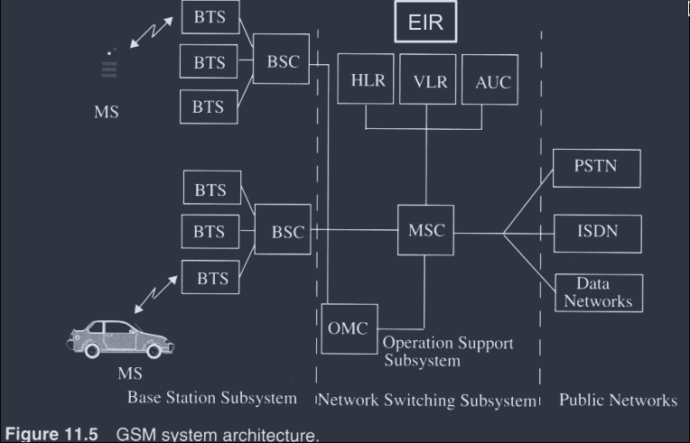
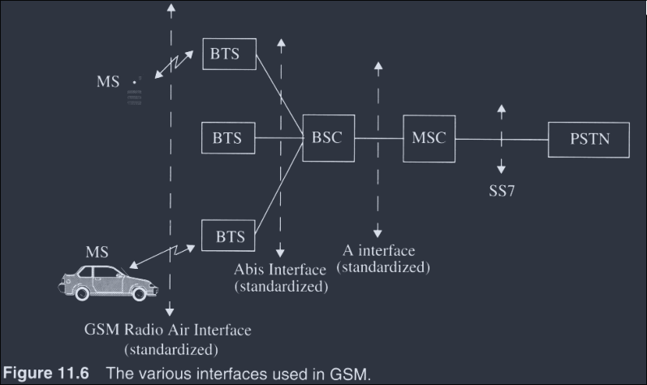
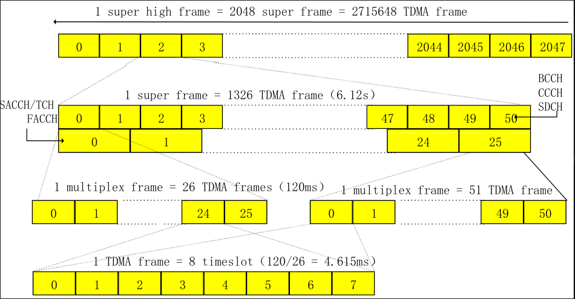
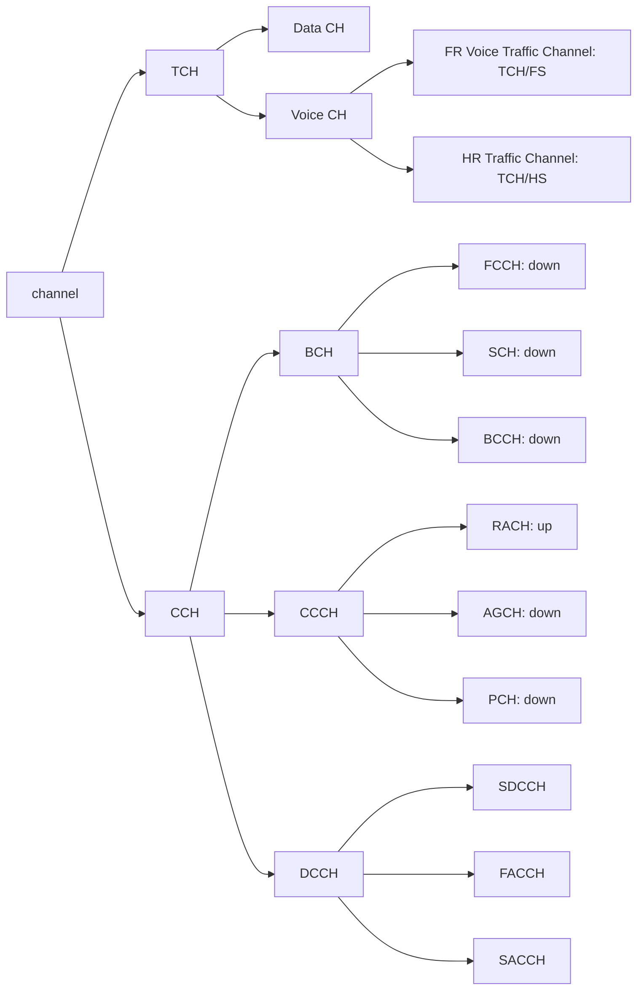

# GSM system

- Global System for Mobile Communications (GSM) introduced in 1991 was developed to solve the fragmentation problems of the first cellular systems in Europe.
- GSM standards was set by ETSI (European Telecommunication Standards Institute)
- Services
    - telephone services
    - data services
    - short message paging
- System architecture:
    - three major subsystems
    - Base Station Subsystem
    - network switching Subsystem
    - Public Networks
    - Figure illustrating such networks:
        - 

## Radio Subsystem (Base Station Subsystem BSS)

- Mobile stations (MS), Base Transreceiver Station (BTS) and the Base Controller (BSC)
- The mobile stations contains IMEI (International mobile equipment identity)
- The IMSI (Internation mobile subscriber identity) is stored in teh subscriber identity module (SIM), the HLR and VLR database
- The IMSI is an unique identity which is used internationally and used within the network to identify the mobile subscribers.
- Provides and manages radio transmission paths between the MS and MSC.
- One BSC controls up to several BTSs
-  BSC performs handover for MS under the control of same BSC.

## Network and Switching Subsystem (NSS)

- MSCs, Visitor Location Register (VLR), Home location register (HLR), authentication center (AUC) and equipment identity register (EIR)
- Switching of GSM calls between external networks and the BSCs
- HLR: contains subscriber information (International Mobile Subscriber Identity, IMSI) and location information for each user who resides in the same city as the MSC.
- VLR: temporarily stores the IMSI and customer information for each roaming subscriber who is visitingg the coverage area of a particular MSC
- once a roaming mobile is logged in the VLR, the MSC sends the necessary information to the visiting subscriber's HLR so that calls to the roaming mobile can be appropriately routed over the PSTN by the roaming user's HLR.
- AUC: Strongly protected database which handles the authentication and encryption keys for every single subscriber in the HLR and VLR.
- EIR: when the mobile equipment is stolen or lost, the owner can typically contact their local oeprator with a request that it should be blocked.
    - if the local operator possess  an equipment identity register (EIR), it then will put the IMEI (pressing `*#06#`) into it, and can optionally communicate this to the central equipment identity register (CEIR) which blacklists the device in all other operator swictches that use the CEIR.

## Operation Support Subsystem (OSS)

- Support the operation and maintenance of GSM and allows system engineers to monitor, diagnose and troubleshoot all aspects fo teh GSM system
- Interacts with the other GSM subsystems
- charging and billing

## Interface

## GSM Air Interface Specification Summary

| Parameter | Specification |
| --- | --- |
| reverse channel frequency | 890 - 915 MHz |
| forward channel frequency | 935 - 960 MHz |
| ARFCN Number  | 0 - 124 and 975 - 1023 |
| Tx/Rx Frequency Spacing | 45 MHz |
| Tx/Rx TImeslot Spacing | 3 time slots |
| Modulation Data rate | 270.8333 kbps |
| frame period | 4.615 ms| 
| users per frame (full rate) | 8 |
| time slot period | 576.9 $\mu$s | 
| bit period | 3.692 $\mu$s | 
| modulation | 0.3 GMSK |
| ARFCN channel spacing | 200 kHz |
| interleaving (max. delay) | 40 ms |
| voice coder bit rate | 13.4 kbps |

## Frequency Domain

- The frequency band for uplink (reverse) is 890-915 MHz, downlink (forward) is 935 - 960 MHz
- the bandwidth for the GSM system is 25 MHz, which provides 125 carriers uplink/downlink each having a bandwidth of 200 kHz. 
    - the ARFCN (absolute radio frequency channel number) denotes a forward and reverse channel pair which is separated in frequency by 45 MHz
- In practical implementations, a guard band of 100 kHz is provided at teh upper and lower end of the GSM spectrum, and only 124 (duplex) channels are imiplemented.
- There are a total of eight channels per carrier.
    - every eigth timeslot on a TDMA channel, the user transmits or receives this information
- a second frequency band from 1710-1785 MHz and 1805 -1880 MHz (three times as much as primary 900 MHz)  are also speciifed in 1900, a total of 374 duplex channels - DCS 1800

## Time Domain

- RF carrier channel is time division multiple accessed by users at different locations within a cell site
- frame duration is 4.615 ms, and each frame consists of 8 time-slots
- each of teh time-slot is a traffic channel having the duration 0.577 ms

## Multiframe

- 26 frames (traffic or speech): Traffic CHannel (TCH), Slow Associated Control CHannel (SACCH), Fast Associated Control CHannel (FACCH).
- 51 frames (control): Broadcast Common Control (BCC), Stand Alone Dedicated Control Channels
- Superframe: 51 traffic multiframes or 26 control multiframes
- Hyperframe: 2048 superframes (3 hrs 28 min 52.76s), to support encryption with high security and frequency hopping.

## Timeslot and Frame Structure

## Physical Channel & Logical Channel

- Physical Channel: specified by ARFCN and TN
- Logical Channel: is mapped onto the physical channel. e.g. TCHs and control channels

## Channel Type

