# GSM system

- Global System for Mobile Communications (GSM) introduced in 1991 was developed to solve the fragmentation problems of the first cellular systems in Europe.
- GSM standards was set by ETSI (European Telecommunication Standards Institute)
- Services
    - telephone services
    - data services
    - short message paging
- System architecture:
    - three major subsystems
    - Base Station Subsystem
    - network switching Subsystem
    - Public Networks
    - Figure illustrating such networks:
        - 

## Radio Subsystem (Base Station Subsystem BSS)

- Mobile stations (MS), Base Transreceiver Station (BTS) and the Base Controller (BSC)
- The mobile stations contains IMEI (International mobile equipment identity)
- The IMSI (Internation mobile subscriber identity) is stored in teh subscriber identity module (SIM), the HLR and VLR database
- The IMSI is an unique identity which is used internationally and used within the network to identify the mobile subscribers.
- Provides and manages radio transmission paths between the MS and MSC.
- One BSC controls up to several BTSs
-  BSC performs handover for MS under the control of same BSC.

## Network and Switching Subsystem (NSS)

- MSCs, Visitor Location Register (VLR), Home location register (HLR), authentication center (AUC) and equipment identity register (EIR)
- Switching of GSM calls between external networks and the BSCs
- HLR: contains subscriber information (International Mobile Subscriber Identity, IMSI) and location information for each user who resides in the same city as the MSC.
- VLR: temporarily stores the IMSI and customer information for each roaming subscriber who is visitingg the coverage area of a particular MSC
- once a roaming mobile is logged in the VLR, the MSC sends the necessary information to the visiting subscriber's HLR so that calls to the roaming mobile can be appropriately routed over the PSTN by the roaming user's HLR.
- AUC: Strongly protected database which handles the authentication and encryption keys for every single subscriber in the HLR and VLR.
- EIR: when the mobile equipment is stolen or lost, the owner can typically contact their local oeprator with a request that it should be blocked.
    - if the local operator possess  an equipment identity register (EIR), it then will put the IMEI (pressing `*#06#`) into it, and can optionally communicate this to the central equipment identity register (CEIR) which blacklists the device in all other operator swictches that use the CEIR.

## Operation Support Subsystem (OSS)

- Support the operation and maintenance of GSM and allows system engineers to monitor, diagnose and troubleshoot all aspects fo teh GSM system
- Interacts with the other GSM subsystems
- charging and billing

## Interface

## GSM Air Interface Specification Summary

| Parameter | Specification |
| --- | --- |
| reverse channel frequency | 890 - 915 MHz |
| forward channel frequency | 935 - 960 MHz |
| ARFCN Number  | 0 - 124 and 975 - 1023 |
| Tx/Rx Frequency Spacing | 45 MHz |
| Tx/Rx TImeslot Spacing | 3 time slots |
| Modulation Data rate | 270.8333 kbps |
| frame period | 4.615 ms| 
| users per frame (full rate) | 8 |
| time slot period | 576.9 $\mu$s | 
| bit period | 3.692 $\mu$s | 
| modulation | 0.3 GMSK |
| ARFCN channel spacing | 200 kHz |
| interleaving (max. delay) | 40 ms |
| voice coder bit rate | 13.4 kbps |

## Frequency Domain

- The frequency band for uplink (reverse) is 890-915 MHz, downlink (forward) is 935 - 960 MHz
- the bandwidth for the GSM system is 25 MHz, which provides 125 carriers uplink/downlink each having a bandwidth of 200 kHz. 
    - the ARFCN (absolute radio frequency channel number) denotes a forward and reverse channel pair which is separated in frequency by 45 MHz
- In practical implementations, a guard band of 100 kHz is provided at teh upper and lower end of the GSM spectrum, and only 124 (duplex) channels are imiplemented.
- There are a total of eight channels per carrier.
    - every eigth timeslot on a TDMA channel, the user transmits or receives this information
- a second frequency band from 1710-1785 MHz and 1805 -1880 MHz (three times as much as primary 900 MHz)  are also speciifed in 1900, a total of 374 duplex channels - DCS 1800

## Time Domain

- RF carrier channel is time division multiple accessed by users at different locations within a cell site
- frame duration is 4.615 ms, and each frame consists of 8 time-slots
- each of teh time-slot is a traffic channel having the duration 0.577 ms

## Multiframe

- 26 frames (traffic or speech): Traffic CHannel (TCH), Slow Associated Control CHannel (SACCH), Fast Associated Control CHannel (FACCH).
- 51 frames (control): Broadcast Common Control (BCC), Stand Alone Dedicated Control Channels
- Superframe: 51 traffic multiframes or 26 control multiframes
- Hyperframe: 2048 superframes (3 hrs 28 min 52.76s), to support encryption with high security and frequency hopping.

## Timeslot and Frame Structure

## Physical Channel & Logical Channel

- Physical Channel: specified by ARFCN and TN
- Logical Channel: is mapped onto the physical channel. e.g. TCHs and control channels

<table>
    <tr>
        <th colspan="5">Logical channels
    </tr>
    <tr>
        <th colspan="2">Traffic channels (TCH) BTS <-> MS</th>
        <th colspan="3">Control Channels (CCHs)</th>
    </tr>
    <tr>
        <td>FEC-coded speech
        <td>FEC-coded data
        <td>BCHs BTS -> MS
        <td>CCCHs
        <td>DCCHs BTS <-> MS
    </tr>
    <tr>
        <td>TCH/FS 22.8 kbps
        <td>TCH/F9.6 TCH/F4.8 TCH/F2.4 22.8 kbps
        <td>BCCH
        <td>PCH BTS -> MS
        <td> SDCCH
    </tr>
    <tr>
        <td rowspan="2">TCH/HS 11.4 kbps
        <td rowspan="2">TCH/H4.8 TCH/H2.4 11.4 kbps
        <td>FCCH
        <td>RACH BTS <- MS
        <td>SACCH
    </tr>
    <tr>
        <td>SCH
        <td>AGCH BTS -> MS
        <td>FACCH
    </tr>
</table>

## Channel Type

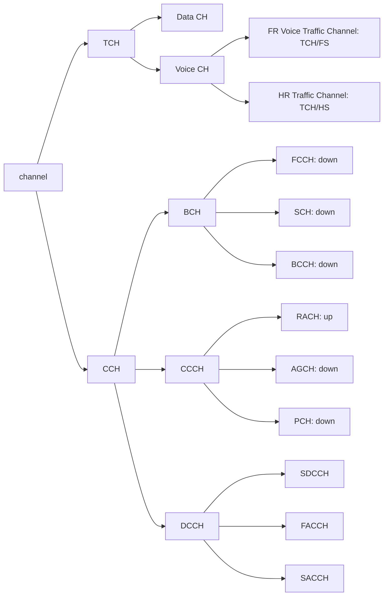

### Traffic Channel (TCH)

- Traffic Channels carry digitally encoded user speech or user data.
    - Have identical functions and formats on both the forward and reverse link.
- Full rate:
    - user data is contained within one TS per frame
- Half rate
    - user data is mapped onto the same time slot, but is sent in alternate frames

### Traffic or speech multiframe

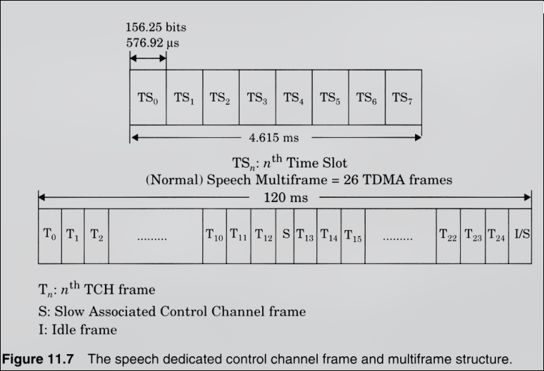
### Control Multiframe

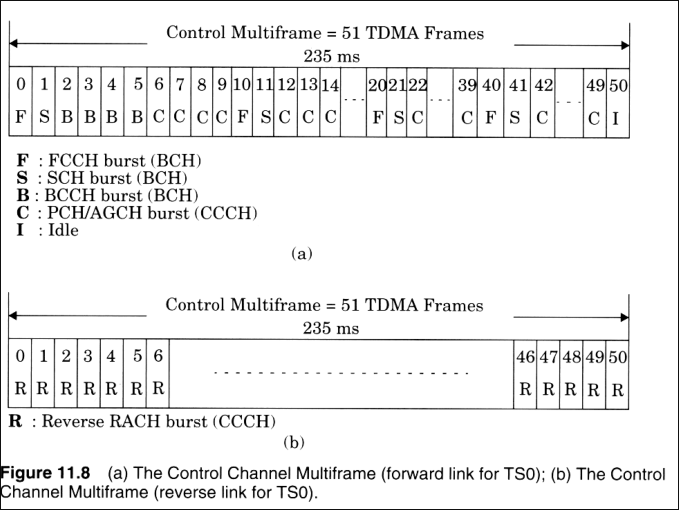

### Control (Signaling) Channels

- Broadcast Channel (BCH)
    - The BCH channel are used, by the base base station, to provide the mobile station with sufficient infromation it needs to synchronize with the network.
    - three different types of BCHs can be distinguished:
    - Broadcast control control channel (BCCH)
        - gives to the mobile station the parameters needed in order to identify and access the network
        - broadcast cell and network information (cell and network activity)
        - list of channels in use
    - frequency correlation channel (FCCH)
        - occupies TS0 of first frame
        - repeated every 10th frame within a control channel multiframe
        - synchronization of local oscillator (radio frequency) to base station oscillator.
    - Synchronization channel (SCH)
        - broadcast in TS0 immediately following a FCCH frame
        - allows for frame synchronization
        - base station issues timing advancement commands
- Common Control Channel (CCCH)
    - help to establish the calls from the mobile station or the network.
    - occupies TS0 of every control frame not used by BCH or the Idle Frame.
    - Three different types of CCCH can be defined
    - Paging channel (PCH)
        - provides paging signals from base to mobiles
        - notifies specific mobile of incoming call
    - random acess channel (RACH)
        - uplink channel
        - used by mobiles to acknowledge page from PCH
        - used by mobiles to originate a call
    - Access grant channel (AGCH)
        - it is used, by the base station, to inform the mobile station about which channel it should use.
        - this channel is the answer of a base station to a RACH from the mobile station.
        - Specifies time slot, radio channel and dedicated control channel.
        - AGCH is final, CCCH message before mobile is moved off the control channel.
- Dedicated Control Chanell (DCCH)
    - Bi-directional channels with same format and function on uplink and downlink.
    - May exist in any time slot and on any radio channel except TS0 of the control radio channel.
    - stand-alone dedicated control channel (SDCCH)
        - carries signaling data following the connection of the mobile with BS.
        - intermediate and temporary channel for mobiles while waiting for the BS to allocate a TCH channel.
        - ensures that mobile and base remains connected during authentication and resource allocation
        - maybe assigned their own physical channel or may occupy TS0 of the BCH if there is low demand for BCH or CCCH traffic

### Associated Control Channel

- Slow associated control channel (SACCH)
    - always associated with a traffic channel
    - on downloink the SACCH carrier power control and timing advance instruction
    - on uplink the SACCH carriers signal strength and quality information
    - SACCH is allocated every 13th frame of a traffic channel.
- Fast associated control channel (FACCH)
    - carries urgent messages to the mobile, for example, handover.
    - FACCH gains access by stealing frames from TCH 9e.g., data transmission slot are stolen)

### Location Updating Communication

| System Activity | Channel | Mobile Activity |
| --- | --- | --- |
|System overhead parameters and other overhead messages | BCCH$\rightarrow$ | Mobile switched on, searches for base channel and synchronizes. Monitor BCCH for current location |
| Receive channel request | $\leftarrow$RACH | If current location different from that stored in SIM, generate a channel request | 
| Assign stand alone dedicated control channel | AGCH$\rightarrow$ | receive stand alone dedicated control channel assignment and store in memory |
| Receive location updating request | $\leftarrow$ SDCCH | Request for location updating (registering) |
| Request authentication from mobile | SDCCH $\rightarrow$ | Receive authentication request |
| Receive and check authentication | $\leftarrow$ SDCCH | Authenticator response |
| Request mobile to transmit in ciphered mode | SDCCH $\rightarrow$ | Receive request and switch to ciphered mode |
| Receive acknowledgement | $\leftarrow$ SDCCH | Acknowledge cipher mode request |
| Confirm location updating including the optional assignment of temporary identity (TMS) | SDCCH $\rightarrow$ | Receive location updating including and TMSI and store in SIM |
| Receive acknowledgement | $\leftarrow$ SDCCH | Acknowledge new location and TSMI |
| Send channel release | SDCCH $\rightarrow$ | Switch to idle update mode, monitor BCCH and CCCH |

### Time Slot Bursts

- Time slot data bursts take on one of the 5 formats according to the logical channel
- A normal burst consists of 148 bits
- Guard time of 8.25 bits are information overlap
- two batched of 57 bits are information bits
- 26 training bits for equalization
- two stealing bits for FACCH

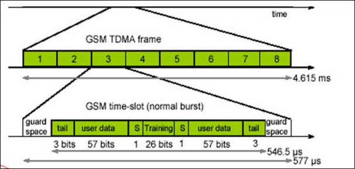

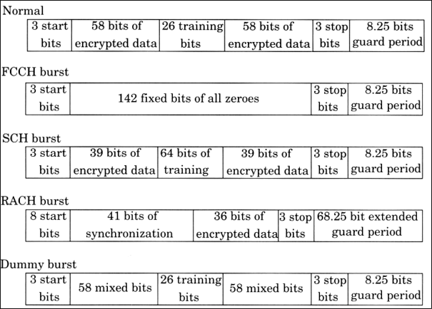

## Speech Coding

- The GSM speech coder is based on the Residually Excited Linear Predictor (RELP)
- Enhanced by a long term predictor (LTP)
- The coder provides 260 speech codec bits for each 20ms, i.e. the speech codec bit rate is 13 kbps
- 40\% average voice activity exploited by a discontinuous transmission mode.
- A voice activity detector (VAD) is used in the speech coder, off the transmitter for power saving
- half rate codec works at 6.5 kbps

### Channel Coding - data channels

- Full Rate 22.8 kbps
    - the output bits of the speech coder are ordered into groups for error protection, based upon their significance in contributing to speechquality.
    - out of the total 260 bits in a frame
    - the most important 50 bits, called type $I_a$ bits, have 3 parity check (CRC) bits added to them
    - The next 132 bits along with the first 53 are reordered and appended by 4 trailing zero bits, and then encoded for error protection using a rate $1/2$ convolution encoder with constraint length $K = 5$
    - the least important 78 bits do not have any error protection

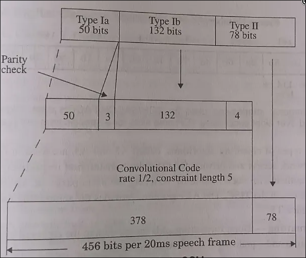

## Modulation and Interleaving

- Modulation
    - 0.3 GMSK
    - the channel data rate of GSM is 270.8333 kbps
- Interleaving
    - to minimze the effect of sudden fades on the received data, the total of 456 encoded bits within each 20 ms speech frame or control message frame are broken into eight 57 bit sub-blocks.
    - These 8 sub-blocks which make up a single speech frame are spread over eight consecutive TCH time slots.
    - If a burst is lost due to interface or fading, interleaved data will help to spread the effect over a few error-correction-frames.
    - hopefully channel coding ensures that enough bits will still be received correctly

## Frequency Hopping

- Under normal conditions, each data burst belonging to a particular physical channel is transmitted using the same carrier frequency.
- if users in a particular cell have severe multipath problems, the cell may be defined as a hopping cell by the network operator.
- frequency hopping is carried out on a frame-by-frame basis, thus hopping occurs at a maximum rate of 216.7 hops per second (1/0.004615 frame rate)
- as many as 64 different channels may be used before a hopping sequence is repeated.
- the bandwidth for the GSM system is 25 MHz, which provides 125 carriers uplink/downlink each having a bandwidth of 200 kHz. 
    - the ARFCN (absolute radio frequency channel number) denotes a forward and reverse channel pair which is separated in frequency by 45 MHz
- In practical implementations, a guard band of 100 kHz is provided at teh upper and lower end of the GSM spectrum, and only 124 (duplex) channels are imiplemented.
- There are a total of eight channels per carrier.
    - every eigth timeslot on a TDMA channel, the user transmits or receives this information
- a second frequency band from 1710-1785 MHz and 1805 -1880 MHz (three times as much as primary 900 MHz)  are also speciifed in 1900, a total of 374 duplex channels - DCS 1800

## Time Domain

- RF carrier channel is time division multiple accessed by users at different locations within a cell site
- frame duration is 4.615 ms, and each frame consists of 8 time-slots
- each of teh time-slot is a traffic channel having the duration 0.577 ms

## Multiframe

- 26 frames (traffic or speech): Traffic CHannel (TCH), Slow Associated Control CHannel (SACCH), Fast Associated Control CHannel (FACCH).
- 51 frames (control): Broadcast Common Control (BCC), Stand Alone Dedicated Control Channels
- Superframe: 51 traffic multiframes or 26 control multiframes
- Hyperframe: 2048 superframes (3 hrs 28 min 52.76s), to support encryption with high security and frequency hopping.

## Others

- Apparent bandwidth efficiency
    - GSM bit rate = 270.83 kbps, bandiwdth = 200 kHz
    - bandwidth efficiency = 1.354 bs/Hz
- The speech codec rate for each time slot = 456b/20 ms = 22.8 kbps
- Each voice channel actually allocated for 270.83/8 = 33.854 kbps
- Number of bits/slot = 33.854 x 4.616 = 156.25 bits (148 + 8.25 guard time)
- For each TDMA slot in each frame, 114 bits are transmitted, and only 24 data frames per 26 frames are transmitting, therefore the vocoder output rate = 114/0.004615 x 24/26 = 22.8 kbps
- However, of the 114 bits in a slot, only 65 are raw speech codec bits
    - raw data rate = 22.8 * 65/114 = 13 kbps
    - 65 bits in 20 ms = 13 kbps

## Timeslot and Frame Structure

## Physical Channel & Logical Channel

- Physical Channel: specified by ARFCN and TN
- Logical Channel: is mapped onto the physical channel. e.g. TCHs and control channels

<table>
    <tr>
        <th colspan="5">Logical channels
    </tr>
    <tr>
        <th colspan="2">Traffic channels (TCH) BTS <-> MS</th>
        <th colspan="3">Control Channels (CCHs)</th>
    </tr>
    <tr>
        <td>FEC-coded speech
        <td>FEC-coded data
        <td>BCHs BTS -> MS
        <td>CCCHs
        <td>DCCHs BTS <-> MS
    </tr>
    <tr>
        <td>TCH/FS 22.8 kbps
        <td>TCH/F9.6 TCH/F4.8 TCH/F2.4 22.8 kbps
        <td>BCCH
        <td>PCH BTS -> MS
        <td> SDCCH
    </tr>
    <tr>
        <td rowspan="2">TCH/HS 11.4 kbps
        <td rowspan="2">TCH/H4.8 TCH/H2.4 11.4 kbps
        <td>FCCH
        <td>RACH BTS <- MS
        <td>SACCH
    </tr>
    <tr>
        <td>SCH
        <td>AGCH BTS -> MS
        <td>FACCH
    </tr>
</table>

## Example of GSM Call

- By receiving the FCCH, SCH, and BCCH messages, the MS would be locked on to the appropriate BCH.
- To originate a call, the MS transmits a burst of RACH data, using the same ARFCN as the base station to which it is locked.
- the base station responds with an AGCH message on the CCCH which assigns the MS to a new channel for SDCCH connection.
- The MS, which is monitoring slot 0 of the BCH, would receive its ARFCN and slot assignment (for SDCCH) from the AGCH and would immediately tune to SDCCH.
- Upon receiving the timing advance and power level command over the SDCCH, the MS is ready to transmit normal bursts as required for speech traffic.
- SDCCH sends messages between MS and base station for authentication, while the PSTN connects the dialed party to MSC, and MSC switches the speech path to the serving base station.
- The MS is then commanded by the base station via SDCCH to tune to a new ARFCN and new slot for TCH assignment
- Once tuned to the TCH, speech data is transferred on both directions and the SDCCH ais vacated.

## Signal Processing in GSM

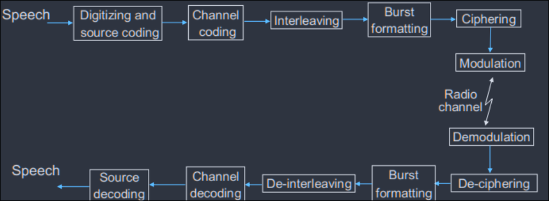

### Speech Coding

- The GSM speech code is based on the RELP, which is enhanced by LTP .
- The coder provides 260 bits for each 20ms blocks of speech, which yields a bit rate of 13 kbps.
- This speech coder was selected after extensive subjective evaluation of various candidate corders available in the late 1980s.
- Provisions for incorporating half-rate coders are included in the specifications
- the gsm speech coder takes advantage of the fact that in a normal conversation, each person on average talks for less than 40\% of the time.
- By incroporating a voice activity detector (VAD) in the speech coder, GSM systems operate in a discontinuous transmission mode (DTX) which provides a longer subscriber battery life and reduces instantaneous radio interference since the GSM transmitter is not active during silent periods.
- A comfort noise sub-system (CNS) at the receiving end introduces a background acoustic noise to compensate for annyoing switched muting which occurs due to DTX

### TCH/FS, SACCH, and FACCH Channel Coding

- The output bits of the speech coders are ordered into groups for error protection, based upon their significance in contributing to speech quality.
- Out of total 260 bits in a frame, the most important 50 bits, called type Ia bits, have 3 parity check (CRC) bits added to them.
- This facilitates the detection fo non-correctable errors at the receiver.
- The next 132 bits along with the first 53 (50 type Ia + 3 parity bits) are reordered and appended by four trailinig zero bits, thus providing a data block of 189 bits.
- This block is then encoded for error protection using a rate 1/2 convolutional encoder with constraint length K = 5, thus providing a sequence of 378 bits.
- The least important 78 bits do not have any error protection and are concatenated to the existing sequence to form a block of 456 bits in a 20 ms frame.
- The error protection coding scheme increases the gross data rate of the GSM speech signal, with channel coding, to 22.8 kbps.

### Channel Coding for Data channels

- The coding provided for GSM full rate data channels (TCH/F9.6) is based on handling 60 bits of user data at 5 ms intervals, in accordance with the modified CCITTT V.110 modern standard.
- 240 bits of user data are applied with four trailing bits to a half-rate punctured convolutional coder with constraint length K = 5.
- The resulting 488 coded bits are reduced to 456 encodeddata bits through puncturing (32 bits are not transmitted), and the data is separated into four 114 bit data bursts that are applied in an interleaved fashion to consecutive time slots.

### Channel Coding for COntrol Channels

- GGSM control channel messages are defined to be 184 bits long, and are encoded using a shortened binary cyclic fire code, followed by a half-rate convolutional coder.
- The fire code uses the generator polynomial
    - $$G_5(x) = (x^{23} + 1) (x^{17} + x^3 1) = x^{40} + x^{26} + x^{23} + x^{17} + x^{3} + 1 $$
- which produces 184 message bits, followed by 40 parity bits.
- Four tail bits are added to clear the convolutional coder which follows, yielding a 228 bit data block.
- this block is applied to a half-rate K = 5 convolutional code using the generator polynomial $G_0 = 1 + x^3 +x^4$ and $G_1 = 1 + x + x^3 + x^4$ (which are teh same polynomials used to code TCH type Ia data bits)
- The resulting 456 encoded bits are interleaved onto eight consecutive frames in the same manner as TCH speech data.

### Interleaving

- In order to minimize the effect of sudden fades on the received dat, the total of 456 bits within each 20 ms speech frame or control message frame are boken into eight 57 bit sub-blocks.
- these sub-blocks which make up a single speech frame are spread over eight consecutive TCH time slots
    - i.e. eight consecutive frames for a specific TS).
- If a burst is lost due to interference or fading, channel coding ensures that enough bits will still be received correctly to allow the error correction to work.
- each TCH time slot carries two 57 bit blocks of data from two different 20 ms (456 bit) speech (or control) segments.
- TS 0 contains 57 bits of data from 0th sub-block of the nth speech coder frame and 57 bits of data from 4th subblock of the (n-1)st speech coder frame

### Ciphering

- ciphering modifies the contents of eight interleaved blocks thorugh the use of encryption techniques known only to the particular mobile station and base transceiver station.
- security is further enhanced by the fact that the encryption algorithm is changed from call to call.
- two types of ciphering algorithms, called A3 ans A4, are used in GSM to prevent unathorized network access and privacy for the radio transmission respectively.
- the A3 algorithm is used to authenticate each mobile by verifying the users passcode within the SIM with the cryptogrtaphic key at the MSC.
- The A5 algorithm provides the scrambling for the 114 coded data bits sent in each TS.

### Burst Formatting

- Burst formatting adds binary data to the ciphered blocks, in order to help synchronization and equalization of the received signal.

### Modulation

- the modulation scheme used in GSM is 0.3 GMSK, where 0.3 describes the 3 dB bandwidth of the gaussian pulse shhaping filter with relation to the bit rate (e.g., BT = 0.3)
- GMSK is a special type of type of digital FM modulation
- binary ones and zeros are represented in gsm by shifting the rf carrier by $\pm 67.708$ kHz.
- the channel data rate of bandwidth occupied by the modulation specturm and hence improves channel capacity.
- the msk modulated signal is passed through a gaussian filter to smooth the rapid frequency transitions, which would otherwise spread energy into adjacent channels.

### Frequency Hopping

- under normal conditions, each data burst belonging to a physical channel is transmitted using the same carrier frequecny
- however, if users in a particular cell have severe multipath problems, the cell may be defind as a hopping cell by the network operator, in which case, slow frequency hopping may be implemented to combat the multipath or interference effects in that cell
- frequency hopping is carried out on a frame-by-frame basis, thus hopping occurs at a maximum rate of 217.6 hops per second.
- as many as 64 dififerent channels may be used before a hopping sequence is repaeated.
- Frequenc hopping is completel specified by the servvice provider.

### Equalization

- equalization is performed at the receiver with the help of th training sequences transmitted in the midamble of every time slot.
- the type of equalizer for gsm is not specified and is left upto the manufacturer

### Demodulation

- The portion of the transmitted forward channel signal which is of interest to a particular user is determined by the assigned TS and ARFCN
- the appropriate TS is demodulated with the aid of synchronization data provided by the burst formatting 
- after demodulation, binary information is deciphered, de-interleaved, channel decoded, and speech decoded.

# CDMA

- A US standard based on the technology developed by Qualcomm
- FDD using two 1.25 MHz simplex channels separated by 45 MHz
- Uplink: 824 MHz - 849 MHz
- Downlink: 869 MHz - 894 MHz
- CDMA to allow users within a cell and users in adjacent cells to use the same radio channel, no frequency planning needed.

## Forward CDMA channel

- Sixty four 64-bit Walsh codes are used to provide 64 channels via spreading within a 1.25 MHz forward link.
- Comprises of the following channels
    1. Pilot Channel (W0)
        - Timing acquisition, phase reference, signal strength measurement for handoff
    2. Synchronization channel (W32)
        - broadcasts synchronization messages
    3. Paging Channels (W1 - W7)
        - Control information and paging messages
    4. Forward Traffic Channels
        - User data and signaling (including power control commands)
- Figure
    - 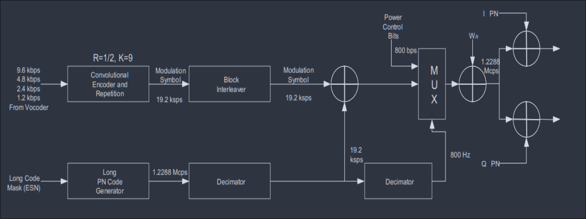
- a long PN code (42 bits) is used for data scrambling or encryption.
- to avoid near-far problem and to achieve maximum efficiency, power control is very important to CDMA systems.
    - open loop power control:
        - the mobile measures the strength of teh pilot signal and adjusts its power based on it
    - closed loop power control
        - the base station monitors received power from all mobiles and send power control command to each mobile.
- each data symbol is then spread by 64 chips of a user specific Walsh code
    - known as Walsh Covering
- signal is fed into the I and Q channels and is spread by a pair of short PN codes (15 bit)
- This is used for cell identification, as each cell uses one of 512 possible phase offsets of the short PN codes.

## Reverse CDMA channel

- The same long PN code is used to provide channels via spreading code within a 1.25 MHz reverse link.
- the long code can also provide encryption if needed.
- the reverse link comprises the following channels
    - Access channels
        - for mobile to initiate call and to respond to paging channel messages
    - Reverse traffic channels
        - user data and signaling data
- Figure
    - 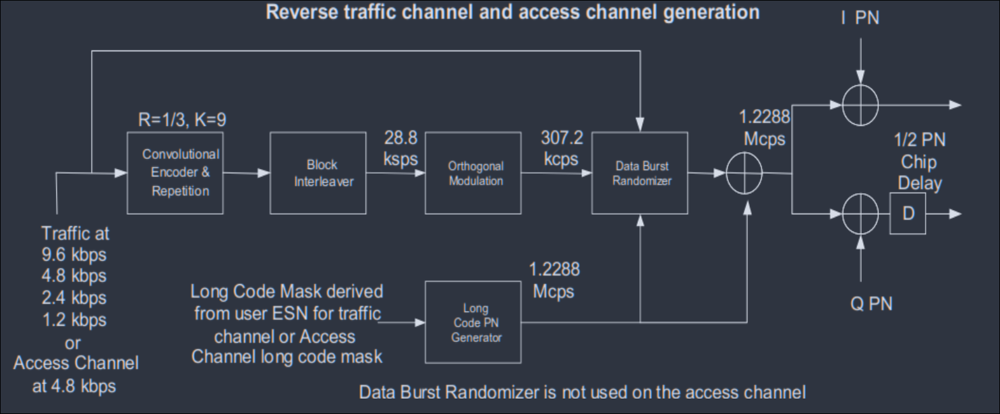
- Data in each 20 ms frame are divided into 16 power control groups (PCG) with a period of 1.25ms.
- Some PCG are gated-ON while others are gated-OFF while passing through Data Burst Randomizer
- the major difference between forward/reverse channels is that the reverse traffic channel contains a data burst randomizer.
- the orthogonally modulated data is fed into the data burst randomizer.
- the function of the data burst randomizer is to take advantage of the voice activity factor on the reverse link.
- forward link uses a different scheme to take advantage of the voice activity factor
    - when the vocoder is operating at lower rate, the forward link transmits the repeated symbols at a reduced energy per symbol and thereby reduces the forward-link power during any given period.
- EIRP (Gate-OFF) = EIRP(Gate-ON) - 20 dB
    - or
    - Noise floor level, whichever is lower
- if the user data rate is 9600 bps, transmission occurs on all 16 PCGs
- if user data rate is 4800 bps, transmission occurs on 8 PCGs
- if user data rate is 2400 bps, transmission occurs on 4 PCGs
- and if user data rate is 1200 bps, transmission occurs on all 2 PCG

# Spectrum Management

- Spectrum management is an international and national effort to regulate the use of EM spectrum
- the EM spectrum is the main way that those on the ground are able to talk to objects in space.
- however, spectrum is a finite resource.
- issues can arise when different parties wish to use the same frequency in the same geographical location at the same time
- to combat this problem, governments around the world regulate who can use what part of the spectrum in what locations.
- these rules will govern your space operations if you are wishing to use spectrum

## Regulatory Approach

Regulatory Functions

1. Inspection and investigation on the affairs of the telecom operators and internet service providers
2. settle disputes between the licensees or between the licensee and the customer relating to the telecommunication service
3. Determine the quality and standard of teh machine, equipment and facilities relating to the telecommunications and the telecommunications service
4. licensing of Telecom operators and Internet service providers
5. approval of tariffs for telecom services, fixed tariffs, maximum tariffs and non-regulated tariffs

# Wireless Technology

## Wifi

- Wifi stands for wireless fidelity.
- Wi-Fi is based on the IEEE 802.11 family of standards and is primarily a LAN technology designed to provide in-building broadband coverage
- Current Wi-Fi systems based on IEEE 802.11 a/g support a peak physical-layer data rate of 54 Mbps and typically provide indoor coverage over a distance of 100 feet.
- Wifi has become the defacto standard for last feet broadband connectivity in homes, offices and public hotspot locations.
- systems can typically provide a coverage range of only about 1000 feet from access point.
- wifi offers remarkably higher peak data rates than do 3G systems,
    - primarily because it operates over a larger 20 MHz bandwidth
    - but Wi-Fi systems are not designed to support high-speed mobility
- There are thre most important items which makes Wi-Fi operational
- These are
    - Radio Signals
    - Wi-Fi card which fits in laptop/computer
    - Hotspots which create WiFi Network
- Figure
    - 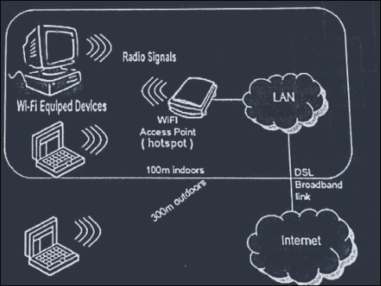

### Radio Signals

- radio signals make WiFi networking possible
- These radio signals transmitted fromWiFi antennas are picked up by WiFi receivers such as computers or cell phones
    - that are equipped with their own WiFi cards
- whenever a  computer ereceives any of the signals within the range of a WiFi network which is usually 300 - 500 feet for antennas, the WiFi card will read the signals and thus create an internet connection between the user and the network without the use of a cord.
- Acess points which consist of antennas and routers are the main source which transmit and receive radio waves.

### WiFi Cards

- Wifi cards can be thought of as being an invisible card that connects computer to the antenna for a direct connection to the internet
- Wifi cards can be external or internal
- e.g., on board built in card, USB dongle, PCMCIA card, etc.

### Wi-fi hotspots

- A wifi hotspot is created by installing an acess point to an internet connection
- the access point transmits a wireless signal over a short distance.
- typically, covering around 300 feets.
- when a wifi enabled device, such as pocket pc, encounters a hotspot, the device cna then connect to that network wirelessly.

### Security Features

- Wired Equivalent Privacy (WEP)
- WiFi Protected Access (WPA)
- IEEE 802.11i/WPA2

## WiMAX

- WiMAX is a standardized wireless version of Ethernet intended primarily as an alternative to wire technologies (such as Cable Modems, DSL and T1/E1 links) to provide broadband acecss to customer premises
- WiMAX operate similar to WiFi but at higher speeds, over greater distances and for a greater number of users.
- WiMAX has the ability to provide service even in areas that are difficult for wired infrastructure to reach and the ability to overcome the phyiscal limitations of traditional wired infrastructure
- Acronym for Worldwide Interoperability for Microwave Acess
- Based on Wireless MAN technology
- A wireless technology optimized for the delivery of IP centric services over a wide area
- A scalable wireless platform for constructing alternative and complementary broadband networks
- a certification that denotes the Interoperability of equipment built to the IEEE 802.16 or compatible standard.
- the IEEE 802.16 working group develops standards that adress two types of usage models
    - a fixed usage model (IEEE 802.16 - 2004)
    - a portable usage model (IEEE 802.16e)
- the 802.16a standard for 2-11 GHz is a wireless MAN technology that will provide broadband wireless to Fixed, Portable and Nomadic devices
- it can be used to connect 802.11 hot spots to the Internet, provide campus connectibity, and provide a wireless alternative to cable and DSL for last mile broadband access

### Feature

1. OFDM-based physical layer
    - The wiMAX physical layer (PHY) is based on orthogonal frequency division multiplexing,
        - a scheme that offers good resistance to multipath
        - and allows WiMAX to operate in NLOS conditions
2. Very high peak data rates
    - WiMAX is capable of supporting very high peak data rates
    - peak PHY data rate can be as high as 74 Mbps when operating using a 20 MHz wide spectrum
    - More typically, using a 10 MHz spectrum operating using TDD scheme with a 3:1 downlink-to-uplink ratio,
        - the peak PHY data rate is about 25 Mbps and 6.7 Mbps for the downlink and the uplink respectively.
3. Scalable bandwidth and data-rate support
    - WiMAX has a scalable physical layer architecture that allows for the data rate to scale easily with available channel bandwidth
    - For example, a WiMAX system ma use 128, 512, or 1,048-bit FFTs based on whether the channel is 1.25 MHz, 5 MHz or 10 MHz respectively.
    - this scaling may be done dynamically to support user roaming across different networks that may have different bandwidth allocations
4. Support for TDD and FDD
    - IEE 802.16-2004 and IEEE 801.16e-2005 supports both time division duplexing and frequency division duplexing, as well as a half-duplex FDD, which allows for a low-cost system implementation
5. Quality-of-service support
    - The WiMAX MAC layer has a connection-oriented architecture that is designed to support a variety of applications, including voice and multimedia services.
    - WiMAX system offers support for constant bit rate, variable bit rate, real time and non-real time traffic flows, in addition to best-effort data traffic.
    - WiMAX MAC is designed to support a large number of users, with multiple connections per terminal, each with its own QoS requirement
6. IP-based architecture
    - A WiMAX Forum has defined a reference network architecture that is based on all-IP platform
    - all end-to-end services are delivered over IP architecture relying on IP-based protocols for end-to-end transfport, QoS, session management, security and mobility
7. WiMAX building blocks
    - consists of two major parts
    - WiMAX Base Station
        - consists of indoor electronics and a WiMAX tower similar in concept to a cell-phone tower
        - can provide coverage to a very large area upto a radius of 6 miles
        - any wireless device within the coverage area would be able to access the internet
        - would use the MAC layer defined in the standard, a common interface that makes the network interoperable and would allocate uplink and downlink bandwidth to subscriber according to their needs, on essentially real-time basis
        - each base station provides wireless coverage over an area called a cell
        - theoretially, the maximum radius of a cell is 50 km (30 miles)
        - however, practical considerations limit to about 10 km (6 miles)
    - WiMAX Receiver
        - may have a separate antenna or could be a stand-alone box or PCMCIA card sitting in a laptop/computer or any other device
        - also refeerred as customer premise equipment (CPE)
        - base station is similar to acessing a wireless access point in a WiFi network, but coverage is greater
8. Backhaul
    - WiMAX tower station can connect directly to the internet using a high-bandiwdth, wired connection (for example, T3 line)
    - it can also connect to another WiMAX tower using a LOS, microwave link
    - backhaul refers both to the connection from the access point back to the base station and to the connection from the base station to the core network
    - it is possible to connect several base stations to one anoter using high-speed backhauil microwave links.
    - this would also allow for a roaming by a WiMAX subscriber from one base station coverage to another, similar to the roaming enabled by cell phones.

## Long Term Evolution (LTE)

- In constrast to the circuit-switched model of previous cellular systems, Long Term Evolution (LTE) has been designed to support only packet-switched services
- it aims to provide seamless IP connectivity between user equipment (UE) and the packet data network (PDN), without any disruption to end user's application
during mobility
- while the term LTE encompassess teh evolution of the Universal Mobile Telecommunication System (UMTS) radio acess through the Evolved UTRAN (E-UTRAN),
    - it is accompanied by an evolution of the non-radio aspects under the term System Architecture Evolution (SAE)
    - which includes the evolved packet core (EPC) network
    - together LTE and SAE comprise the evolved packet system (EPS)

### Performance Requirements

| Metric | Requirement |
| --- | --- |
| Peak data rate | DL: 1000 Mbps  UL:5Mbps   (20 MHz spectrum) |
| Mobility support | Upto 500 Kmph |
| Control plane latency | < 100 ms (for idle to active) |
| User plane latency | < 5 ms |
| Control plane capacity | > 200 users per cell  (for 5 MHz spectrum) |
| coverage | 5 to 100 with slight degradation after 30 km |
| spectrum flexibility | 1.25, 2.5, 5, 10, 15 and 20 MHz |

### Architecture

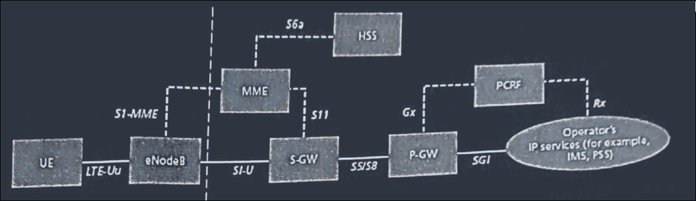

1. Evolved Radio Access Netowk (RAN)
    - the evolved RAN for LTE consists of a single node, i.e. the eNodeB (eNB) that interfaces with the UE
2. Serving Gateway (SGW)
    - the SGW routes and forwards user data packets, while also acting as the mobility anchor for the user plane during inter-eNB handovers
    - and as the anchor for mobility between LTE and other 3GPP technologies
3. Mobility Management Entity (MME)
    - The MME is the key control-node for lTE access-network.
    - responsible for idle mode UE tracking and paging procedure including retransmissions
    - it is involved in the bearer activation/deactivation process and is also responsible for choosing the SGW for a UE at the initial attach
    - and at the time of intra-LTE handover involving Core Network (CN) node reallocation
4. Packet Data Network Gateway (PDN GW)
    - the PDN GW provides connectivity to the UE to external packet data networks by being the point of exit and entry of traffic for the UE
