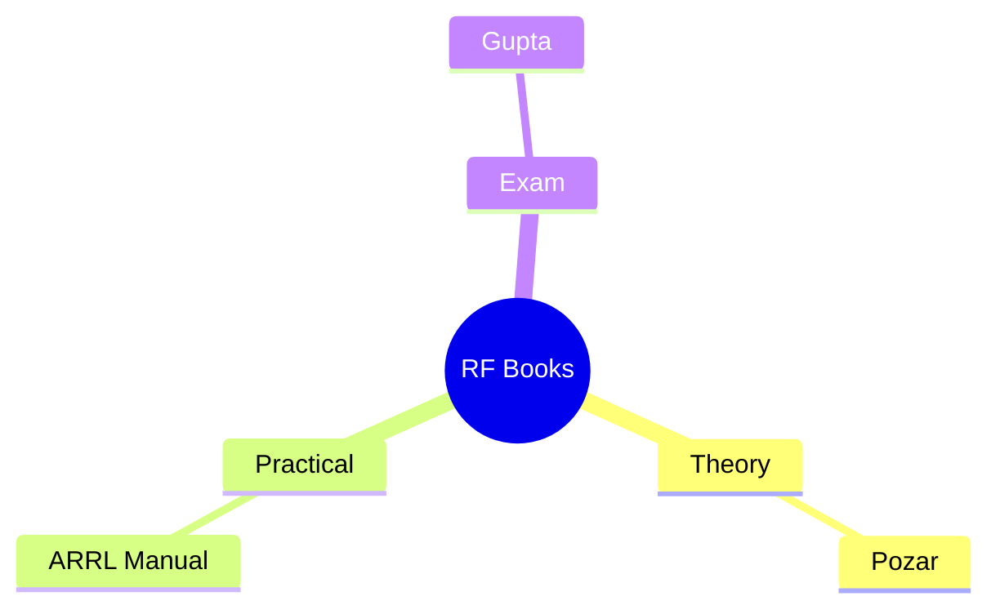
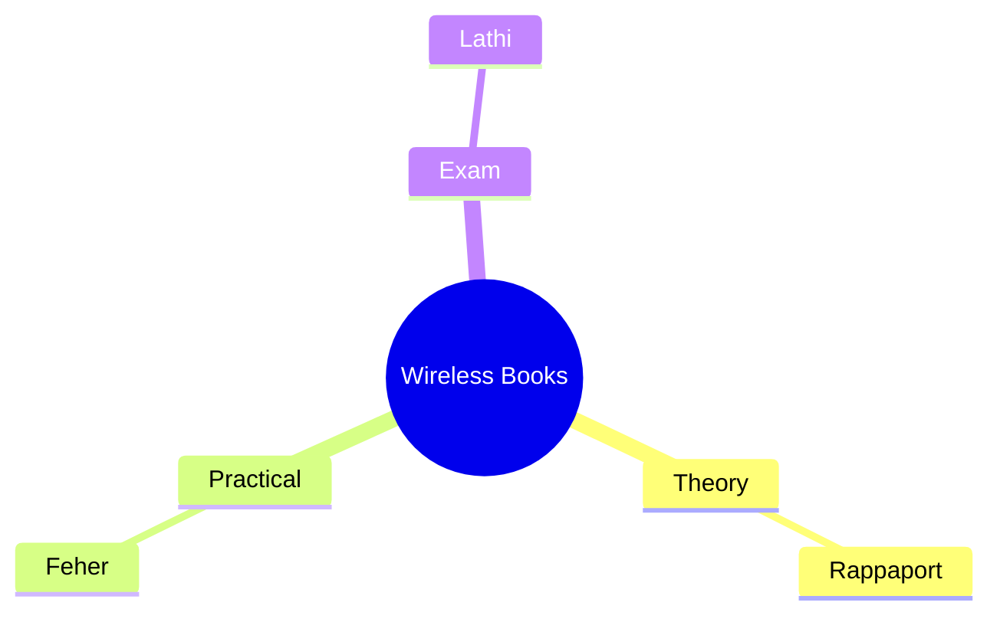

# 1 📚 RF and Microwave Engineering (EX 716)

## 1.A 1️⃣ Theoretical Deep Dive

Book: Microwave Engineering – David M. Pozar, 2nd Edition, John Wiley & Sons
Strength: Rigorous field theory, S-parameter derivations, Smith chart mathematics, waveguide analysis
Covers syllabus: Transmission lines, network theory, components, antennas, measurements (~85%)
Best for: Understanding why at the electromagnetics level; exam derivation questions
### 1.A.A 2️⃣ Practical / Lab Oriented

Book: ARRL UHF/Microwave Experimenter’s Manual, 4th Edition, Newington CT
Strength: Hands-on measurements, microstrip implementation, safety practices, instrument use (spectrum/network analyzers)
Covers syllabus: Practicals (Smith chart, strip-line design, ADS simulation), RF design practices (~90% of labs)
Best for: Lab sessions, real-world filter/amplifier building, VSWR measurements
#### 1.A.A.A 3️⃣ Exam & Syllabus Consolidation

Book: Microwave Electronics – K.C. Gupta, Tata McGraw Hill
Strength: Concise theory with solved numerical problems, exam-focused summaries, covers Gunn diode, MASER, Tee junctions in detail
Covers syllabus: Components, generators (klystron, TWT, magnetron), measurements (~80%)
Best for: Last-minute revision, numerical problems on impedance matching and S-parameters

    📖 Library get: Pozar (widely available)
    📥 PDF online: ARRL Manual
    📚 Buy/borrow: Gupta

# 2 🤖 Artificial Intelligence (CT 710)

```mermaid
mindmap
  root((AI Books))
    Theory
      Russel & Norvig
    Practical
      Winston
    Exam
      Rich & Knight

1️⃣ Theoretical Deep Dive

Book: Artificial Intelligence A Modern Approach – Stuart Russel & Peter Norvig, Pearson
Strength: Comprehensive coverage of search, logic, probability, learning, NLP; strong mathematical foundations
Covers syllabus: Introduction, problem solving, search (informed/uninformed/adversarial), knowledge representation, machine learning (~95%)
Best for: Building deep conceptual understanding; research-oriented
2️⃣ Practical / Lab Oriented

Book: Artificial Intelligence – P.H. Winston, Addison Wesley
Strength: LISP/Prolog examples throughout, practical implementation of search algorithms, rule-based systems, semantic nets
Covers syllabus: Practical exercises (search techniques, question answering, inference) – directly matches lab requirements (~90%)
Best for: Writing actual code for DFS, BFS, resolution refutation, expert system shells
3️⃣ Exam & Syllabus Consolidation

Book: Artificial Intelligence – E. Rich & K. Knight, McGraw Hill
Strength: Clear chapter-wise solved examples, short answer questions, algorithm summaries (minimax, alpha-beta, unification)
Covers syllabus: Entire syllabus but especially probability/Bayes, resolution refutation system, Horn clauses (~90%)
Best for: Exam cramming, numerical problems on Bayes' theorem, resolution proofs

    📖 Library get: Russel & Norvig (most libraries have latest edition)
    📥 PDF online: Rich & Knight
    📚 Buy/borrow: Winston

📡 DSAP – Digital Signal Analysis & Processing (EX 710)

```mermaid
mindmap
  root((DSAP Books))
    Theory
      Oppenheim
    Practical
      Proakis
    Exam
      (Oppenheim same)
```

## 2.A 1️⃣ Theoretical Deep Dive

Book: Discrete-Time Signal Processing – Alan V. Oppenheim, Ronald W. Schafer, John R. Buck, Pearson
Strength: Rigorous DFT, Z-transform, filter design theory, multirate concepts; industry gold standard
Covers syllabus: All topics (DT signals, Z-transform, LTI analysis, filter structures, FIR/IIR design, FFT) (~95%)
Best for: Understanding mathematical foundations; graduate-level depth
### 2.A.A 2️⃣ Practical / Lab Oriented

Book: Digital Signal Processing – John G. Proakis & Dimitris G. Manolakis, Prentice Hall
Strength: MATLAB examples, algorithm implementation focus (FFT, convolution, filter design), practical quantization effects
Covers syllabus: Practicals (signal generation, convolution, IIR/FIR filters, cascade systems) (~90% of lab work)
Best for: Coding DSP algorithms, understanding finite word length effects, limit cycles
#### 2.A.A.A 3️⃣ Exam & Syllabus Consolidation

Book: Discrete-Time Signal Processing – Oppenheim (same as #1 – no other reference in your list covers exams better)
Alternative (if available outside your list): Digital Signal Processing – S. K. Mitra (not in your refs, but excellent for exams)
Strength within your list: Oppenheim has end-of-chapter problems that mirror exam questions (pole-zero plots, ROC determination, filter design steps)
Covers syllabus: ~95%
Best for: Problem-solving practice, understanding exam-style derivations

    📖 Library get: Oppenheim (universal)
    📥 PDF online: Proakis
    📚 Buy/borrow: Oppenheim (use same for theory & exam)

# 3 📱 Wireless Communication (EX 715)


## 3.A 1️⃣ Theoretical Deep Dive

Book: Wireless Communications – Theodore Rappaport, Latest Edition
Strength: Propagation models (Okumura, Hata, indoor), fading (Rayleigh/Ricean), equalization, diversity, cellular concepts
Covers syllabus: Propagation (12 hrs), equalization & diversity (4 hrs), cellular concept (4 hrs) (~85%)
Best for: Understanding link budget design, path loss, multipath channel modeling
### 3.A.A 2️⃣ Practical / Lab Oriented

Book: Wireless Digital Communications – K. Feher, Latest Edition
Strength: Modulation techniques (GMSK, π/4 QPSK, OFDM), practical receiver design, spectrum efficiency, real-world standards (GSM, CDMA)
Covers syllabus: Modulation (4 hrs), multiple access (FDMA/TDMA/CDMA), wireless systems (~80%)
Best for: Implementation insights, modem design, modulation performance comparison in fading channels
#### 3.A.A.A 3️⃣ Exam & Syllabus Consolidation

Book: Analog and Digital Communication Systems – B.P. Lathi, Latest Edition
Strength: Solved problems on modulation, line coding, block/convolutional codes, SNR calculations; clear exam-style questions
Covers syllabus: Modulation review (4 hrs), speech/channel coding (4 hrs), some multiple access basics (~70% – weaker on propagation & cellular specifics)
Best for: Communication theory exams, coding gain problems, Viterbi algorithm examples

    📖 Library get: Rappaport (most common)
    📥 PDF online: Lathi
    📚 Buy/borrow: Feher

📊 Quick Reference Table (Obsidian-friendly)

| Subject                 | Theory Book     | Practical Book | Exam Book        |
| ----------------------- | --------------- | -------------- | ---------------- |
| RF & Microwave          | Pozar           | ARRL Manual    | K.C. Gupta       |
| Artificial Intelligence | Russel & Norvig | Winston        | Rich & Knight    |
| DSAP                    | Oppenheim       | Proakis        | Oppenheim (same) |
| Wireless Communication  | Rappaport       | Feher          | Lathi            |

[!tip] RF Study Strategy
Use Pozar for chapters 1-5 (transmission lines, Smith chart, S-params). Switch to ARRL for lab weeks. Gupta for exam problem practice.

[!warning] AI Exam Focus
    Rich & Knight Chapter 5 (resolution refutation) and Chapter 9 (Bayes' theorem) are high-yield. Russel & Norvig for conceptual clarity.

[!note] DSAP Lab Prep
    Proakis MATLAB examples directly map to your practicals: convolution (Ch. 2), IIR filters (Ch. 7), FIR design (Ch. 8).

[!quote] Wireless Equation to Memorize
    Friis transmission formula (Rappaport Ch. 4) and Doppler shift (Ch. 5) appear in every exam.

